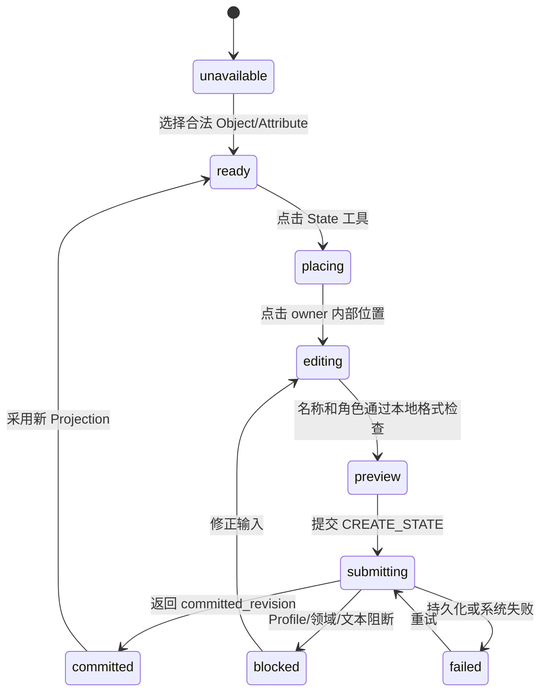
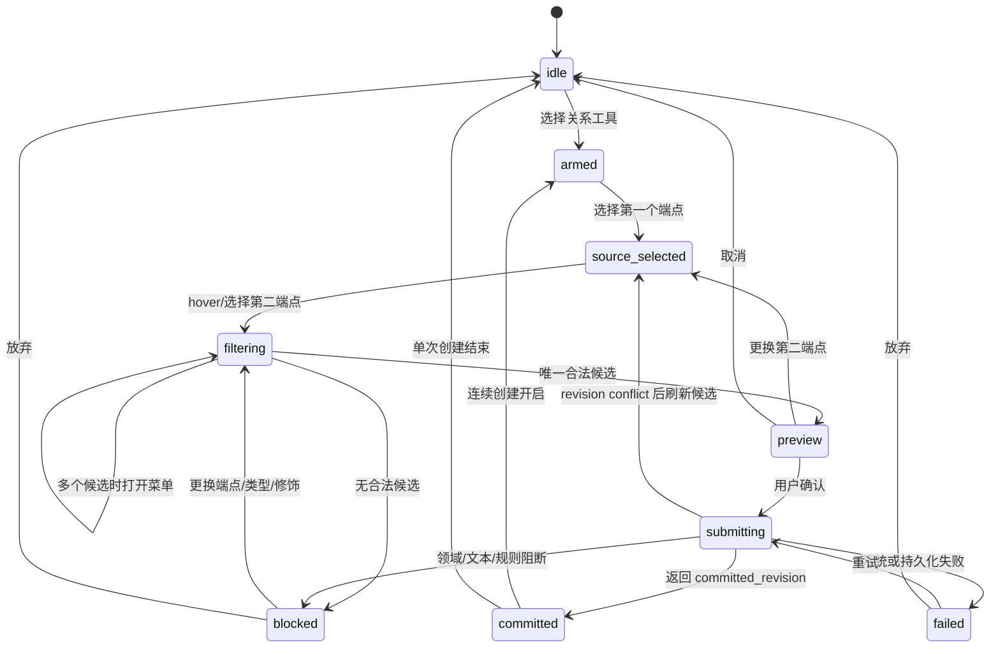

# OPM 完整画布工具链设计

文档版本：`v0.4-draft`

文档状态：完整画布及 Control/Structural OPL/Trace 开发输入冻结；机器资产、视觉、E2E 与性能证据待实现

更新时间：2026-07-29

## Task Type

- `feature`

## Active Playbooks

- `design-module-docs (primary)`
- `testing`

## 1. 文档目的

本文档把 P03 建模工作台中未由 P0 最小闭环承接的 State、完整关系工具链、候选过滤、图形预览、提交回流、键盘、响应式和验收口径冻结为可开发输入。

本文档承接以下设计职责：

1. 完整画布工具栏组件树、固定分组和图标口径；
2. State 创建、编辑、显示、修饰、端点选择和删除闭环；
3. ISO 配置档 16 类 Procedural Link、8 类 Control Link 组合和 10 类 Structural Link 的唯一工具映射；
4. 关系候选状态机、端点归一化和 Profile 动态过滤；
5. 前端事件、字段、焦点、键盘、窄屏和大图行为；
6. `API-EDT-001/002` 后续机器契约扩展输入和验收矩阵。

本文档不替代 [配置档能力矩阵](../requirements/opm-profile-capability-matrix.md)、[核心元模型字段 Schema](opm-core-metamodel-field-schema.md)、[应用 API 契约](opm-modeling-tool-application-api-contract.md) 或 [符号与文本生成实现契约](opm-symbol-and-text-generation-implementation-contract.md)。

### 1.1 Canonical 责任边界

1. Capability 编号和 Profile 支持级别以配置档能力矩阵为准；
2. `CommandCapabilityQuery/Option` 与 command payload 以应用 API 契约为准；
3. Relation/Marker/Label Slot 逻辑字段以 Profile Package 字段级 Schema 为准；
4. 页面 selection、State/relation candidate 以工作台状态模型为准，字段编辑性与组件事件分别以字段明细和组件交互文档为准；
5. line/marker/route/template/golden 以符号与文本生成实现契约为准；
6. 自动化层级、用例和发布门槛以测试策略为准，拆包依赖和回滚以开发执行包为准。

本文档负责跨责任源的专题映射，不建立第二份冲突定义。发现差异时先修正对应 Canonical 文档，再同步本专题映射。

## 2. 范围、非目标与声明边界

### 2.1 本轮冻结范围

1. ISO 配置档中的 Object、Process、Object State；
2. `CAP-ISO-PROC-001~016`；
3. `CAP-ISO-CTRL-001~008`；
4. `CAP-ISO-STRUCT-001~010`；
5. 与上述能力直接相关的标签、State 修饰、端点和 Context 投影交互；
6. 桌面完整编辑与移动端查看/轻量属性编辑降级。

### 2.2 非目标

1. 不实现代码、OpenAPI、Schema、Rule、Grammar、Symbol Catalog 或测试；
2. 不把中文草案配置档的 Value Domain、Value、Flow 和专属关系混入 ISO 菜单；
3. 不开放自由 SVG、任意箭头、任意标签关系或绕过 Profile 的连接；
4. 不设计直接编辑 OPL 并反向修改 OPD；
5. 不声明产品已符合 ISO 19450:2024；
6. 不把本文中的浏览器布局尺寸冒充 ISO 图形尺寸。

### 2.3 事实与待实现输入

| 类型 | 结论 |
| --- | --- |
| 事实 | Profile Capability Matrix 已定义 16/8/10 能力，State 为 ISO 配置档 `MUST` |
| 事实 | State 是 Object/Attribute 的从属语义，不是独立 Thing，ISO 配置档禁止 Process State |
| 事实 | 当前工作区 OpenAPI 草案已出现 `CREATE_STATE/UPDATE_STATE/CREATE_FACT/UPDATE_FACT` 和结构化 `CommandCapabilityOption`，但尚无对应完成证据 |
| 事实 | 当前草案仍缺 Control option 的 `base_fact_capability_ref`、Modifier 基数/原子组；Revision Schema 的 Fact 也尚无 `modifiers` |
| 冻结设计 | 本文定义工具行为、候选 DTO 和命令 payload 的后续契约输入 |
| 冻结设计 | 8 类 Control 的 20 个 concrete OPL 组合、10 类 Structural 变体、Token/Trace、golden manifest 和性能阈值由符号/文本契约及 DEV-CANVAS-05/06 规格承接 |
| 待实现证据 | 完整 Symbol/Rule/Grammar 资产、API 契约测试、浏览器视觉证据和 E2E |

## 3. 设计原则

1. **模型优先**：Semantic Model 是唯一事实源，X6 Cell、工具选择和候选预览均不是正式事实。
2. **Profile 驱动**：工具可见性、端点合法性、修饰组合和禁用原因均来自当前 Revision 的精确 Profile/Rule/Symbol/Grammar 绑定。
3. **候选而非猜测**：用户拖线方向不等于规范 source/target；歧义必须展示候选菜单。
4. **图标表达工具，符号表达语义**：通用操作使用 Lucide 图标；OPM 领域工具使用 Symbol Catalog 缩略符号，不使用颜色代替关系类型。
5. **高频直达、全量可搜索**：Object、Process、State 提供固定快捷入口；34 项关系能力进入分组、搜索和最近使用菜单，不平铺占满工具栏。
6. **预览与提交隔离**：候选图形和候选 OPL 具有明确预览态，只有 `API-EDT-002` 返回 committed revision 后才成为正式投影。
7. **视口与语义隔离**：放大视图、缩小视图、平移和适配画布不产生 Revision；内缩放、外缩放、显式/抑制和展开/折叠是语义命令。
8. **不可用要可解释**：被 Profile、端点、Context、State、只读模式或资产证据阻断的工具必须提供稳定 reason code 和可读原因。

## 4. 信息架构与组件树

```text
panel-opd-editor
├── editor-toolchain
│   ├── tool-group-pointer
│   │   ├── tool-select
│   │   ├── tool-marquee
│   │   └── tool-pan
│   ├── tool-group-things
│   │   ├── tool-create-object
│   │   ├── tool-create-process
│   │   └── tool-create-state
│   ├── tool-group-relations
│   │   └── tool-relation-split-button
│   │       ├── tool-relation-primary
│   │       └── menu-relation-catalog
│   │           ├── field-relation-search
│   │           ├── group-recent-relations
│   │           ├── group-procedural-relations
│   │           ├── group-control-relations
│   │           └── group-structural-relations
│   ├── tool-group-semantic
│   │   ├── menu-state-visibility
│   │   ├── menu-folding
│   │   └── menu-semantic-zoom
│   └── tool-group-layout
│       ├── menu-align
│       ├── menu-distribute
│       └── tool-auto-layout
├── editor-canvas
│   ├── editor-projection-layer
│   ├── editor-candidate-layer
│   ├── editor-selection-layer
│   ├── editor-finding-layer
│   └── editor-focus-layer
├── editor-context-popover
├── editor-command-feedback
└── editor-viewport-controls
    ├── tool-zoom-out
    ├── field-viewport-scale
    ├── tool-zoom-in
    └── tool-fit-view
```

组件职责：

| 组件 | 拥有状态 | 禁止拥有 |
| --- | --- | --- |
| `editor-toolchain` | 当前本地工具模式、最近关系、菜单开关 | Capability 合法性规则、Semantic Model |
| `menu-relation-catalog` | 搜索词、展开分组、焦点项 | 硬编码的允许关系集合 |
| `editor-candidate-layer` | source/target hover、候选路径、候选符号、候选错误 | committed Fact |
| `editor-projection-layer` | 当前 Context Projection 的 ViewModel | 正式 Element/State/Fact 副本 |
| `editor-command-feedback` | submitting/blocked/failed 的当前候选反馈 | 把 failed 映射为 committed |
| `editor-viewport-controls` | scale/translation/fit target | Revision、语义 zoom |

## 5. 工具链固定分组

### 5.1 通用工具与图标

| 工具 | 图标来源 | Tooltip | 事件 | 说明 |
| --- | --- | --- | --- | --- |
| 选择 | Lucide `MousePointer2` | 选择 | `tool-mode-changed(SELECT)` | 默认工具 |
| 框选 | Lucide `Scan` | 框选 | `tool-mode-changed(MARQUEE)` | 只改变选择 |
| 平移 | Lucide `Hand` | 平移画布 | `tool-mode-changed(PAN)` | 不产生 Revision |
| 撤销 | Lucide `Undo2` | 撤销 | `undo-requested` | 使用应用撤销命令 |
| 重做 | Lucide `Redo2` | 重做 | `redo-requested` | 使用应用重做命令 |
| 删除 | Lucide `Trash2` | 删除所选内容 | `delete-requested` | 必须先取影响摘要 |
| 缩小视图 | Lucide `ZoomOut` | 缩小视图 | `viewport-zoom-requested` | 视口事件 |
| 放大视图 | Lucide `ZoomIn` | 放大视图 | `viewport-zoom-requested` | 视口事件 |
| 适配画布 | Lucide `Maximize` | 适配画布 | `viewport-fit-requested` | 视口事件 |

图标按钮固定 `32 x 32px` 命中框，图标 `18 x 18px`；这是产品交互令牌，不是 ISO 尺寸。未知图标必须有 hover/focus tooltip 和 `aria-label`。

### 5.2 OPM 领域工具

| 工具 | 图标来源 | 主动作 | 无选择时 | 有合法选择时 |
| --- | --- | --- | --- | --- |
| Object | `symbol.object.basic` 缩略符号 | 在画布创建 Object | 可用 | 可用 |
| Process | `symbol.process.basic` 缩略符号 | 在画布创建 Process | 可用 | 可用 |
| State | `symbol.state.basic` 置于 Object 轮廓内的缩略符号 | 给 Object/Attribute 创建 State | 禁用并提示“先选择对象或属性” | 进入 owner 锁定创建态 |
| Relation | 当前最近使用关系的标准符号缩略图 | 进入关系 armed 态 | 可打开目录 | 按选择预筛目录 |
| Semantic refinement | Symbol Catalog 的显式/抑制、折叠、语义 zoom 图标 + 文本 | 打开语义动作菜单 | 按 Context 决定 | 按选择与 Profile 过滤 |

领域工具缩略图必须从当前 `symbol_catalog_ref + digest` 解析。描述符缺失、版本不匹配或来源证据未满足生产门槛时，工具显示为不可用，不使用手绘替代图标启用关系。

### 5.3 关系 split-button

1. 主按钮使用最近一次成功创建且当前仍允许的关系；没有最近项时只显示“选择关系”图标。
2. 下拉菜单固定分组为“最近使用 / 过程关系 / 控制关系 / 结构关系”。
3. 搜索匹配关系名称、Capability ID、别名和 OPL 关键词，但提交使用稳定 Capability ID。
4. 每项展示标准符号缩略图、正式名称、端点摘要和状态；不展示长段说明。
5. 被当前端点阻断但属于活动 Profile 的项可在“显示不可用项”模式出现，并展示 reason；Profile 为 `FORBIDDEN/N/A` 的项完全不出现。
6. 菜单最多保留 8 个最近项；最近项只存本地偏好，不进入模型或 Revision。

## 6. State 完整交互设计

### 6.1 创建入口与主路径



主路径：

1. 用户选择 Object 或 Profile 允许拥有 State 的 Attribute；
2. 点击 State 工具，owner 被锁定并以焦点轮廓显示；
3. 用户点击 owner content box 内的位置，生成 State 候选并打开内联名称编辑；
4. 输入名称，按 Profile 返回的规则选择 `INITIAL/DEFAULT/FINAL` 零到多个角色；
5. 前端提交 `CREATE_STATE` 候选命令；
6. 成功后使用新 Revision 的 Context Projection 替换候选；失败时保留名称、角色和位置。

禁止在空白画布直接创建 State。将 State 拖出 owner 只显示阻断反馈；跨 owner 移动是未来专用语义命令，不降级成 `UPDATE_LAYOUT`。

### 6.2 State 字段

| 字段 | 来源 | 编辑性 | 规则 |
| --- | --- | --- | --- |
| `state_id` | Semantic Model | 只读 | Model 内稳定 |
| `owner_ref` | Semantic Model | 只读 | 变更 owner 不作为普通属性编辑 |
| `capability_ref` | API-EDT-001 候选 | 创建时选择/后续只读 | ISO 为 `CAP-ELEM-004` 及其受控子能力 |
| `name_or_value` | Semantic Model | 命令编辑 | 受 Profile 命名和值约束 |
| `state_roles` | Semantic Model + Profile | 命令编辑 | `INITIAL/DEFAULT/FINAL`，组合由规则决定 |
| `ordinal` | owner 的 State 顺序投影 | 命令编辑 | 同 owner 稳定排序；仅通过明确重排动作修改 |
| `explicitness` | Context Projection | 语义命令 | `EXPLICIT/SUPPRESSED`，不删除 State |
| `fold_state` | Context Projection | 语义命令 | `UNFOLDED/FOLDED`，不改变 State 所有权 |
| `layout` | Context Projection | 布局命令 | 必须位于 owner content box |
| `fact_trace` | Text/Fact Trace | 只读 | 列出使用该 State 的关系与句子 |

### 6.3 修饰与编辑

1. `INITIAL` 使用粗轮廓、`FINAL` 使用双轮廓、`DEFAULT` 使用指向 State 的空心箭头；组合时按 Symbol Catalog 叠加，不由 CSS 临时拼图。
2. State 单击进入选择，双击或 `Enter` 进入名称编辑；`Escape` 取消候选，`Ctrl/Cmd + Enter` 提交。
3. 角色使用复选项，因为它们不是互斥枚举；每项可用性和组合错误由 Capability/Rule 返回。
4. 删除 State 前展示引用它的 Fact、Text Trace 和 Context 影响；存在引用时是否允许级联由后端影响分析决定，前端不得自行删边。
5. State 顺序变化可能影响 OPL，必须作为语义命令处理；只移动显示坐标不改变语义顺序。

### 6.4 显式/抑制、展开/折叠

| 动作 | 对正式 State | 对 Occurrence | Revision | OPL/校验 |
| --- | --- | --- | --- | --- |
| State 显式 | 不创建/删除 | 当前 Context 显示 State | 产生 | 重新生成/校验 |
| State 抑制 | 不创建/删除 | 当前 Context 使用标准允许的抑制投影 | 产生 | 重新生成/校验 |
| 展开 | 不改变 owner | 展示当前层级允许的内部构造 | 产生 | 按语义 Context 更新 |
| 折叠 | 不改变 owner | 使用折叠投影 | 产生 | 按语义 Context 更新 |

如果 Symbol Catalog 没有某一 State-specified Fact 在抑制态的合法投影，`API-EDT-001` 必须阻断该动作；前端不得把关系端点静默改接 owner Object。

### 6.5 State 作为关系端点

1. 展开状态下可直接点击 State 作为 source/target；命中优先级为 State -> owner Object -> 背景。
2. State 被抑制时，关系端点选择由 Context Projection 提供的可选 locator 决定；前端不从几何位置猜测 State。
3. Candidate Builder 同时校验 `target_ref` 与 `state_qualification`；UI 不把 State 复制成 Element。
4. 被选 State 以轮廓和 owner 关联提示表达，不能只使用填充色。

## 7. 关系候选状态机



状态字段：

```text
RelationCandidateState {
  phase
  capability_query_id
  selected_capability_id?
  first_endpoint_locator?
  second_endpoint_locator?
  normalized_endpoints[]
  candidate_options[]
  selected_option_id?
  symbol_descriptor_ref?
  template_family_ref?
  draft_labels[]
  draft_modifiers[]
  preview_route?
  reason_codes[]
  base_revision
}
```

`candidate_options` 必须是后端根据固定 `base_revision` 计算的短期候选。Revision 变化、Context 变化、Profile binding 变化或端点变化时立即失效。

## 8. 候选过滤与端点归一化

### 8.1 过滤顺序

```text
活动 Profile Capability
-> 对应 Rule/Symbol/Grammar 资产可用性
-> 当前 access_mode
-> 当前 Context 类型与 projection 状态
-> 端点 target_kind / capability / essence / affiliation
-> State owner 与 state_qualification
-> 已有 Fact、扇出、完整/不完整集合和逻辑组约束
-> 标签、方向、modifier 组合
-> 候选 OPL/Trace 可生成性
```

任一层阻断都返回稳定 reason code；UI 显示首要原因并可展开全部原因。

### 8.2 端点选择和归一化

1. 用户先选的端点记为 `first_endpoint_locator`，不直接写入规范 `source`。
2. `API-EDT-001` 返回规范化 `endpoints[]`，包含 `role/target_ref/ordinal/state_qualification`。
3. 同一对端点可以匹配多个关系时，按“最近使用”排序只影响显示，不能自动提交第一项。
4. Effect、双向 Tagged、Reciprocal 和 fan 关系不能被压缩成简单 source/target 箭头。
5. Self-invocation 必须验证同一个 Process 稳定 ID，不能通过两个同名 Process 发生。
6. 结构 fan 的一次提交可以包含多个 part/specialization/instance 端点；新增或移除成员使用 `UPDATE_FACT`，保持同一个 Fact 身份和完整性标志。

### 8.3 Candidate reason code

| reason code | 含义 | UI 动作 |
| --- | --- | --- |
| `PROFILE_CAPABILITY_DISABLED` | 当前 Profile 未启用能力 | 隐藏或在不可用模式说明 |
| `SYMBOL_ASSET_MISSING` | 符号描述符/marker 不可用 | 禁用并定位资产版本 |
| `TEXT_TEMPLATE_MISSING` | OPL 模板族不可用 | 禁用生产提交 |
| `ENDPOINT_KIND_MISMATCH` | 端点类型不匹配 | 突出错误端点 |
| `STATE_OWNER_MISMATCH` | State 不属于被限定实体 | 定位 owner |
| `CONTEXT_NOT_ALLOWED` | 当前 OPD/视图不允许创建 | 提供允许的 Context 入口 |
| `FACT_ALREADY_EXISTS` | 已存在不允许重复的 Fact | 定位已有关系 |
| `MODIFIER_COMBINATION_INVALID` | 事件/条件/状态等组合非法 | 定位修饰字段 |
| `READ_ONLY_REVISION` | Snapshot/Baseline 只读 | 提供“创建草稿”动作 |
| `REVISION_STALE` | 候选基于旧 Revision | 刷新 Projection 后重算 |

## 9. ISO Procedural Link 工具映射

| Capability | 菜单路径 | 规范端点概要 | Symbol ID | OPL template family |
| --- | --- | --- | --- | --- |
| `CAP-ISO-PROC-001` Consumption Link | 过程关系/转换/消耗 | Object -> Process | `symbol.link.consumption` | `opl.consumption.*` |
| `CAP-ISO-PROC-002` Result Link | 过程关系/转换/结果 | Process -> Object | `symbol.link.result` | `opl.result.*` |
| `CAP-ISO-PROC-003` Effect Link | 过程关系/转换/效果 | Object <-> Process | `symbol.link.effect` | `opl.effect.*` |
| `CAP-ISO-PROC-004` Agent Link | 过程关系/使能/主体 | Agent Object -> Process | `symbol.link.agent` | `opl.agent.*` |
| `CAP-ISO-PROC-005` Instrument Link | 过程关系/使能/工具 | Instrument Object -> Process | `symbol.link.instrument` | `opl.instrument.*` |
| `CAP-ISO-PROC-006` State-specified Consumption | 过程关系/状态指定/消耗 | Object State -> Process | `symbol.link.consumption.state` | `opl.consumption.state.*` |
| `CAP-ISO-PROC-007` State-specified Result | 过程关系/状态指定/结果 | Process -> Object State | `symbol.link.result.state` | `opl.result.state.*` |
| `CAP-ISO-PROC-008` Input-output-specified Effect | 过程关系/状态指定/输入输出效果 | Input State -> Process -> Output State | `symbol.link.effect.state.input-output` | `opl.effect.state.input-output.*` |
| `CAP-ISO-PROC-009` Input-specified Effect | 过程关系/状态指定/输入效果 | Input State -> Process -> Object | `symbol.link.effect.state.input` | `opl.effect.state.input.*` |
| `CAP-ISO-PROC-010` Output-specified Effect | 过程关系/状态指定/输出效果 | Object -> Process -> Output State | `symbol.link.effect.state.output` | `opl.effect.state.output.*` |
| `CAP-ISO-PROC-011` State-specified Agent | 过程关系/状态指定/主体 | Agent State -> Process | `symbol.link.agent.state` | `opl.agent.state.*` |
| `CAP-ISO-PROC-012` State-specified Instrument | 过程关系/状态指定/工具 | Instrument State -> Process | `symbol.link.instrument.state` | `opl.instrument.state.*` |
| `CAP-ISO-PROC-013` Invocation Link | 过程关系/调用与异常/调用 | Process -> Process | `symbol.link.invocation` | `opl.invocation.*` |
| `CAP-ISO-PROC-014` Self-invocation Link | 过程关系/调用与异常/自调用 | Process -> same Process | `symbol.link.invocation.self` | `opl.invocation.self.*` |
| `CAP-ISO-PROC-015` Overtime Exception Link | 过程关系/调用与异常/超时异常 | Process -> handling Process | `symbol.link.exception.overtime` | `opl.exception.overtime.*` |
| `CAP-ISO-PROC-016` Undertime Exception Link | 过程关系/调用与异常/欠时异常 | Process -> handling Process | `symbol.link.exception.undertime` | `opl.exception.undertime.*` |

## 10. ISO Control Link 组合工具映射

Control Link 是对进入 Process 的合法基础 Transforming/Enabling Link 的修饰，不创建脱离基础 Fact 的自由连线。工具选择后先选择或创建基础关系，再提交控制语义。

| Capability | 菜单路径 | 可修饰基础关系 | 图形组合 | OPL template family |
| --- | --- | --- | --- | --- |
| `CAP-ISO-CTRL-001` Transforming Event | 控制关系/Event/转换 | Consumption、Effect 输入段 | 基础 marker + process 端 `e` | `opl.control.event.transforming.*` |
| `CAP-ISO-CTRL-002` Enabling Event | 控制关系/Event/使能 | Agent、Instrument | 基础 marker + process 端 `e` | `opl.control.event.enabling.*` |
| `CAP-ISO-CTRL-003` State-specified Transforming Event | 控制关系/Event/状态指定转换 | State Consumption、三种 State Effect | 状态基础 marker + process 端 `e` | `opl.control.event.transforming.state.*` |
| `CAP-ISO-CTRL-004` State-specified Enabling Event | 控制关系/Event/状态指定使能 | State Agent、State Instrument | 状态基础 marker + process 端 `e` | `opl.control.event.enabling.state.*` |
| `CAP-ISO-CTRL-005` Transforming Condition | 控制关系/Condition/转换 | Consumption、Effect 输入段 | 基础 marker + process 端 `c` | `opl.control.condition.transforming.*` |
| `CAP-ISO-CTRL-006` Enabling Condition | 控制关系/Condition/使能 | Agent、Instrument | 基础 marker + process 端 `c` | `opl.control.condition.enabling.*` |
| `CAP-ISO-CTRL-007` State-specified Transforming Condition | 控制关系/Condition/状态指定转换 | State Consumption、三种 State Effect | 状态基础 marker + process 端 `c` | `opl.control.condition.transforming.state.*` |
| `CAP-ISO-CTRL-008` State-specified Enabling Condition | 控制关系/Condition/状态指定使能 | State Agent、State Instrument | 状态基础 marker + process 端 `c` | `opl.control.condition.enabling.state.*` |

Effect 的 Event/Condition 只修饰 Object/State 到 Process 的输入段；输出段不是独立 Event/Condition Link。前端必须使用后端返回的 segment role，不按折线路径方向判断。

### 10.1 Control 的 Fact/Modifier 表示

1. 画布中的 Control 仍选择、更新和追踪同一个基础 Procedural Fact，不创建第二条 edge 或 `fact_family=CONTROL` 的伪 Fact；
2. 正式提交只使用 `control.capability=<CAP-ISO-CTRL-001~008>` 与 `control.segment=PROCESS_INPUT` 两个成对 Modifier；
3. Candidate Option 的 `capability_ref` 返回 Control Capability，`base_fact_capability_ref` 返回被修饰的 Procedural Capability，并给出两个 Modifier 的精确值；不允许前端从关系分组名称或折线路径组装；
4. X6 根据 `control.capability` 映射 `e/c`，并根据 `control.segment` 定位规范 Process 输入段；Projection 不保存额外 Control edge ID；
5. OPL Planner 和 Trace 以基础 `fact_id` 为主身份，并把两个 Modifier key/value 纳入 token range、rule evidence 和 digest；
6. `condition` 只承载独立谓词，不用于重复保存 Event/Condition 类型。Control pair 的 Canonical 字段与 API wire 结构分别以核心元模型和应用 API 契约为准。

## 11. ISO Structural Link 工具映射

| Capability | 菜单路径 | 规范端点概要 | Symbol ID | 标签槽位 | OPL template family |
| --- | --- | --- | --- | --- | --- |
| `CAP-ISO-STRUCT-001` Unidirectional Tagged | 结构关系/标记/单向 | 同类 Thing -> Thing | `symbol.link.structural.tagged.unidirectional` | `forward_tag` 必填 | `opl.structural.tagged.unidirectional.*` |
| `CAP-ISO-STRUCT-002` Unidirectional Null-tagged | 结构关系/标记/单向空标签 | 同类 Thing -> Thing | `symbol.link.structural.null-tagged.unidirectional` | 无 | `opl.structural.null-tagged.unidirectional.*` |
| `CAP-ISO-STRUCT-003` Bidirectional Tagged | 结构关系/标记/双向 | 同类 Thing <-> Thing | `symbol.link.structural.tagged.bidirectional` | `forward_tag/reverse_tag` 必填 | `opl.structural.tagged.bidirectional.*` |
| `CAP-ISO-STRUCT-004` Reciprocal Tagged | 结构关系/标记/互惠 | 同类 Thing <-> Thing | `symbol.link.structural.tagged.reciprocal` | 单标签或无标签 | `opl.structural.tagged.reciprocal.*` |
| `CAP-ISO-STRUCT-005` Aggregation-participation | 结构关系/基本/聚合参与 | Whole -> Part Things | `symbol.link.structural.aggregation` | 无 | `opl.structural.aggregation.*` |
| `CAP-ISO-STRUCT-006` Exhibition-characterization | 结构关系/基本/展示特征 | Exhibitor -> Attribute/Operation | `symbol.link.structural.exhibition` | 无 | `opl.structural.exhibition.*` |
| `CAP-ISO-STRUCT-007` Generalization-specialization | 结构关系/基本/泛化特化 | General -> Specialized Things | `symbol.link.structural.generalization` | 无 | `opl.structural.generalization.*` |
| `CAP-ISO-STRUCT-008` Classification-instantiation | 结构关系/基本/分类实例 | Class -> Instance Things | `symbol.link.structural.classification` | 无 | `opl.structural.classification.*` |
| `CAP-ISO-STRUCT-009` State-specified Characterization | 结构关系/状态指定/特征 | Specialized Object -> 继承 Attribute 的 Value State | `symbol.link.structural.exhibition.state` | 无 | `opl.structural.exhibition.state.*` |
| `CAP-ISO-STRUCT-010` State-specified Tagged | 结构关系/状态指定/标记 | Object/owned Object State；source、target 或双端 State 指定 | `symbol.link.structural.tagged.state` | 按 tagged variant | `opl.structural.tagged.state.*` |

Structural Link 默认不连接 Object 与 Process；Exhibition-characterization 只按 Profile Endpoint Schema 允许的 Attribute/Operation 例外开放。完整/不完整 refinee 集合是同一 Fact 的集合状态，不复制为另一种关系类型。

## 12. 字段、事件与命令边界

### 12.1 工具链字段

| 字段 | 所属 Store | 生命周期 | 是否进入 Revision |
| --- | --- | --- | --- |
| `active_tool` | `view-state` | 页面会话 | 否 |
| `relation_search` | `view-state` | 菜单打开期间 | 否 |
| `recent_relation_ids` | 本地偏好 | 安装内 | 否 |
| `relation_candidate` | `editor-session` | 单次候选 | 否 |
| `candidate_opl_preview` | `editor-session` | 单次候选 | 否，且必须标记 preview |
| `committed_projection` | `context-projection` | 固定 read revision | 读取正式 Revision |
| `viewport` | `view-state` | 页面会话/bookmark | 否 |
| `selection` | `view-state` | 页面会话 | 否 |

### 12.2 前端事件

| 事件 | payload 摘要 | 处理结果 |
| --- | --- | --- |
| `state-create-requested` | owner locator、canvas point | 打开 State candidate |
| `state-candidate-changed` | name/value、roles、layout | 更新候选与本地校验 |
| `relation-tool-selected` | capability_id 或 catalog open | 进入 armed |
| `relation-endpoint-selected` | occurrence/target locator | 调 API-EDT-001 重算候选 |
| `relation-option-selected` | option_id | 采用规范端点和 symbol/template refs |
| `relation-candidate-changed` | labels/modifiers/fan members | 重新取能力或更新候选 |
| `edit-command-submitted` | frozen command candidate | 调 API-EDT-002 |
| `candidate-cancelled` | candidate id | 清理候选层，不改变 Projection |
| `semantic-state-visibility-requested` | State/owner/Context locator、action | 语义命令，成功产生 Revision |
| `viewport-zoom-requested` | scale/anchor | 只更新 view-state |

### 12.3 候选命令 payload

以下结构是 `DEV-CANVAS-00` 的 OpenAPI/Schema 设计输入，不是当前 `opm-local-api-v1.yaml` 已支持事实。

```text
CREATE_STATE {
  context_id
  owner_ref
  capability_ref
  name_or_value
  state_roles[]
  occurrence { ownership, construct_role }
  layout { x, y, width?, height? }
  capability_query_id
  selected_option_id
}

CREATE_FEATURE {
  context_id
  owner_element_id
  feature_kind              // ATTRIBUTE | OPERATION
  capability_ref            // CAP-FEAT-ATTRIBUTE-001 | CAP-FEAT-OPERATION-001
  name
  occurrence { ownership, construct_role }
  layout { x, y, width?, height? }
  capability_query_id
  selected_option_id
}

UPDATE_STATE {
  state_id
  expected_owner_ref
  changes { name_or_value?, state_roles?, ordinal? }
  capability_query_id
  selected_option_id
}

CREATE_FACT {
  context_id
  capability_ref
  fact_family
  normalized_endpoints[]
  direction
  labels[]
  modifiers[]
  condition?
  logical_groups[]
  collection_completeness?
  occurrence { ownership, construct_role }
  layout { route_points[]?, label_positions[]?, junction_position? }
  capability_query_id
  selected_option_id
}

UPDATE_FACT {
  fact_id
  expected_capability_ref
  replacement {
    normalized_endpoints[]?
    labels[]?
    modifiers[]?
    condition?
    logical_groups[]?
    collection_completeness?
  }
  capability_query_id
  selected_option_id
}
```

State 删除继续使用 `DELETE_CONSTRUCT`，但 payload 必须包含 `construct_kind=STATE`、`construct_id` 和未过期 impact token。State 显式/抑制继续使用现有 `STATE_EXPLICIT/STATE_SUPPRESS`。`CREATE_ELEMENT` 不得接收 State。

`CREATE_FEATURE` 只接受已存在 Element 作为 owner，并原子维护 owner 的 `feature_ids`。它不创建独立 Thing，不接收自由 `value_schema_ref`，也不替代 `CREATE_ELEMENT`。首期 P03 使用两个目录入口“属性”“操作”：用户先选择 owner Element，Runtime 对 `CREATE_FEATURE` 返回唯一可用 option；未选 owner 时返回 `ENDPOINT_KIND_MISMATCH`。投影 construct role 固定为 `ATTRIBUTE_NODE` 或 `OPERATION_NODE`，Feature Value State 为 `FEATURE_STATE_NODE`。Feature 结点和 Feature Value State 均由 Runtime Projection 返回，前端不得由关系端点临时拼接。

`CREATE_STATE.owner_ref` 允许 `ELEMENT` 或 `FEATURE`。当 owner 是 Feature 时，Runtime 只返回 `CAP-FEAT-STATE-001`，投影为 `FEATURE_STATE_NODE`；当 owner 是 Element 时，保持既有 `CAP-STATE-001` Object State 行为。

### 12.4 `API-EDT-001` 候选返回

```text
CommandCapabilityOption {
  capability_query_id
  option_id
  command_type
  capability_ref
  base_fact_capability_ref?
  display_name
  group_path[]
  normalized_endpoints[]
  required_fields[]
  allowed_modifiers[]
  symbol_descriptor_ref + digest
  template_family_ref + digest
  rule_refs[]
  enabled
  reason_codes[]
  impact_summary?
  impact_token?
  expires_with_revision
}
```

`impact_summary/impact_token` 仅在 `DELETE_CONSTRUCT` option 返回，且必须绑定 construct、影响集合摘要、Revision 和 Profile/Rule/Symbol/Grammar binding；前端不得从 Trace 数量或当前 Projection 自行生成 token。

当前工作区 OpenAPI 草案已开始承载结构化 option 和 State/Fact command union，但尚未覆盖 `base_fact_capability_ref`、Modifier 基数/原子组及 Revision Fact `modifiers`。完整 State/关系联调必须先由 `DEV-CANVAS-00` 补齐版本化契约、生成前端类型并通过正反 contract test；禁止把草案文件存在或前端手写临时 DTO 宣称为契约闭合。

## 13. 检查器设计

### 13.1 State 单选

分区顺序固定为“身份 / 所有权 / 名称或值 / 状态角色 / 当前 OPD 展示 / 布局 / 追踪”。语义字段与布局字段分区，避免把坐标修改误认为语义修改。

### 13.2 Relation 单选

分区顺序固定为：

1. 身份：Fact ID、Capability、Fact family；
2. 端点：规范 role、target、State qualification 和 multiplicity；
3. 关系字段：方向、标签、完整性；
4. 修饰：Event/Condition、路径、逻辑和概率；
5. 布局：route points、label positions；
6. 追踪：OPL Sentence、Rule、Finding 和出现位置。

端点、关系类型或修饰改变后先调用 `API-EDT-001` 重算候选，再提交 `UPDATE_FACT`；不能只改 X6 marker。

## 14. 键盘、焦点与可访问性

| 按键 | 画布行为 | 约束 |
| --- | --- | --- |
| `V` | 选择工具 | 输入框、菜单、弹层内不触发 |
| `H` 或按住 `Space` | 平移工具/临时平移 | 松开恢复上一工具 |
| `O` | Object 工具 | 当前 Profile 允许时 |
| `P` | Process 工具 | 当前 Profile 允许时 |
| `S` | State 工具 | 必须有合法 owner |
| `L` | 打开关系目录 | 焦点进入搜索框 |
| `Delete/Backspace` | 删除所选 | 文本输入内只删除文字 |
| `Ctrl/Cmd + Z` | 撤销 | editable draft |
| `Ctrl/Cmd + Shift + Z` | 重做 | editable draft |
| `Ctrl/Cmd + 0` | 适配画布 | 不产生 Revision |
| `+/-` | 放大/缩小视图 | 不产生 Revision |
| `Enter` | 编辑所选名称/确认菜单项 | 按焦点上下文解释 |
| `Escape` | 关闭菜单或取消当前候选 | 不撤销已提交命令 |

要求：

1. 工具栏使用 roving tabindex，方向键在同组内移动；`Tab` 在组间移动。
2. 关系目录搜索结果使用 listbox/option 语义，读出名称、端点摘要、可用状态和原因。
3. Canvas construct 必须有可聚焦代理，读出类型、名称、State owner 或关系端点摘要。
4. candidate/blocked/committed 通过 `aria-live` 简短播报，不能只用颜色或动画。
5. Escape 关闭最内层交互，不跨层清空未提交检查器表单。

## 15. 响应式与移动降级

### 15.1 桌面 `>820px`

1. 工具链竖排固定在画布左上内侧；viewport controls 固定右下；二者不覆盖检查器和底栏。
2. 关系目录以 anchored popover 打开，宽度受画布可用空间约束，长名称换行。
3. 工具栏组尺寸稳定，提交状态只在 `editor-command-feedback` 显示，不撑大按钮。

### 15.2 窄屏 `<=820px`

1. 工具链变为底部横向可滚动工具条，Object/Process/State/Relation 始终在首屏；通用次要工具进入 overflow menu。
2. 关系目录使用全宽 bottom sheet，搜索框固定顶部，分组列表独立滚动。
3. 检查器使用独立 bottom sheet；打开时画布保留可见区域，不叠放 card。
4. 创建 fan、编辑复杂逻辑/概率和语义 zoom 影响确认可查看但默认提示转到桌面完成；这属于输入效率降级，不改变模型能力。

### 15.3 紧凑屏 `<=520px`

1. 保证查看、选择、定位、视口缩放、Object/Process/State 基本创建和单关系创建主路径。
2. 不在同一屏同时打开关系目录、检查器和底部 OPL；后打开者替换前一个面板并保留其本地状态。
3. 所有按钮、标签和错误文案允许换行；不得缩小字体适配长术语。

## 16. 大图、性能与错误状态

### 16.1 大图交互预算

以下是后续性能验收目标，不是当前事实：

1. 以 `1,000` 个可见 construct、`2,000` 个可见 edge 的代表 fixture 验证 pan/zoom、选择和候选 hover；
2. 搜索、关系候选和规则过滤不得扫描 X6 Cell 推导语义，使用服务器候选和稳定索引；
3. Projection 更新按稳定 ID diff，candidate/finding/focus overlay 与基础 symbol 分层；
4. 关系目录 34 项可直接渲染，不需要虚拟滚动；Context/搜索结果按真实规模决定虚拟化；
5. 性能不满足门槛时允许降低非语义动画，不允许省略 marker、标签、State 或 Finding。

准确阈值、采样方法和测试环境已由 `DEV-CANVAS-06` 规格冻结：300/600 基线为 frame P95 `<=32 ms`、选择 P95 `<=100 ms`，1,000/2,000 压力集为 `<=50 ms`、`<=200 ms`；10,000 结点模型保存/快照/全量校验分别 `<=10/15/60 s`。这些仍是待实现验收目标，不是当前运行事实或 ISO 要求。

### 16.2 错误与恢复

| 状态 | 画布 | 候选 | 恢复动作 |
| --- | --- | --- | --- |
| `blocked` | 保留 committed Projection | 保留并突出错误字段/端点 | 修正或取消 |
| `revision-conflict` | 刷新前保持旧 read revision 标识 | 标记过期，不可直接重放 | 刷新 Projection、重算候选 |
| `text-generation-blocked` | 不显示候选为正式关系 | 保留候选 OPL 但标明非正式 | 修正模型或资产 |
| `persistence-failed` | 回到最近 committed Projection | 保留可重试输入 | 重试或放弃 |
| `symbol-asset-missing` | 已有构造显示受控错误占位且阻断编辑 | 不提供替代自由符号 | 修复绑定资产 |
| `projection-load-failed` | 不显示空白画布冒充空模型 | 无 | 重试、返回、恢复 |

## 17. 稳定测试标识

| 范围 | `data-testid` |
| --- | --- |
| 工具链 | `P03-canvas-toolchain` |
| Object/Process/State | `P03-tool-object`、`P03-tool-process`、`P03-tool-state` |
| 关系 split-button | `P03-tool-relation-primary`、`P03-tool-relation-menu` |
| 关系搜索/选项 | `P03-relation-search`、`P03-relation-option-{capabilityId}` |
| candidate layer | `P03-relation-candidate` |
| command feedback | `P03-command-feedback` |
| viewport | `P03-viewport-zoom-in/out/fit/scale` |
| State inspector | `P03-inspector-state-name/roles/explicitness` |
| Relation inspector | `P03-inspector-relation-endpoints/labels/modifiers` |

X6 SVG 内部生成的 DOM 层级和 class 不作为 E2E 选择器。Construct 定位使用稳定 `data-target-id`，测试 fixture 中不得用显示名称代替稳定 ID。

## 18. 验收矩阵

| 层级 | 必须证明 | 代表验收 |
| --- | --- | --- |
| Symbol 组件 | node/marker/label slot/route 与描述符一致 | Object/Process/State + 16/8/10 缩略图和画布符号 |
| Candidate 单元 | Profile、端点、Context、State、已有 Fact 过滤与归一化 | 拖线顺序反转仍得到规范端点；歧义不自动提交 |
| API 契约 | `API-EDT-001/002` 候选和命令 DTO 可生成且错误稳定 | CREATE/UPDATE State、CREATE/UPDATE Fact、旧 revision 失效 |
| 领域集成 | State owner、fan、modifier、文本与原子 Revision 闭合 | 任一文本/规则失败无 partial revision |
| OPL golden | Control 20 个基础组合、Structural 全部合法 variant 和关键组合反例 | 主 ID + variant manifest、字节/Token/Trace/digest 可重复 |
| 浏览器视觉 | 标准符号、长标签、缩放、折叠、Finding 不重叠 | `25%/100%/400%` + 桌面/窄屏截图和 canvas pixel 检查 |
| E2E | 用户从工具选择到 committed Projection/OPL/Trace | State、过程关系、控制修饰、结构 fan、blocked/conflict/readonly |
| 性能 | 大图下工具选择、候选和视口操作可用 | 独立性能规格与固定 fixture/机器报告 |

完整关系生产启用门槛：

1. Capability、Endpoint Schema、Rule、Symbol Descriptor、Marker、Template family 和 golden fixture 均为同一版本依赖闭包；
2. `API-EDT-001/002` 机器契约和 generated client 已完成；
3. 组件、契约、领域集成、OPL golden、视觉和主路径 E2E 全部通过；
4. 界面仍按实际证据显示 ISO 配置档状态，不因关系菜单完整而显示“符合 ISO”。

## 19. 开发前置与拆包入口

1. `DEV-CANVAS-00`：扩展 OpenAPI/Schema，冻结 State/Fact command 和结构化 capability option；
2. `DEV-CANVAS-01`：State Symbol、命令、检查器、显式/抑制与 State-specified endpoint；
3. `DEV-CANVAS-02`：16 类 Procedural Link；
4. `DEV-CANVAS-03`：8 类 Control Link 组合；
5. `DEV-CANVAS-04`：10 类 Structural Link、fan、标签和完整性；
6. [`DEV-CANVAS-05`](../../specs/opm-dev-canvas-05-opl-trace-golden-task-spec.md)：完整 OPL/Trace/Rule/golden 和错误闭环；
7. [`DEV-CANVAS-06`](../../specs/opm-dev-canvas-06-toolchain-release-task-spec.md)：浏览器视觉、E2E、性能、移动降级和分批启用。

上述包的依赖、DoD 和回滚由 [开发执行包](opm-development-execution-pack.md) 承接。`DEV-CANVAS-00` 未完成前，只允许开发纯 Symbol 组件和无提交原型，不允许把完整 State/关系标记为可联调。
