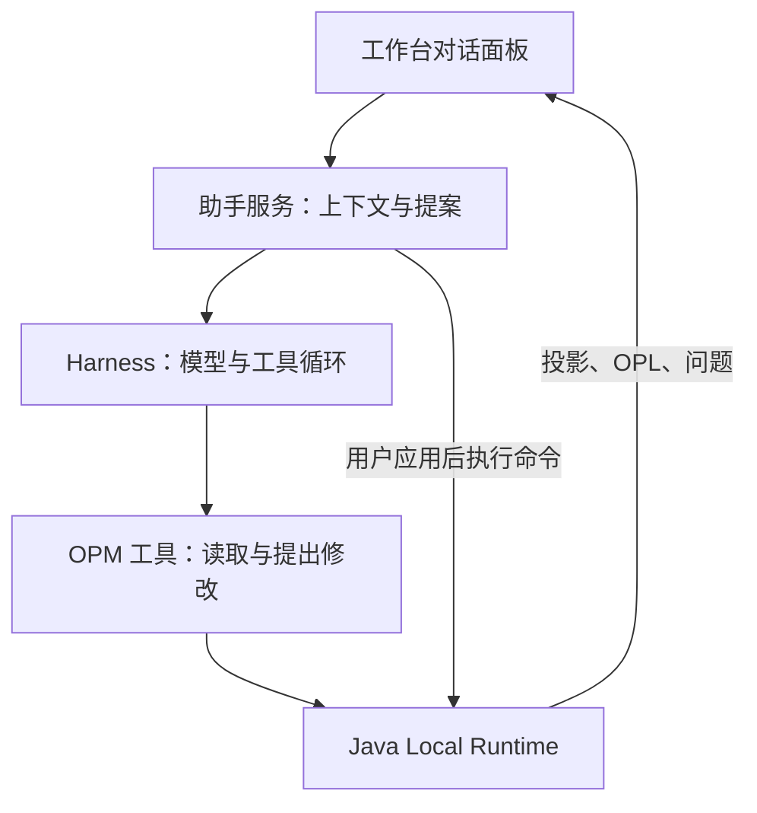

# 对话式智能建模助手设计

版本：v0.7；日期：2026-10-05；状态：第一版按[实现规格](../../specs/opm-conversational-modeling-implementation-task-spec.md)实施。当前 OPD 实时整图方案按[实时整图规格](../../specs/opm-assistant-live-plan-task-spec.md)扩展；跨图写入、自动细化与语义撤销仍为后续设计，不改变[现有设计基线](opm-design-freeze-baseline.md)的首期范围。v0.7 已实施脑图分析阶段 A/B 的单图流程，范围与证据见[脑图实施规格](../../specs/opm-mindmap-implementation-task-spec.md)。运行方式见[助手说明](../../apps/assistant/README.md)，证据见[实现检查记录](../checklists/opm-conversational-modeling-implementation-checklist.md)。

## 1. 目标与边界

通过多轮对话解释、补充和修改模型，在画布预览变化，应用后同步 OPD、OPL 和问题列表。默认围绕当前 OPD 工作，从第一版就检查整个模型中的关联影响。

第一版覆盖对象、过程、状态、关系及名称调整；支持已有父子图的关联读取和影响提示。跨图批量写入、自动细化建模及整组语义撤销在相应契约完成前禁用。跨模型编辑、多人协作、直接修改数据库或用自由 JSON 覆盖模型不在范围内。

交互入口位于左侧“智能助手”页签，与 OPD 导航共享侧栏；底部折叠或属性区关闭不影响使用。首次打开才挂载，随后切换保持会话、输入和后台订阅；切 OPD 仍按当前图范围恢复对话。助手默认 360 像素，导航沿用现有默认值，宽度分别保留在当前页面。窄于 680 像素时沿用上下排列，助手区高 480 像素、历史独立滚动。验证见[左侧迁移规格](../../specs/opm-assistant-left-panel-task-spec.md)。

## 2. 已核对事实

- Harness 本地源码 `5badb15009`：TypeScript SDK 支持具名 session 和事件流；持久化由 profile 提供；Workspace 绑定目录/cwd。SDK 无单轮取消及已实现的审批往返协议，接口尚不稳定。接入须固定版本，重启续聊需实测。
- 当前 OPM `a9461e9`：[草稿入口](../../apps/web/src/shared/api/draftWorkbenchSession.ts)已有投影、能力查询、语义命令及 token 校验；[子图删除](../../services/local-runtime/src/main/java/org/opm/localruntime/application/DraftContextDeletion.java)会计算子树并阻断外部引用。不能据此声称已有助手批量事务或语义撤销。

Harness 设计阶段复核入口（相对其仓库根目录）：`packages/sdk/client/src/api.ts`、`packages/sdk/protocol/README.zh.md`、`packages/workspace/workspace/src/types.ts`、`docs/cookbook/adding-a-tool.md`；当时仅核对源码。实施使用安装版 `@deepseek-ai/dsh`、`dsh-sdk-client`、`dsh-tools` `0.2.0-rc.2`，与上述源码快照分别记录。已验证用户指定的 `https://api.deepseek.com` / `deepseek-flash` 经 Messages 兼容端点调用；本地 SDK 适配提供新会话 create、持久会话 resume 和专用工具限制。

## 3. 会话与执行架构

| 业务对象 | 映射与职责 |
|---|---|
| 项目 | 一个助手工作区，目录用于资料和产物；目录不等于权限隔离 |
| 模型 | 语义一致性、版本冲突和写入串行化的单位 |
| OPD | 固定归属一个会话，切图自动恢复对应历史 |
| 对话 | 一个 Harness session，保存多轮历史和操作回执关联 |

服务端维护项目、模型、OPD、会话及 Harness session 的稳定 ID 映射。每个 OPD 固定一个工作台会话，首次自动创建，刷新和切图恢复同一身份；会话选择/新对话/常驻刷新控件已移除，失败时可重连。读取其他图不会创建新 session；第一版不提供“继续当前对话到此图”，对话归属不变。已生成提案及运行中的请求不随切图改变目标。存量多会话完整保留，优先绑定含运行中/中断生成或 pending 回执的一条，再取最近有内容的会话，primary 标记使后续绑定稳定。验证见[唯一会话规格](../../specs/opm-assistant-single-session-task-spec.md)。

同模型的不同 session 共享最新模型事实，不自动拼接彼此的聊天历史，也不维护独立模型副本。

第一版采用 Node.js 服务和 TypeScript SDK，通过 POST SSE 同步生成状态、回答和提案；回答在本轮结束后展示。专用 profile 仅开放 `read_model`、`get_capabilities`、`stage_change`、最终修正用的 `revise_plan` 和兼容旧单步的 `propose_change`，独立审查 session 仅开放 `read_review_model` 和 `submit_review`；禁用 shell、文件、web 和 subagent 工具。凭据留在服务端，工具按服务端绑定范围校验参数。Harness 负责推理，Runtime 决定操作是否合法。服务默认只监听本机 `17860`，验证本地来源、工作台会话和内部工具令牌；生产代理与多人部署尚未验证。

## 4. 父子图与跨图规则（约束）

父子 OPD 属于同一模型，通过细化边关联；创建子图不等于复制父图元素。相同名称也不等于同一元素：语义身份按 element/state/fact ID 判定，图上表现按 occurrence/context ID 判定。

| 场景 | 判定与行为 |
|---|---|
| 查询父图、子图或引用图 | 按需读取关联语义，不授予写权限，不自动修改 |
| 移动当前图的元素表现 | 只改该 occurrence 的布局，不移动其他图 |
| 修改被多图引用的名称、状态或关系 | 按共享语义计算所有受影响 OPD；不能伪装成本图修改 |
| 为父图过程创建子图 | 同时涉及父元素、子 Context 和细化边；必须预览关联变化 |
| 删除被细化元素、共享元素或子树 | 显示依赖及阻断原因；遵守现有 Runtime 规则，确认不能绕过禁用候选 |

第一版每轮按固定草稿 token 读取整个模型投影，包括父子图；最多 100 图、投影小于 1 MB，超限或读取不完整时拒绝修改。写入范围为当前图。影响计算由后端依据完整模型完成，不能依赖模型生成的清单或截断的提示词。

凡作用超出当前图，提案须列出直接修改、共享语义影响、受影响图及定位入口，再请求扩展本次范围。用户要求“只改当前图”而操作必然影响共享语义时，拒绝该操作并解释原因，不能静默复制元素。第一版若尚无跨图执行能力，只展示影响和原因，不出现可用的跨图应用按钮。

例：根图有“烘焙”过程，子图描述具体步骤。若子图引用同一“咖啡豆”，重命名须列出根图与子图；若只是同名独立对象则不联动。仅要求增加子图步骤，不代表允许删除父过程或改写兄弟图。

## 5. 多轮、提交与恢复（约束）

1. 每轮读取最新草稿 token、OPD、选中项、关联摘要和可用能力；历史只用于理解意图。资料作为数据处理，不能改变工具权限。
2. 工具通过 `stage_change` 连续生成高层步骤，以 local_id 别名引用先前创建的图元。Runtime 在独立副本中逐步绑定候选、验证步骤并返回完整投影；前端自动实时绘制，生成中不能确认。完成时再统一校验整组方案，用户只确认一次；失败、截断、未修正非法步骤或停止不能确认半张图，取消零写入。确认前继续对话会沿用未提交步骤与图元身份，新完整方案替代旧方案。同对象的输入状态、过程、输出状态按三端点查询状态变化候选，一个事实可在画布渲染为两段线。
3. “应用”绑定提案版本和范围。后端重新检查能力及 token；手工编辑或其他对话已修改同一模型时，旧提案失效并重新预览，不能覆盖或自动扩大范围。
4. 每模型串行提交；确认绑定基础 token 及整组结果。`APPLY_MODEL_PLAN` 在现有 Journal 单事务中重新解析并校验所有步骤，成功只增加一次 edit_seq，非法后续步骤或冲突零部分写入。方案上限 100 步，支持当前图对象、过程、状态、关系、改名和布局；跨图共享语义修改仍阻断。
5. 持久化提案、命令标识及回执关联；重试先查结果，避免重复创建。刷新、重启后核对实际模型；未知结果显示待核对，不能用助手文本判断成功。
6. 停止生成先关闭工具准入，再关闭本项目 Harness；已提交结果保留并展示。每项目同时运行一个生成，最长 180 秒、每轮最多 160 次工具调用，不影响其他项目。停止后同会话续聊及服务重启恢复已实际验证；SDK 非 completed 结束原因显示失败，不能把截断或阻断当作成功。

应用后刷新图、文本、问题和树导航，保留用户当前视图。会话历史由 Harness 持久化，业务映射和执行记录由助手服务原子文件管理，模型真值归 Runtime。未知结果保持 pending，重试先查原 command ID 的回执。OPD 删除后会话保留历史，生成和应用由 Runtime 拒绝；须切换到有效 OPD，由服务恢复其固定会话。导入模型使用新身份，不自动复用旧会话。

## 6. 验收与实施缺口

以下保留设计验收场景；第一版实际执行结果以[实现检查记录](../checklists/opm-conversational-modeling-implementation-checklist.md)为准，未开放能力不能标记为完成：

| ID | 观察结果 |
|---|---|
| AI-01 | 咖啡豆状态变化建模后继续补设备；无重复元素，画布、OPL、保存重开一致 |
| AI-02 | 刷新/重启恢复对话；切换父子图不改变运行请求或待应用提案的目标 |
| AI-03 | 同名不同 ID 不联动；共享 ID 改名列出全部受影响图；本图布局不串图 |
| AI-04 | 手工与助手交替编辑，旧提案失效；越界、只读、非法关系和依赖删除零写入 |
| AI-05 | 超时、断线、重复应用及进程停止后，通过回执恢复且不重复修改 |
| AI-06 | 跨图写入启用前验证组内失败零部分写入、父子图保存重开及整模型一致性；语义撤销另验，不复用布局撤销作证据 |

当前实现复用 Runtime 草稿能力、EDIT 和回执契约，新增本地助手 HTTP 接口与文件历史存储。实时整图扩展新增 `/draft/plan-preview` 查询和 `APPLY_MODEL_PLAN` 命令，数据库 schema 不变。已实施当前图对象、过程、状态、关系、名称和位置的实时整组方案及一次原子确认，旧单步提案兼容。跨图写入、自动创建细化子图、语义撤销和会话迁移仍禁用，启用前须另立执行契约并验证 AI-06。验收需服务端、契约及真实浏览器证据；故障注入、局部 OPL 断言与规则通过不等于真实网络所有故障或完整 ISO 符合性。

## 最终诊断与标准语义审查（已实施）

实时方案生成后，首先使用 Runtime 模型级 Findings，与问题面板复用规则。`plan-preview` 增加可选 `finalize`，最终预览返回 Findings，普通预览为 null；确认 Journal 事务重新检查阻断项，非法方案零部分写入。

平台通过后创建独立只读 Harness session，使用 deepseek-flash 和固定的 [OPM 标准审查 Skill](../../apps/assistant/skills/opm-standard-review/SKILL.md)，逐项审查冻结的整份模型投影、需求和暂存步骤。核对的原文为 `reference/ISO+19450-2024.pdf`，版本、SHA256、条款及 PDF 页码见 [规则目录](../../apps/assistant/skills/opm-standard-review/references/rules.json)。六组条款覆盖实体/活动、状态归属、消耗/结果/作用、输入输出状态变化、agent/instrument 以及图间事实一致性，不构成完整 ISO 符合性声明。

报告由封闭 schema 验证，服务端核对六项检查齐全、问题引用在快照内、检查与问题结论一致，并绑定方案和快照摘要。条款来源由服务端赋值；用户需求遗漏以 USER_REQUIREMENT 区分且不附虚假标准条款。报告缺失、截断、过期或当前规则版本/来源变化不能确认。前端展示诊断、条款、图元、建议与假设，保存及重启后保留。

存在平台阻断或审查 ERROR 时，由建模会话修正预览，最多两轮，每轮重新诊断并使用新的审查 session。`revise_plan` 仅在最终修正阶段替换全部未提交步骤，不删除真值图元、不开放跨图写入。审查 session 无建模权限，生成会话也不能在审查期间改动快照。停止、180 秒超时或仍有错误时禁止确认。用户仍只在最终完整方案上确认一次；旧整图提案缺少新报告时须继续对话重新生成，待核对回执兼容保留。

实现范围与实际验证证据见[任务规格](../../specs/opm-assistant-validation-review-task-spec.md)。报告是同一模型在隔离会话中的部分语义审查，不能替代完整标准认证或业务专家复核。

## 生成指导与质量建议（已实施）

当前图生成及修正轮加载独立的 [opm-modeling-guide](../../apps/assistant/skills/opm-modeling-guide/SKILL.md)，将业务目标、身份复用、对象/过程/状态选择、先实体后关系及可读性原则落实到现有暂存工具。不将 CWOPM 的格式字段、固定细化深度、方括号类型标题或同端点关系唯一性作为本平台契约。结构清单、只读解释及用户指定布局保持用户意图；父图相关对象只在本图已有 occurrence 时复用，不以同名独立复制冒充跨图继承。

质量检查在每轮最终投影上确定性计算，不增加模型调用。当前图密度、命名、身份核对、过程变换关系和布局间距/跨度报告保存为提案可选 `quality` 字段，绑定方案摘要、指导与策略版本及内容摘要。状态与属性不按顶层节点检查重叠；近义名称和同端点多条事实不自动判错。阈值由 [版本化策略](../../apps/assistant/skills/opm-modeling-guide/references/quality-policy.json) 配置，最多显示 50 条建议并注明遗漏数量。

面板以“建模质量”展示非阻断建议；平台 Findings 和独立标准语义审查继续决定最终确认资格。生成者仅根据需求改善质量，不因建议强制修正、合并、删除或增加确认。标准审查会话不加载生成指导，仍只允许专用只读工具。方案变化后旧报告清除并重算；保存及服务重启恢复，旧历史缺少字段仍可用。完整路由交叉、字体排版、父子图自动创建及多图事务不在本轮范围。

实现和验证见[生成指导与质量规格](../../specs/opm-assistant-generation-quality-task-spec.md)。

## 脑图分析衔接（阶段 A/B）

新增的[脑图分析与 OPD 转换设计](opm-mindmap-analysis-design.md)将业务梳理作为可选前置步骤。已实现一个模型一份脑图及固定分析会话；与 OPD 会话使用不同范围类型，复用项目工作区，不伪造 Context ID、不混合聊天历史，也不扩大现有会话权限。本文“每 OPD 一个会话”的现行规则继续适用于正式 OPD。

分析会话可逐步修改分析资料；用户触发生成时明确目标 OPD，再复用整图暂存、实时投影、平台 Findings、独立语义审查及一次确认。脑图主题/分类与正式元素分开，类型、状态归属、共享身份和关系歧义集中处理。首版单图转换不能自动创建细化子图，也不能把不支持的属性/条件静默转成其他元素。

转换方案除现有 DraftToken 外还须绑定脑图修订和来源摘要。脑图修改、手工编辑或绑定失效使旧方案过期；确认需受控地检查两个版本，模型修改、来源映射与回执保持一致。来源追踪用于重复转换和三方差异预览，不自动覆盖手工结果、删除正式元素或进行双向同步。

新增模型级 mindmap 操作、ANALYSIS 会话和来源契约已实现，分析资料保存到 Runtime SQLite V8。分析 session 只开放 read_analysis/save_analysis；转换按明确类型和关系编译步骤，复用逐步暂存和最终审查。来源修订/摘要、模型版本、映射与回执在确认事务保持一致，明确排除项可随转换记录恢复。阶段 B 单图与阶段 C 多图分别验收，后者尚未开放；具体证据及限制见脑图实施规格。
