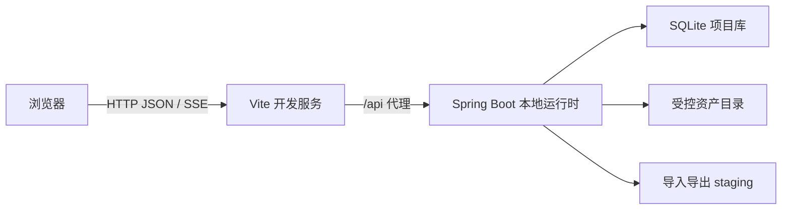
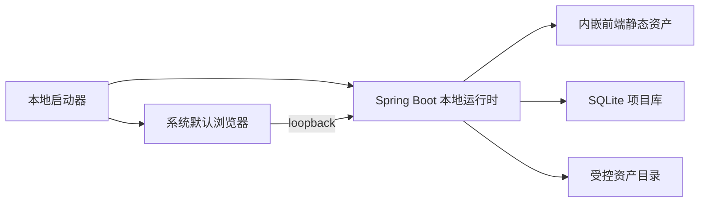

# OPM 单机建模工具开发技术基线

文档版本：`v1.2`

文档状态：`FROZEN_INCLUDED`；当前开发技术基线冻结

全局设计状态、延期边界和开发准入以 `opm-design-freeze-baseline.md` 为唯一事实源。

更新时间：2026-09-02

## Task Type

- `feature`

## 1. 文档目的

本文档冻结 OPM 单机建模工具首批开发使用的运行形态、工程结构、前后端技术栈、图形引擎、接口方式、本地存储、交换容器、任务通知、安全边界和版本锁定方式，关闭 `ARC-007/008/009`。

本文档是开发约束，不表示仓库当前已经存在工程代码、依赖锁文件或可发布安装包。

## 2. 输入基线

1. `docs/requirements/opm-online-modeling-tool-requirements.md`
2. `docs/design/opm-modeling-tool-architecture.md`
3. `docs/design/opm-modeling-tool-module-design.md`
4. `docs/design/opm-modeling-tool-application-api-contract.md`
5. `docs/design/opm-modeling-tool-persistence-contract.md`
6. `docs/design/opm-core-metamodel-field-schema.md`
7. `docs/design/opm-profile-package-field-schema.md`
8. `docs/design/opm-rule-definition-field-schema.md`

## 3. 已冻结技术决策

| 决策 | 状态 | 冻结内容 |
| --- | --- | --- |
| ARC-007 | ACCEPTED | 本地应用运行时仅监听 loopback，并由默认浏览器打开工作台；开发态前后端双进程，发布态由本地运行时提供静态前端 |
| ARC-008 | ACCEPTED | SQLite 项目数据库 + 受控资产目录 + `.opmp` ZIP 原生交换包 |
| ARC-009 | ACCEPTED | Vue 3/TypeScript/Vite/Element Plus/AntV X6 前端，Java 21/Spring Boot 3/Maven 后端，Flyway+SQLite，JSON Schema 2020-12，OpenAPI 3.1，JUnit/Playwright 测试 |

技术组件的 major 版本由本文冻结；首个工程提交使用 lockfile、Maven dependency management 和构建工具锁定准确版本。未经过 ADR 变更不得替换框架、图形引擎、数据库或交换编码。

## 4. 运行拓扑

### 4.1 开发态



1. Vite 和 Spring Boot 分别启动，Vite 只代理 `/api/v1` 与 `/api/v1/events`；
2. 浏览器只访问 Vite origin，写请求由代理转发，避免开发态跨源漂移；
3. SQLite、staging 和资产目录由本地运行时独占管理，前端不得直接访问文件；
4. 端口通过启动参数配置，默认只绑定 `127.0.0.1`，禁止 `0.0.0.0`。

### 4.2 发布态



发布态只有一个本地服务 origin。启动器等待健康检查成功后打开浏览器；关闭时若存在未提交候选，工作台必须给出明确提示，运行时只在无活动写事务时退出。

## 5. 前端基线

| 领域 | 技术 | 使用边界 |
| --- | --- | --- |
| 语言 | TypeScript strict | 禁止 `any` 绕过核心 DTO；生成类型与手写 view model 分层 |
| 框架 | Vue 3 Composition API | 页面与状态组合；不在组件内实现 OPM 领域规则 |
| 构建 | Vite，Node.js 22 LTS | 统一开发、测试和生产构建入口 |
| UI | Element Plus | 表单、表格、弹层、树和反馈；主题 token 统一覆盖 |
| 状态 | Pinia | workspace/session/view 状态；服务端 Revision 是正式状态 |
| 路由 | Vue Router | P01-P06 路由；写命令不由路由副作用触发 |
| 图形 | AntV X6 | 自定义 OPM 节点/边、端口、选择、路由和视口；X6 cell 不是语义事实 |
| API | 由 OpenAPI 生成 TypeScript client | 禁止页面自行拼 URL 或复制 DTO |
| 测试 | Vitest + Vue Test Utils + Playwright | 组件状态、交互和 P0 主路径 |

### 5.1 图形边界

1. `Semantic Model -> Context Projection -> X6 Cell ViewModel` 单向生成；
2. 拖拽、连线、改名等交互先形成候选 Command，成功提交后再用服务器投影替换画布；
3. 普通 viewport、hover、selection 和临时 route 不发送语义命令；
4. X6 History 只用于临时交互，不替代 M03 Undo/Redo；
5. 自定义 shape 和 connector 只读取 Symbol Catalog，不硬编码配置档能力。

### 5.2 浏览器基线

1. 根 lockfile 固定 `@playwright/test=1.57.0`，对应 Chromium `143.0.7499.4`、Firefox `144.0.2`、WebKit `26.0`；
2. Chromium 承担全部 P01-P03、完整画布、visual、E2E、性能、恢复和 release smoke；Firefox/WebKit 承担核心主路径并阻断不兼容发布；
3. Launcher 打开默认浏览器，但应用必须在进入项目或工作台前校验版本和必需 Web API；
4. 不受支持的默认浏览器只显示兼容性阻断页，允许复制 loopback 地址并重新检测，不允许忽略继续或发出写命令；
5. 版本、视口、跨浏览器验收和变更入口以 `opm-design-freeze-baseline.md` 第 3 章为准。

### 5.3 OPD 元素渲染架构

1. Object、Process、State、Attribute、Operation 各自使用唯一独立 Definition 文件，共同实现类型安全 `OpdNodeDefinition`；不使用 Vue 组件类继承，也不为每个画布实例创建代码文件。`Node` 只表示画布图元，不改变领域 Element/State/Feature 分类。
2. `NodeDefinitionRegistry` 负责 kind 到 Definition 的封闭映射；共享 X6 adapter 是 RenderSpec 到 Cell 的唯一 owner。
3. 基础 Relation Registry 按 Capability ID 注册 16 个 Procedural 与 10 个 Structural Definition；Control Decorator Registry 按 `control.capability` 注册 8 个 Decorator，不把 Control 建成第二关系。
4. Procedural、Control、Structural 只作为目录、共享 helper 和测试分组；production renderer 禁止以 family 为最终查找键或聚合 16/8/10 大型条件分支。
5. Editor、Definition、RenderSpec、Registry、X6 adapter 和 Workbench Command adapter 必须分层；Profile 合法性和 Command 允许性仍以 Runtime Capability Query 为准。
6. 内置 registry 是编译期显式装配，不是第三方插件 API；Profile、Rule、Grammar 和 Symbol 资产不得加载或执行 JavaScript。
7. 正常 Projection 更新使用 occurrence-keyed 增量调和；选择、Finding、viewport 和单元素更新不得通过 `graph.clearCells()` 全量重建。
8. 完整接口、目录、诊断、影响边界、迁移和验收以 [OPD 节点定义与渲染注册架构](opm-opd-node-renderer-architecture.md) 为唯一实现输入。

## 6. 本地运行时基线

| 领域 | 技术 | 使用边界 |
| --- | --- | --- |
| 语言 | Java 21 LTS | 启用编译器严格警告和不可变领域值对象 |
| 框架 | Spring Boot 3 | 本地 HTTP、应用装配、健康检查和任务执行 |
| 构建 | Maven Wrapper + 多模块 | 根聚合、依赖集中管理、可复现构建 |
| JSON | Jackson | DTO 映射；Canonical JSON 由独立组件固定排序和数字格式 |
| Schema | JSON Schema 2020-12 validator | 导入、Profile/Rule 加载和 Revision 提交前验证 |
| 数据访问 | JDBC + 明确 Repository | 不把 ORM 实体当领域对象；SQL 和事务边界可审计 |
| 迁移 | Flyway + SQLite SQL | 启动前 validate，显式执行 migration，失败不开放写服务 |
| API | OpenAPI 3.1 contract-first | Java/TypeScript 类型由同一契约生成或校验 |
| 测试 | JUnit 5 + Spring Boot Test | 领域、应用、持久化和本地 HTTP 集成测试 |

M01-M12 保持模块化单体边界。表现层不得依赖 JDBC；Controller 不承载规则；M12 适配 SQLite、文件、时钟和任务，不拥有 OPM 语义。

## 7. HTTP 与任务通知

1. API 前缀固定 `/api/v1`；首批 operationId 继续使用 `API-*` 稳定编号；
2. 命令使用 `POST`，查询使用 `GET`；不以 `PUT/PATCH` 隐含绕过 revision 守卫；
3. 模型写命令必须携带 `command_id`、`base_revision`、Profile 和 Rule 绑定；
4. 后台任务创建后返回 `202 + task_id`；任务状态可由 `GET /tasks/{taskId}` 查询；
5. 进度通知固定使用同 origin SSE `/api/v1/tasks/{taskId}/events`，断线后以 task 查询恢复，不依赖事件不丢失；
6. HTTP 状态只表达传输层结果，业务阻断仍返回结构化 `ErrorDetail` 和 Finding；
7. 未进入首批 OpenAPI 的操作继续以应用 API 契约为设计源，不允许临时增加未编号端点。

## 8. 本地安全

1. 监听地址固定 loopback；启动时检测实际 bind address，非 loopback 直接失败；
2. 每次启动生成内存态 `local_session_token`，由启动页下发到同 origin 前端，写请求使用 `X-OPM-Session`；token 不写入模型、日志或交换包；
3. 所有写请求校验 `Origin`、`Host` 和 session token；
4. 文件选择由受控入口返回 opaque handle，页面不得传任意绝对路径；
5. 导入、恢复和解压在独立 staging，限制大小、条目数、压缩比、路径和 schema 深度；
6. CSP 禁止远程脚本和 `eval`；Profile、Rule、Grammar 与原生包均不得执行代码或网络调用；
7. 首期不提供登录、用户、角色和远程访问，不把 local_session_token 描述为用户认证。

## 9. 存储与交换基线

| 能力 | 冻结方案 |
| --- | --- |
| 活动项目存储 | 每个 Project 一个 SQLite 文件，单写连接协调，WAL 模式 |
| 大资产 | Project 相邻受控资产目录，内容寻址命名，Manifest 管理 |
| Revision | 不可变 Canonical JSON 文档 + digest，索引表可重建 |
| Profile/Rule/Grammar | 版本化只读 Package，按 ID/version/digest 缓存 |
| 迁移 | Flyway SQL 管 storage schema；Profile/Rule 迁移产生新 Revision |
| 原生交换 | `.opmp` ZIP，`manifest.json` + Canonical JSON entries + SHA-256 |
| 备份 | SQLite 一致性快照 + required 资产 + Profile/Rule 闭包 |

SQLite 是一期唯一目标数据库。本基线不声明兼容达梦、MySQL 或 PostgreSQL；未来支持其他数据库必须新增物理适配与真实方言验证，不能复用 SQLite 结果推断。

## 10. 建议工程结构

```text
apps/
  web/                         Vue 3 工作台
services/
  local-runtime/               Spring Boot 聚合与启动
  modules/                     M02-M12 模块
packages/
  openapi/                     OpenAPI 源与生成配置
  schemas/                     MS/PS/RS JSON Schema
  profiles/                    ISO/CN Profile Package
  rules/                       Rule Set
  grammar/                     OPL/OPT 语法与生成资产
migrations/
  sqlite/                      Flyway SQL
tests/
  fixtures/                    代表性模型和破损包
  e2e/                         Playwright P0 路径
prototype/                     设计原型，不进入生产构建
```

公共 contracts 不依赖业务模块；模块只能通过应用命令、查询和端口协作，禁止跨模块直接访问 Repository。

## 11. 构建与质量门槛

| 层 | 必须具备的工程命令 |
| --- | --- |
| 根目录 | `./mvnw verify`、Web install/build/test、contract/schema validate、e2e smoke |
| 前端 | lint、typecheck、unit、production build |
| 后端 | unit、module integration、SQLite migration test、package test |
| 契约 | OpenAPI lint/generate diff、JSON Schema meta/example validate |
| 发布 | clean machine smoke、loopback bind check、backup/restore roundtrip |

准确命令在首个工程脚手架提交中落盘；未存在的命令不得在当前文档阶段报告为已执行。

## 12. 兼容与变更控制

1. API、storage、exchange、Profile、Rule、Grammar、schema 和 application version 分开演进；
2. OpenAPI 破坏性变更需要 major API 版本或兼容窗口；
3. SQLite 迁移采用 expand/migrate/contract，已发布 Flyway 文件不可修改；
4. Profile/Rule/Grammar 升级不覆盖旧 Baseline 所需资产；
5. 图形引擎和 UI 框架升级必须通过 prototype golden screenshot、P0 e2e 和 300/600 性能集；
6. 技术栈替换必须新增 ADR，不得仅修改依赖版本。

## 13. 事实与建议

### 13.1 已确认事实

1. 用户已要求补齐设计并直接进入开发，因此本轮采用既有推荐方案关闭 ARC-007/008；
2. 当前仓库仍没有生产工程、依赖和运行实现；
3. 一期产品为单用户、单设备、本地运行，不需要远程数据库或账号体系；
4. 本文冻结技术边界，不构成性能、迁移或 ISO 符合性执行证据。

### 13.2 开发约束

1. 首批开发必须从 contracts/schema/migration 验证开始，再实现 UI 和领域模块；
2. 依赖准确版本由首个 lockfile 和 Maven dependency management 固定，并在开发执行包验收；
3. 任一 PoC 发现 SQLite、X6 或本地浏览器形态无法满足 P0 门槛时，先提交 ADR 和证据，不在实现中静默换栈。
