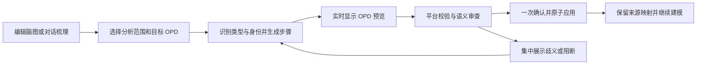

# 脑图分析与 OPD 转换设计

版本：v0.2；日期：2026-10-05；状态：阶段 A/B 已实施，阶段 C/D 为后续设计。本文补充[工作台页面设计](opm-modeling-workbench-page-design.md)与[智能助手设计](opm-conversational-modeling-design.md)，不改变[现有冻结基线](opm-design-freeze-baseline.md)。原设计检查见[检查记录](../checklists/opm-mindmap-analysis-design-checklist.md)，实施范围、证据及限制见[实施规格](../../specs/opm-mindmap-implementation-task-spec.md)。

## 1. 定位与决策状态

让用户先整理目标、对象、活动、状态和待解决问题，再生成可编辑的 OPD。脑图是模型的分析资料，允许不完整、存在假设和仅用于分类的节点；正式语义仍由 OPM 模型承载。脑图不是 ISO 图形，也不因形成树形层级就自动满足 OPM 细化规则。

| 决策 | 状态与依据 |
|---|---|
| 增加先分析、后生成 OPD 的设计 | 用户已授权实施；首版提供阶段 A/B 单图流程 |
| 脑图为可选入口，保留直接画 OPD 和直接对话建模 | 已实现；工作台默认进入 OPD，可切换脑图分析 |
| 一个模型首版对应一份脑图，首轮推荐生成根 OPD | 已实现；模型级固定分析会话，转换时选择一个目标 OPD |
| 分析树、OPM 语义关系和 OPD 细化层级分别表达 | 约束；三种关系不能相互隐式转换 |
| 实时预览、完成后校验、一次确认 | 约束；延续现有助手交互和用户偏好 |
| 首版单 OPD 转换，父子图自动生成分阶段交付 | 约束；当前整图执行契约不支持创建 Context 和跨图步骤 |
| 具体组件、布局算法、物理存储和接口路径 | 首版使用 Vue/HTML 节点与 SVG 树线、树布局、Runtime SQLite V8 和 mindmap 操作，未增加依赖 |

首版非目标：通用脑图产品的全部样式能力、多人同时编辑、XMind 等第三方格式、OPD 到脑图的完整逆向转换、双向自动同步、批量删除正式元素和跨模型转换。

## 2. 实施基线与当前能力

2026-10-05 在 `c389970` 核对原能力，并在本轮扩展：

- [实时整图规格](../../specs/opm-assistant-live-plan-task-spec.md)及[助手服务](../../apps/assistant/src/service.mjs)已有逐步暂存、实时投影、最终校验、一次确认及结果恢复。
- [ModelPlanStep 契约](../../apps/web/src/shared/api/generated/draftWorkspaceContract.ts)支持当前图对象、过程、状态、关系、名称和位置修改；一个方案最多 100 步。普通草稿命令支持创建 Context，不代表整图方案支持该步骤。
- OPD 会话仍以项目、模型、OPD 绑定；新增 ANALYSIS 固定会话以项目、模型、mindmap ID 绑定。脑图独立修订，确认同时检查分析修订/摘要与 DraftToken，来源映射与模型/回执在 Journal 同一事务写入。
- 平台 Findings 与独立标准语义审查可复用，质量建议继续作为非阻断信息；不能把现有规则覆盖或模型回答当成完整 ISO 符合性证明。

新增能力按独立实施规格交付。下面保留完整设计目标，实际范围与证据以实施规格为准；多图阶段的要求不能用单图结果替代。

## 3. 工作台交互

### 3.1 入口、画布与会话

中央工作区增加稳定的“脑图分析 / OPD 建模”模式切换。脑图占用主画布，左侧继续使用“导航 / 智能助手”；分析详情和转换操作放在脑图内部的独立详情栏，窄屏改为上下布局。原 OPD 属性区和底部的折叠不影响分析操作。顶部保留模型身份，局部显示“分析已保存”或“分析未保存”，不借用 OPD 的“草稿已保护”表示脑图保存成功。

进入模型默认沿用 OPD 模式，从中央模式栏选择脑图分析。OPD 保持挂载，脑图保留选择、展开和撤销记录；进入脑图时适应视口，刷新恢复已保存资料与折叠状态。脑图模式下 OPL、模型问题等区域仍属于正式模型。

会话归属：同项目复用 Harness 工作区；脑图拥有固定分析会话，按 `projectId + modelId + mindmapId` 绑定，使用明确的 ANALYSIS 类型，不伪造 Context ID。SDK session 使用 `analysis.<会话ID>`，只开放 `read_analysis` 和 `save_analysis`。原 OPD 固定会话继续按当前规则恢复，两者不自动合并聊天历史。脑图会话生成提案时，服务端绑定用户选定的目标 OPD；切换模式或图不会改变运行任务的目标。

分析助手左侧提供“根据脑图生成 OPD 预览”，与脑图详情生成按钮共用目标、明确排除和保存流程。用户无需新建 OPD 或会话；正式模型为空、分析节点尚未绑定是首次转换的正常情况。生成前集中展示不支持项、未分类和依赖问题，支持定位与显式排除；原文保留，服务端仍执行最终守卫。模型指导说明当前页面入口，不能把分析工具自身的权限限制解释成用户无法转换。转换业务错误不显示连接重试。

### 3.2 脑图编辑

- 中心主题为模型分析主题，可编辑；默认分支建议“目标与范围、对象、过程、状态与条件、待确认问题”，可自由调整，模板标题不生成正式元素。
- Enter 新增同级节点，Tab 新增子节点，F2 或双击改名；拖动调整父级与顺序，支持折叠、删除、撤销/重做、搜索、平移和缩放。快捷键仅在脑图画布获得焦点时生效，不抢占文本输入。
- 节点类型包括主题、对象、过程、状态、属性、约束/问题、未分类；类型使用图标和文字提示，不仅靠颜色。用户手工指定的类型优先于助手推断。
- 状态另有“所属对象”，属性另有“所属元素”；拖动树节点不会静默改变语义归属。重复引用可选择同一候选实体；同名节点不自动合并。
- 关系说明以自然语言或明确引用补充，例如“操作人员执行烘焙”“烘焙机支持烘焙”。节点顺序仅表示分析顺序，不自动成为时序关系。
- 脑图允许暂时不完整；无法转换的节点保留原文、原因和定位入口，用户不必为了保存分析而先补齐全部 OPM 信息。

### 3.3 从分析到确认

“生成 OPD”默认纳入当前脑图的有效节点与关系；首版通过显式勾选排除项收缩范围，不提供单击分支自动选范围。依赖的所属对象、状态和已有绑定一并展示，不能悄悄丢弃依赖。首次推荐根 OPD，已有模型必须清楚展示目标 OPD 及“补充现有模型”含义；不清空目标图，不自动把每个分支生成一个子图。

生成后自动打开目标 OPD 预览，并提供“返回脑图”入口；保留左侧对话。步骤逐渐出现在画布中，但不写入正式模型。进度显示运行阶段和已暂存修改数，不虚构完成百分比；保持用户手动平移、缩放及向上滚动的意图，不随每次事件重置视口。

明确的信息直接生成，候选解释记入摘要。影响元素类型、身份、状态归属或关系含义的歧义集中列出，提供少量可选解释，禁止自行编造。用户可一次回答多个问题；如果决定暂不处理，必须显式缩小转换范围，并显示排除项。没有排除的阻断项不能以“部分成功”确认。

生成和审查期间只提供停止操作；就绪后显示新增/复用/修改数量、未纳入内容、假设及目标图，提供“确认应用”和“取消”。取消或停止保留脑图和对话，清除未应用预览，不修改正式模型。确认后回到正式 OPD，可从生成元素定位来源节点。

## 4. 语义转换规则

转换输入是带稳定身份和引用的分析结构、用户需求及最新模型快照，不能只把一张脑图图片交给模型猜测。先识别实体与依赖，再查询 Runtime 能力并生成步骤；关系类型和可执行性最终由 Runtime 判定。

| 分析内容 | 转换规则与歧义处理 |
|---|---|
| 主题、目标、分类标题 | 保留为分析资料；只有明确指定为对象/过程时才成为元素 |
| 对象候选 | 创建对象或复用明确绑定的 element ID；名词仅作识别提示，不作为充分证据 |
| 过程候选 | 表达活动或变换；动词识别仍须结合上下文，避免把“订单处理系统”误当过程 |
| 状态候选 | 必须绑定唯一对象；状态描述不能默认转成独立对象，也不能因位于过程分支下就归属过程 |
| 属性候选 | 明确所属元素及含义；首版整图步骤不支持 CREATE_FEATURE，保留为待补充项，不伪装成对象或静默遗漏 |
| 条件、约束、业务问题 | 先保留说明；只有语义明确且当前能力可表达时才转换，不声称任意自然语言条件都已落实 |
| 输入、输出、改变 | 区分消耗对象、产生对象和同一对象改变状态；核对身份和状态归属后选择关系 |
| 人员、设备 | 判断执行者与所需工具的区别；不能仅按“人/机器”词语机械判定 Agent/Instrument |
| 父子分支 | 默认仅为分析组织关系；组成、分类、状态归属、细化必须各自有明确证据 |
| 顺序与交叉引用 | 不依据上下位置或兄弟节点顺序推导执行先后；跨分支引用不自动生成 OPM 连线 |

既有 ID 绑定优先；其次匹配类型、上下文和业务说明，仅作为复用建议。发现同名不同 ID 时要求选择或保留独立身份；发现同一实体多个引用时允许多个脑图节点追踪同一语义实体。同一对端点可能有多个合法事实，不能只按端点去重。

示例：“咖啡豆从待烘焙变成已烘焙，烘焙由操作人员执行并使用烘焙机”。候选结果是一个咖啡豆对象及两个所属状态、烘焙过程、操作人员和烘焙机对象；状态变化依据输入状态—过程—输出状态候选生成。若未另行描述投入产出，不额外创建两个咖啡豆对象或叠加 Consumption/Result 事实。

## 5. 父子图与共享身份

模型级脑图可以分析多层内容，但转换范围由目标 OPD 和已开放能力控制。

第一阶段只生成一张图。识别到“烘焙包含加热、恒温、冷却”等细化意图时，提供“建议细化烘焙”的分析标记；用户可将细节暂不纳入本轮转换，或调整为单图范围。不能自动平铺全部细节后声称已完成父子建模，也不能生成孤立的虚假子图占位。

后续父子图生成需显式描述“被细化元素 → 子 Context → 内部元素/事实”。各图的语义元素、状态、事实以稳定 ID 复用，布局以 occurrence/context 区分。同一咖啡豆的子图表现应引用同一对象；同名业务对象只有经确认才合并。共享名称和状态的修改必须列出全部受影响图。

多图预览应提供整组图清单和逐图查看，完成后一次确认。启用前需要扩展方案步骤、全模型影响检查、跨图原子事务和保存重开验证；不能通过依次提交多个单图方案冒充整组原子确认。父图的外部接口和子图的内部行为还需进行一致性审查。

## 6. 数据、版本与转换记录

首版由 Local Runtime 管理模型下的分析资料与转换来源，助手保存对话与生成过程；前端通过应用接口访问。物理结构见 [V8 迁移](../contracts/migrations/sqlite-mindmap/V8__mindmap_analysis.sql)，严格字段见 [草稿契约](../contracts/schemas/opm-draft-workspace-v02.schema.json)。下表为逻辑职责，实体声明通过节点引用实现，不另建实体表。

| 逻辑对象 | 必需信息与职责 |
|---|---|
| MindmapDocument | 项目/模型由请求路径绑定；格式版本、mindmap ID、独立修订、根 ID、节点集与关系说明 |
| MindmapNode | 稳定 node ID、父 ID、顺序、原文、备注、类型、owner_id、entity_ref、target_id 和 collapsed；视口不持久化 |
| AnalysisEntity | 首版以同类型节点的 entity_ref 引用规范节点，owner_id 表达归属，target_id 表达明确正式绑定；同名不自动合并 |
| RelationIntent | 首版 MindmapRelation：稳定说明 ID、label、capability_id 和有序节点端点；未知关系能力可为 null，不等同正式 Fact |
| ConversionPlan | plan/command ID、源脑图修订及摘要、目标 OPD、基础 DraftToken、纳入与排除的源 ID、步骤和状态 |
| ConversionResult | 原命令回执、实际提交 token、源节点/实体/说明到正式 element/state/fact ID 的映射、目标 occurrence/context、应用结果 |

脑图修订号与模型 DraftToken 独立。编辑、自动保存和撤销脑图不改变模型 edit_seq，不触发 OPL 生成；模型变化也不把脑图标记成“自动同步”。保存失败保留编辑内容并明确未保存，刷新恢复以最后成功持久化版本为准。生成只使用已持久化的分析快照。

脑图树必须无环、根唯一、父引用有效；语义引用单独校验，分析阶段可以记录待解决引用，转换阶段禁止未解决依赖进入方案。删除分析节点先显示受影响的分析引用；已生成模型不随之删除，历史转换记录保留来源快照。

首版已提供独立脑图 JSON 导入/导出，包含版本、原文、类型与引用，不含凭据或聊天历史。导入建立新分析身份；来自其他模型的正式 ID 绑定默认解除并要求重新匹配。已有模型/OPD 原生导出继续按其既有契约执行；包含分析资料的整模型交换需另行版本化，界面明确模型包是否包含脑图。

## 7. 重复转换、冲突与失败恢复

| 场景 | 必须满足的行为 |
|---|---|
| 已生成后再次点击转换 | 根据来源映射、基础版本与最新模型计算差异；无变化时提示，无新增副本 |
| 脑图增加或改名，模型对应实体未变 | 预览新增或更新；更新遵守当前 OPD 的共享影响限制 |
| 用户在 OPD 中手工修改对应实体 | 做源分析/上次应用结果/当前模型的三方比较；双方改动同一字段时显示冲突，不覆盖 |
| 移动、折叠脑图节点 | 仅改变分析结构或视图，不自动移动 OPD 元素；重新布局须为明确操作 |
| 删除脑图节点 | 显示“来源已移除”，不自动删除正式元素；首版正式删除继续走现有画布流程 |
| 正式元素被删除、重建或重新导入 | 原映射失效，提示重新绑定；不能按同名自动认领或擅自重建 |
| 生成中脑图或模型被修改 | 绑定快照的方案标记过期，旧事件不能恢复为可确认；保留分析内容供重新生成 |
| 模型未完成、超时、停止或服务重启 | 未就绪方案不可应用，分析和已持久化对话可恢复；不宣称模型进程可无损续跑 |
| 确认响应丢失或重复点击 | 保持原 command ID 查询回执；提交未知时禁止用新 ID 重提，防止重复创建 |

确认须同时检查源脑图修订和目标 DraftToken，并与正式修改处于同一受控事务边界，避免“检查后源又变化”的竞态。源守卫与来源映射已在 Runtime 确认事务中实现，不仅在前端检查。

模型修改、完整来源快照、纳入/排除信息、映射和成功回执在同一 SQLite 事务持久化。助手历史写入失败或响应未知时优先查询原命令回执；来源后来改变也不重复执行已经提交的命令。转换记录恢复目标 OPD 上次明确的排除选择。

分析助手与 OPD 助手共用既有项目生成互斥和模型提交串行化。脑图生成任务可读取明确授权模型的事实，不能因拥有分析会话而获得所有 OPD 写权限。只读 Revision 中不能应用转换或把活动脑图冒充历史分析快照；首版仅在活动草稿入口提供脑图编辑。

规模限制分开处理：脑图节点数不等于建模步骤数。转换前估算范围，生成中继续强制步骤、上下文及时间上限；超限要求缩小分析范围，不能静默截断或自动分批提交。首版上限为 300 节点、100 关系与 100 项正式修改；这属于输入守卫，不代表已完成大规模性能验收。助手单次 document_json 最多 128000 字符，本地助手 HTTP 请求与脑图导入文件最多 256 KiB；较大资料需要收缩或分轮分析。

## 8. 分阶段交付与验收

| 阶段 | 可交付结果 | 前置边界 |
|---|---|---|
| A：分析编辑 | 模型级脑图、基本编辑/撤销、持久化、分析会话、JSON 交换 | 分析数据版本化；尚不能标记脑图转 OPD 已完成 |
| B：首个完整版本 | 单图实时转换、语义识别、现有 ID 复用、最终校验/审查、一次确认、来源追踪和增量预览 | 新增源版本守卫/回执映射；支持范围不超出现有步骤契约 |
| C：多层建模 | 从明确细化意图生成父子图、共享实体、多图预览和整体确认 | 独立扩展跨图执行契约并验证全组原子性 |
| D：后续评估 | 更多属性/条件能力、分析与模型差异辅助整理、第三方格式 | 按用户价值和能力目录推进，不承诺完整双向同步 |

阶段 A/B 已实施；下表保留总体验收要求，实际测试范围、通过证据与未测场景逐项记录在实施规格，MM-11 随阶段 C 后置：

| ID | 场景与可观察结果 | 阶段 |
|---|---|---|
| MM-01 | 创建、改名、拖动、折叠、撤销脑图；保存、刷新及服务重启后内容和身份一致，模型 token 不变 | A |
| MM-02 | 对话生成/修改脑图；切模式和 OPD 后恢复各自会话，旧事件不污染当前画布；关闭底部和属性仍能操作 | A/B |
| MM-03 | 咖啡豆状态变化示例得到一个对象、两个所属状态及正确关系；分类标题不成为元素，OPL 与确认结果一致 | B |
| MM-04 | 同名不同实体不误合并，同一实体多处引用不重复创建；不支持的属性和歧义集中提示，未排除阻断不能确认 | B |
| MM-05 | 生成中可见渐进 OPD，正式 token 不变；通过校验/审查后一次确认仅一次提交，取消/停止零正式修改 | B |
| MM-06 | 相同脑图重复转换不重复创建；新增、改名可预览差异，删除分析节点不删除正式元素 | B |
| MM-07 | 生成后修改分析、手工改模型或切只读；过期/越界方案阻断，三方冲突不覆盖手工内容 | B |
| MM-08 | 响应丢失、重复确认、服务重启、助手历史写入失败；回执与来源可恢复且无半组结果、无重复元素 | B |
| MM-09 | 脑图 JSON 往返保持原文和内部引用；跨模型导入不复用外部正式 ID；损坏/循环/未知版本被明确处理 | A |
| MM-10 | 1600/1280/820/390px 下模式和主要操作可达；节点/步骤超限不截断，渲染预算实测并记录 | A/B |
| MM-11 | 生成烘焙父子图，共享咖啡豆身份一致，细化绑定正确；任一子步骤失败全组零写入，保存重开及 OPL 一致 | C |

MM-03/04 除确定性转换和负例外，需要真实 DeepSeek 端到端证据；模型供应商、模型 ID、需求、平台诊断、语义审查与最终保存结果分别记录。通过这些用例仍不能推导任意自然语言需求都正确或完整符合 ISO。

## 9. 当前实现边界

阶段 A/B 按独立 L3 规格实施，新增模型级 mindmap 操作、ANALYSIS 会话、来源契约和 SQLite V8。支持对象、过程、状态、明确关系的新建以及名称增量更新；类型、归属、关系端点/能力发生变化时明确阻断，要求通过正式模型编辑处理。属性、约束与未分类项保留在分析中，转换须明确排除，不能自动转换成其他元素。

首版保持“一模型一脑图、单目标 OPD、人工编辑与助手共用分析数据”。支持向已有单个子 OPD 转换，但不自动生成父子图或跨图共享 occurrence。阶段 C 的多图事务、第三方格式、完整双向同步及 300 节点性能基准仍未实现/验证。历史 Revision 禁用活动脑图入口；现有模型/OPD 交换包不包含脑图，迁移分析须单独导出脑图 JSON。
