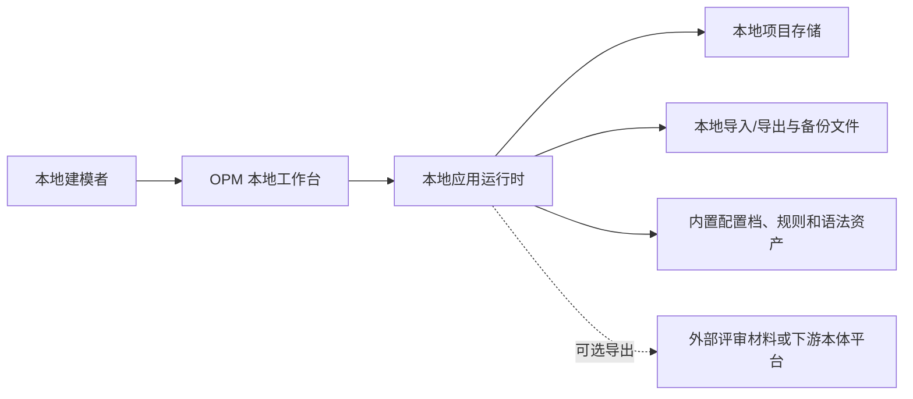
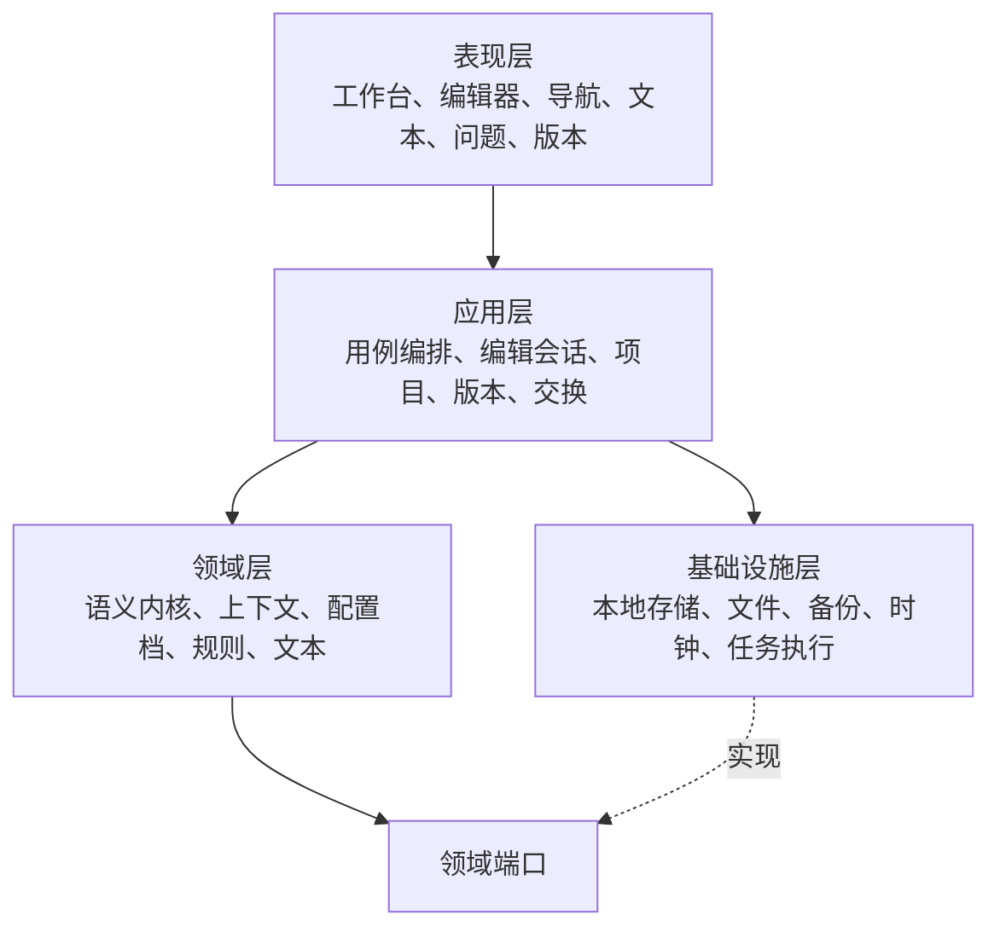
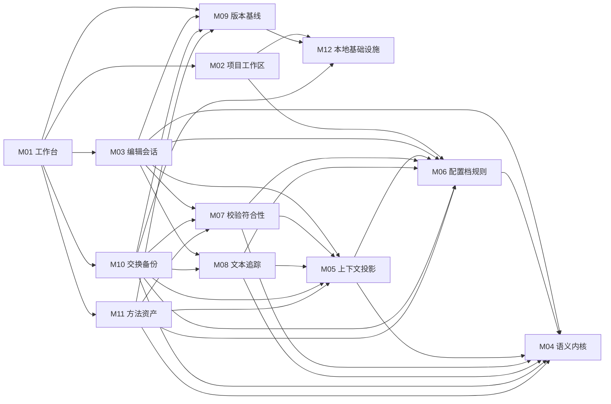
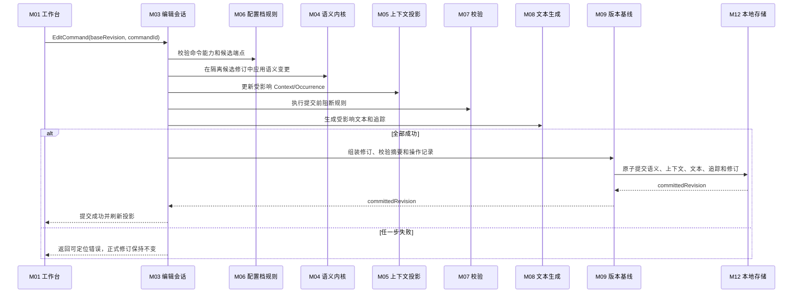

# OPM 单机建模工具顶层技术架构

文档版本：`v0.5-draft`

文档状态：逻辑与 P0 物理架构冻结，可进入开发

更新时间：2026-07-27

## Task Type

- `feature`

## 1. 文档范围

本文档定义 OPM 单机建模工具的系统边界、逻辑分层、一级模块、依赖方向、核心数据流、事务原则、运行边界和架构决策状态。

本文档回答：

1. 单机产品由哪些逻辑模块组成；
2. 哪个模块拥有语义事实、OPD 上下文、文本、规则、版本和本地数据；
3. 一次 OPD 编辑如何在图文等价和原子保存约束下提交；
4. ISO 19450:2024 与中文草案如何共享公共内核但保持扩展隔离；
5. 哪些架构决策已冻结，哪些仍需产品或技术评审。

本文档负责逻辑架构。P0 编程语言、前端框架、数据库、运行形态、API 和 DDL 由开发技术基线及机器契约冻结；安装脚本仍由生产开发包承接。

## 2. 上游设计输入

1. `docs/requirements/opm-online-modeling-tool-requirements.md` `v0.13-draft`
2. `docs/requirements/opm-profile-capability-matrix.md` `v0.3-draft`
3. `docs/requirements/opm-requirement-acceptance-matrix.md` `v0.7-draft`
4. `docs/requirements/iso-19450-2024-conformance-matrix.md` `v0.1-draft`
5. `docs/requirements/opm-common-semantic-core.md` `v0.4-draft`
6. `docs/design/opm-core-metamodel-field-schema.md` `v0.1-draft`
7. `docs/design/opm-profile-package-field-schema.md` `v0.1-draft`
8. `docs/design/opm-rule-definition-field-schema.md` `v0.1-draft`

## 3. 架构驱动约束

| 驱动 | 架构响应 |
| --- | --- |
| 单用户、单设备、本地运行 | 使用本地优先模块化单体，不引入租户、账号、权限和远程控制面 |
| 统一语义事实源 | Semantic Model 是唯一可发布事实；OPD、System map、OPL/OPT 和报告均为投影 |
| 有效编辑后 500 ms 内更新文本 | 采用基于受影响 Fact/Context 的增量校验和增量文本生成 |
| 图文不能持久化半更新 | 语义修订、正式文本投影、追踪映射和校验摘要在同一提交单元中形成 |
| 两配置档差异显式 | Profile Package 提供能力、符号、规则、文本语法和转换适配器；公共核心不作为第三配置档 |
| 一个模型、多张 OPD | Context/Occurrence 与 Element/Fact 分离；process tree、object forest、model view 是独立投影 |
| 基线不可变 | Draft、Snapshot、Baseline 使用不同生命周期；Baseline 绑定配置档和规则版本 |
| 导入、迁移、恢复原子性 | 先进入隔离 staging，完整校验后一次性替换目标草稿或创建新版本 |
| 10,000 结点模型 | 建立身份、名称、关系邻接、Occurrence、文本追踪和规则依赖索引；全量任务使用只读修订快照 |
| 默认仅本机访问 | 运行时仅暴露本地入口；任何本地 HTTP 方案默认绑定 loopback 并防止跨源写入 |

## 4. 架构风格

### 4.1 已冻结逻辑架构

首期采用本地优先的模块化单体：

- 一个本地应用运行边界；
- 一个逻辑写模型；
- 模块间通过应用命令、查询端口和进程内领域事件协作；
- 不使用微服务、消息中间件、分布式事务或远程数据库；
- 领域模块不依赖表现层和具体持久化实现；
- 基础设施通过端口实现接入领域与应用层。

模块化单体是物理部署决策，不等于把全部职责放进一个无边界代码包。模块所有权和依赖方向必须由工程结构和测试持续约束。

### 4.2 已冻结物理形态

首期采用“本地应用服务 + 默认浏览器界面”：

1. 启动器在本机启动应用运行时；
2. 运行时仅监听 loopback；
3. 启动器打开本地浏览器访问工作台；
4. 退出应用时完成脏草稿处理并停止本地运行时；
5. 后续可增加桌面壳，但不得改变应用和领域模块契约。

该方案状态为 `ACCEPTED`。开发态 Vite 与 Spring Boot 双进程，发布态由本地运行时提供静态前端；后续桌面壳不得改变应用和领域模块契约。

### 4.3 已冻结本地存储形态

首期采用：

- 工作项目使用可事务提交的嵌入式本地存储；
- 图像、报告和大体积导出物由受控资产目录管理；
- 对外交换使用带格式版本、配置档和校验摘要的单文件项目包；
- 备份以完整项目快照为单位，不直接复制运行中的半写入文件。

存储固定为“每 Project 一个 SQLite 数据库 + 受控资产目录”，交换包固定为 `.opmp` ZIP。该方案状态为 `ACCEPTED`，领域层只依赖 `ProjectStore` 端口。

## 5. 系统上下文

外部评审和本体平台不是首期在线依赖。产品通过文件导出建立边界，不在核心建模事务中调用远程服务。

## 6. 逻辑分层

约束：

- 表现层不得直接读写本地存储；
- 应用层只编排用例，不实现 OPM 语义规则；
- 领域层不依赖 UI、数据库、浏览器或文件格式；
- 基础设施层不得反向定义领域语义；
- 图形库只能负责渲染和交互，不得成为语义事实源。

## 7. 一级模块

| 模块 | 层次 | 主职责 | 需求归属 |
| --- | --- | --- | --- |
| M01 应用壳与工作台 | 表现 | 本地入口、页面导航、命令反馈和只读投影视图 | FR-EDIT-*、FR-TEXT-004、FR-VAL-006、NFR-UX-* |
| M02 项目与工作区 | 应用 | 项目/模型生命周期、打开关闭、搜索和活动配置档 | FR-PROJ-*、FR-LOCAL-001~002 |
| M03 编辑会话与命令 | 应用 | 命令编排、候选修订、撤销重做、增量提交和脏状态 | FR-EDIT-*、FR-VER-001 |
| M04 公共语义内核 | 领域 | Element、Fact、身份、不变量和语义变更 | FR-META-*、FR-ASSET-001~002 |
| M05 OPD 上下文与投影 | 领域 | Context、Occurrence、布局语义、导航结构和 System map | FR-OPD-*、FR-EDIT-006、008、013 |
| M06 配置档与规则治理 | 领域 | Profile Package、能力表、规则版本、原子规则和转换分析 | FR-PROJ-005、FR-META-011~012、FR-VAL-004、NFR-MAINT-001、003~004 |
| M07 校验与符合性 | 领域 | 阻断/警告/建议、规则执行、问题定位和符合性汇总 | FR-VAL-*、ISOR-* |
| M08 OPL/OPT 生成与追踪 | 领域 | 增量文本、Paragraph/章节、Fact-Construct-Sentence 追踪 | FR-TEXT-*、FR-OPD-013、NFR-MAINT-002 |
| M09 版本、基线与历史 | 应用 | 自动保存、快照、差异、不可变基线和操作记录 | FR-VER-*、FR-LOCAL-003~004 |
| M10 交换、备份与恢复 | 应用/基础设施 | 原生包、图文导出、staging 导入、备份和恢复 | FR-IO-*、FR-LOCAL-005~006 |
| M11 架构方法与语义资产 | 应用/领域 | 三层架构、6x1 检查、方法建议和本体上游发布包 | FR-METHOD-*、FR-ASSET-003~006 |
| M12 本地持久化与任务执行 | 基础设施 | 原子存储、索引、文件安全、后台只读任务和故障恢复 | NFR-REL-*、NFR-SEC-*、NFR-PERF-* |

## 8. 模块依赖

M12 只实现上层定义的存储、文件、时钟和任务端口，不得依赖 M01，也不得承载规则和文本语义。

## 9. 唯一写入路径

### 9.1 语义编辑事务

规则：

1. UI 可展示未提交的拖拽或连接预览，但不得把预览当作正式模型；
2. 配置档禁止项和结构不变量在候选修订阶段阻断；
3. 无法生成合法 OPL/OPT 的语义变更不得进入正式修订；
4. 正式提交至少绑定 `base_revision`、`command_id`、配置档版本和规则版本；
5. 文本是派生物，但正式文本及追踪必须与语义修订同版本提交或能由同版本确定性重建；
6. 普通视口缩放只更新会话视图状态，不进入语义事务；语义布局变更必须走完整事务。

### 9.2 长任务

全量校验、版本比较、大模型导出和报告生成使用不可变修订快照：

- 任务读取启动时修订，不阻塞短编辑；
- 任务结果携带输入修订和规则版本；
- 输入修订已过期时，结果可作为历史结果保存，但不能覆盖当前问题列表或文本；
- 后台任务不得直接修改 Semantic Model；
- 首期只使用进程内任务执行器，不引入外部队列。

## 10. 读模型与投影

| 投影 | 来源 | 是否可编辑 | 失效条件 |
| --- | --- | --- | --- |
| 当前 OPD | Context + Occurrence + Layout + Fact | 通过命令编辑 | 相关 Context、Occurrence、Fact 或语义布局变化 |
| process tree | Refinement Edge 的过程细化子集 | 否 | 过程细化关系变化 |
| object forest | Refinement Edge 的对象细化子集 | 否 | 对象细化关系变化 |
| System map | Context、Occurrence、Fact 和导航索引 | 否 | 任一相关模型结构变化 |
| Model view | 筛选条件 + 稳定 Fact 引用 | 只编辑条件，不复制事实 | 条件或被引用 Fact 变化 |
| OPL/OPT | Fact + Context + Profile Grammar | 否 | 语义、上下文、配置档或生成规则变化 |
| 问题列表 | Validation Finding | 否 | 模型修订、规则或配置档变化 |
| 版本差异 | 两个不可变修订 | 否 | 输入版本不变时结果稳定 |

投影可以缓存，但缓存不是事实。缓存缺失、损坏或版本不匹配时必须从对应修订重建。

## 11. 本地数据与事务边界

### 11.1 逻辑持久化对象

- Project、Model、Profile Binding；
- Element、Fact；
- Context、Occurrence、Refinement Edge、Layout；
- Text Artifact、Text Trace；
- Validation Finding、Conformance Summary；
- Draft Revision、Named Snapshot、Baseline；
- Operation Record；
- Import Staging、Export Manifest、Backup Manifest。

### 11.2 原子提交单元

以下操作必须原子化：

1. 正式语义编辑提交；
2. 导入 staging 转为新草稿；
3. 配置档迁移生成新版本；
4. 生成不可变基线；
5. 恢复备份到新项目或替换目标项目；
6. 写入命名版本快照。

文件导出失败不回滚模型修订，但必须清理未完成目标文件并记录失败结果。

### 11.3 Undo、历史与版本

- Undo/Redo：编辑会话内的可逆命令栈；
- Operation Record：已尝试本地动作及结果，不等同 Undo 日志；
- Autosave：当前草稿的耐久 checkpoint；
- Named Snapshot：用户命名的不可变修订；
- Baseline：通过阻断校验、绑定规则证据的不可变发布对象。

五者不得复用同一状态字段或生命周期。

## 12. 性能策略

| 场景 | 架构策略 |
| --- | --- |
| 普通编辑反馈 100 ms | 视图预览本地完成；语义命令使用受影响集合和增量索引 |
| 文本更新 500 ms | 只重算受影响 Sentence/Paragraph，并维护 Fact-Text 反向索引 |
| 300 结点、600 关系 OPD | 画布采用视口裁剪、分层渲染和稳定尺寸；语义状态与渲染对象分离 |
| 10,000 结点模型 | 避免全模型深复制；使用不可变修订共享、邻接索引和后台全量校验 |
| 搜索与定位 | 维护名称、稳定 ID、Context occurrence 和 Finding 定位索引 |
| 自动保存 | 合并短时间命令，但不合并跨语义事务；保存失败保持内存草稿和脏状态 |

具体数据结构和性能阈值在元模型与性能设计中冻结，不在本轮选择实现库。

## 13. 安全与故障边界

1. 本地服务默认只绑定 loopback，不允许通配地址监听；
2. 若使用 HTTP，写操作必须防止跨源请求，不以“没有用户账号”为由取消本地源校验；
3. 导入和恢复在隔离目录解析，限制大小、文件数量、压缩比和路径穿越；
4. 原生包、备份和导出物不得包含应用密钥、令牌或本机敏感配置；
5. 持久化采用临时写入、事务提交或原子替换，避免部分文件覆盖有效版本；
6. 启动时检测未完成事务和临时文件，只恢复最近确认提交的修订；
7. 保存失败时保留内存草稿，明确显示脏状态和失败原因；
8. 未确认加密需求前不宣称本地模型已加密。

## 14. 架构决策记录

| 决策 | 状态 | 内容 | 理由 |
| --- | --- | --- | --- |
| ARC-001 | ACCEPTED | 首期采用本地优先模块化单体 | 单用户单机，无分布式复杂度需求 |
| ARC-002 | ACCEPTED | Semantic Model 是唯一正式事实源 | 保证 OPD、OPL/OPT 和版本一致 |
| ARC-003 | ACCEPTED | 配置档以版本化 Profile Package 和适配器隔离 | 防止中文扩展静默进入 ISO |
| ARC-004 | ACCEPTED | 语义、正式文本、追踪和校验摘要按修订原子提交 | 满足图文持久一致性 |
| ARC-005 | ACCEPTED | process tree、object forest、System map、model view 和文本均为投影 | 避免多份可写事实 |
| ARC-006 | ACCEPTED | 模块间只使用进程内命令、查询、事件和端口 | 首期不引入消息中间件和分布式事务 |
| ARC-007 | ACCEPTED | loopback 本地应用服务 + 默认浏览器界面 | 开发双进程、发布单 origin，保留后续桌面壳可能性 |
| ARC-008 | ACCEPTED | SQLite 项目库 + 资产目录 + `.opmp` ZIP | 同时满足原子性、查询、备份和可移植性 |
| ARC-009 | ACCEPTED | Vue 3/X6 + Spring Boot 3/Java 21 + SQLite/Flyway | 原型、机器契约和物理设计已形成开发基线 |

## 15. 一期边界

### 15.1 必须建设

- M01-M10 的 MUST 主路径；
- M11 的三层架构分类、6x1 检查和语义资产基线能力；
- 两个配置档的版本化能力、规则和文本生成；
- 编辑提交、自动保存、导入、迁移、基线和恢复原子性；
- 本地项目备份、操作记录和故障恢复；
- 规则、配置档、文本和校验追溯。

### 15.2 后置

- 多用户、账号、权限、租户、在线协同和云同步；
- 微服务拆分、远程数据库和外部消息总线；
- 在线评论审批、共享链接和服务端发布；
- AI 辅助、仿真、三维模型和 STEP 集成；
- OPL/OPT 直接编辑回写语义模型。

## 16. 进入下一阶段的条件

逻辑架构、P01-P06 页面、机器契约、SQLite V1、P0 符号/OPL 契约、原型验收、handoff、测试策略和开发执行包已经形成。P0 设计门槛已满足，代码开发按 `opm-development-execution-pack.md` DEV-00~09 小步进入。

完整 ISO 符号、原子规则、Annex A Grammar、P04-P06 生产实现和本体发布仍为后续范围，不阻断 P0 框架开发，但阻断对应能力启用与 ISO 符合性声明。
