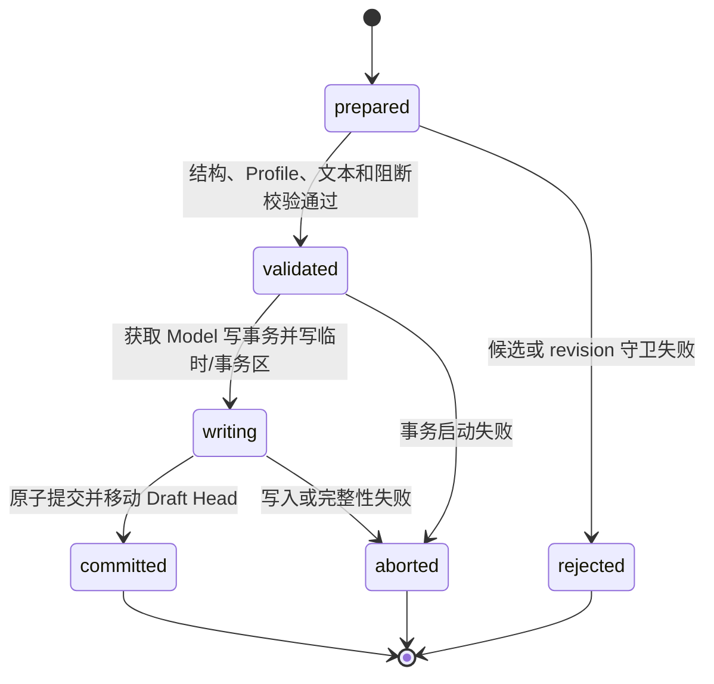

# OPM 单机建模工具逻辑持久化契约

文档版本：`v1.0`

文档状态：`FROZEN_INCLUDED`；逻辑数据、Revision 0.2 目标和事务契约冻结，SQLite V1 保持不变

全局设计状态、延期边界和开发准入以 `opm-design-freeze-baseline.md` 为唯一事实源。

更新时间：2026-07-28

## Task Type

- `feature`

## 1. 文档范围

本文档冻结 OPM 单机建模工具的逻辑持久化对象、唯一所有者、稳定身份、可变性、修订提交包、原子事务、并发幂等、索引缓存、迁移和故障恢复边界。

本文档定义“必须持久化什么以及以什么一致性提交”，不定义“用哪种数据库和表实现”。

以下责任不由本文档重复定义，其状态由对应正式设计或全量冻结基线承接：

1. SQLite、DDL、列类型和物理索引由物理数据设计承接；
2. 目录结构、文件扩展名、压缩格式和序列化编码由物理数据与原生交换契约承接；
3. 核心元模型、Profile Package 和 Rule Definition 的物理存储表示；逻辑字段由独立 schema 文档承接；
4. 本地加密、密钥管理和备份默认周期为 `FROZEN_DEFERRED`；
5. 多用户锁、远程复制、分布式事务和消息队列为 `FROZEN_DEFERRED`。

## 2. 关联文档

1. `docs/requirements/opm-online-modeling-tool-requirements.md`
2. `docs/requirements/opm-common-semantic-core.md`
3. `docs/design/opm-modeling-tool-architecture.md`
4. `docs/design/opm-modeling-tool-module-design.md`
5. `docs/design/opm-modeling-tool-application-api-contract.md`
6. `docs/design/opm-native-exchange-package-contract.md`
7. `docs/design/opm-core-metamodel-field-schema.md`
8. `docs/design/opm-profile-package-field-schema.md`
9. `docs/design/opm-rule-definition-field-schema.md`

## 3. 持久化原则

1. Semantic Model 是正式事实源；OPD、System map、文本、Finding 和 Diff 是带输入版本的投影；
2. Revision 一经提交不可原地修改，Draft 通过移动可写 head 指向新 Revision 演化；
3. 正式语义、Context/Occurrence、语义布局、正式文本、Text Trace、提交校验摘要和 Revision 元数据属于同一原子提交包；
4. Baseline、Named Snapshot、Profile Package 和已完成 Manifest 不可变；
5. viewport、选择、hover、面板尺寸和未提交表单值不是模型持久化事实；
6. 缓存与索引可以丢弃重建，不得成为恢复模型所必需的唯一数据；
7. 存储故障时优先保护最近确认提交的 Revision，不以部分新数据换取“尽量保存”；
8. 物理实现必须支持原子事务或临时写入加原子替换的等价保证。

## 4. 身份、版本与时间

### 4.1 稳定身份

| 身份 | 稳定范围 | 规则 |
| --- | --- | --- |
| `project_id` | 本地工作区 | Project 生命周期内不变；恢复为新项目时分配新 ID 并保留 origin |
| `model_id` | Project | 同一模型跨 Revision 不变；导入碰撞按 Import Plan 处理 |
| `element_id/fact_id` | Model | 跨 OPD 和 Revision 稳定；删除后不得复用 |
| `context_id` | Model | OPD Context 跨 Revision 稳定；删除后不得复用 |
| `occurrence_id` | Context | 同一 Element/Fact 在特定 Context 的出现标识 |
| `revision_id` | Model | 每次原子提交唯一且不可变 |
| `snapshot_id/baseline_id` | Model | 指向固定 Revision 的不可变发布对象 |
| `operation_record_id` | Project | 追加记录唯一标识 |
| `task_id/manifest_id/plan_id` | 本地运行域 | 任务、清单和预检计划稳定标识 |

稳定 ID 的具体编码形式待实现冻结，但必须不含用户身份、机器路径、可变名称或业务密钥。

### 4.2 版本维度

以下版本不得合并成一个字段：

1. `storage_schema_version`：本地耐久数据读取与迁移版本；
2. `exchange_format_version`：原生交换包格式版本；
3. `model_revision`：模型事实和投影提交版本；
4. `profile_version`：配置档能力和解释版本；
5. `rule_version`：校验与转换规则版本；
6. `text_grammar_version`：OPL/OPT 生成语法资产版本；
7. `application_version`：产生数据的应用版本，仅用于兼容诊断。

### 4.3 时间语义

本地时间用于展示、记录和排序提示，不作为并发冲突或事实先后关系的唯一依据。模型写入顺序使用 Revision 父链和 Model 内单调 `revision_sequence`；该序号只在本地 Model 内有意义。

## 5. 逻辑数据对象

### 5.1 项目与模型目录

| 对象 | 所有者 | 可变性 | 最小内容 |
| --- | --- | --- | --- |
| Project Catalog | M02 | 可变 | project_id、名称、说明、状态、默认 Profile、位置引用、创建/最近打开时间 |
| Model Catalog | M02 | 可变 | model_id、project_id、名称、说明、Profile Binding、活动 Draft Head |
| Workspace Session Record | M02/M03 | 会话级 | 打开模型、写 session token、恢复状态；不是业务基线 |
| Profile Binding | M02/M06 | 随新 Revision 变更 | profile_id/version、rule/text grammar version 和迁移来源 |

Project 归档只修改目录可见状态，不删除 Model、Revision 或 Baseline。

### 5.2 Revision 正式提交包

| 分区 | 所有者 | 最小内容 | 是否正式事实 |
| --- | --- | --- | --- |
| Revision Header | M09 | revision_id、parent、sequence、Profile/规则版本、原因、提交摘要和 digest | 是 |
| Semantic Partition | M04 | Element、Fact、属性、端点、受控 Modifier、独立 Condition、来源和扩展隔离 | 是 |
| Context Partition | M05 | Context、Occurrence、Refinement Edge、View Definition、普通/语义 Layout | Context 和语义布局是；普通布局是正式图形表达 |
| Text Partition | M08 | Text Artifact、Paragraph/Sentence、grammar version | 只读正式派生物 |
| Trace Partition | M08 | Fact-Construct-Sentence-Rule 多对多映射 | 正式追踪 |
| Commit Validation Summary | M07 | pre-commit 规则集、等级计数、阻断为零证明和输入版本 | 正式提交证据摘要 |
| Method Partition | M11 | 架构分类、决策和豁免的版本化记录 | 方法事实，与语言事实分区 |

正式提交包必须能在不读取页面缓存的情况下重建当前 OPD、导航、OPL/OPT 和提交时的追踪。详细 POST_COMMIT/FULL Validation Report 可以作为绑定 Revision 的独立不可变派生物保存，但不得冒充提交时原子摘要。

#### 5.2.1 ISO Control 的 Revision 表示

Control 作为基础 Fact 的组合语义进入同一 Semantic Partition。以下是逻辑 Canonical JSON 形状；对象包络和 CapabilityRef 物理编码由机器 Schema 冻结，但两个 key/value 不得改名：

```json
{
  "fact_id": "fact-consumption-001",
  "fact_family": "TRANSFORMATION",
  "capability_ref": {
    "capability_id": "CAP-ISO-PROC-001",
    "profile_id": "iso-19450-2024",
    "profile_version": "2024.1"
  },
  "modifiers": [
    {"modifier_id": "control.capability", "value": "CAP-ISO-CTRL-001"},
    {"modifier_id": "control.segment", "value": "PROCESS_INPUT"}
  ]
}
```

1. `fact_id` 和基础 Procedural Capability 不因增加/删除 Control 改变；
2. Inline JSON 省略 MS-MOD-001 的 `target_ref/capability_ref`：owning Fact 隐含 target，两个逻辑 capability_ref 均由 `control.capability.value` 确定；
3. 两个 Modifier 以 `modifier_id` 字典序规范化，作为同一 Revision digest、semantic change set、Text Trace 和 Operation Record 输入；
4. 添加、替换或删除 Control pair 与 OPL、Trace、提交校验摘要和 Draft Head 移动属于同一 TX-002；
5. 只有确有独立谓词时才持久化 `condition_id/MS-COND-001`，不得复制 `control.capability` 已表达的 Event/Condition；
6. 读取到单项、重复项、未知 segment 或独立 ISO Control Fact 时，Revision 标记不兼容/无效，不进行猜测修复。

### 5.3 版本、基线和历史

| 对象 | 所有者 | 可变性 | 规则 |
| --- | --- | --- | --- |
| Draft Head | M09 | 可移动指针 | 只指向已提交 Revision；同一 Model 首期只有一个活动写 head |
| Autosave Checkpoint | M09 | 可移动指针 | 指向最近耐久 Revision，不能指向内存候选 |
| Named Snapshot | M09 | 不可变 | 名称、说明、固定 revision_id、创建时间 |
| Baseline | M09 | 不可变 | 固定 revision、Profile/规则、全量报告、文本/追踪 digest、说明和时间 |
| Validation Report | M07 | 不可变 | report_id、input_revision、规则版本、范围、Finding 和证据状态 |
| Operation Record | M09 | 追加 | 动作、对象、结果、时间、command/task/revision 关联；不含用户身份 |
| Idempotency Receipt | 各应用命令所有者，M12 实现 | 保留期内不可变 | operation、aggregate、command_id、请求摘要和既有结果引用 |

Named Snapshot 和 Baseline 不复制第二份可写 Semantic Model，可以引用不可变 Revision 及其内容摘要。垃圾回收不得删除仍被 Snapshot、Baseline、Manifest、Task Result 或 Operation Record 必要引用的 Revision。

### 5.4 交换、任务与恢复

| 对象 | 所有者 | 可变性 | 规则 |
| --- | --- | --- | --- |
| Import Staging | M10/M12 | 临时可变 | 与活动项目隔离；有 plan_id、来源摘要、期限和状态 |
| Import Plan | M10 | 不可变预检结果 | 绑定 package digest、目标、身份映射、兼容结论和过期条件 |
| Export Manifest | M10 | 完成后不可变 | 绑定固定 Revision、文件摘要和结果位置引用 |
| Backup Manifest | M10 | 完成后不可变 | 覆盖项目数据、版本、基线、Profile Binding 和必要资产 |
| Restore Plan | M10 | 不可变预检结果 | 绑定 backup digest、目标模式、迁移和回退点 |
| Task Record | M12 端口 | 状态机可变 | 固定输入、阶段、进度、可取消性、结果或错误 |
| Recovery Marker | M12 | 临时 | 标记未完成原子写和恢复所需信息，成功提交后清除 |

### 5.5 非正式数据

| 数据 | 存储建议 | 约束 |
| --- | --- | --- |
| 页面偏好 | 独立本地偏好区 | 不进入模型 Revision；损坏可重置 |
| viewport bookmark | 可选会话/偏好区 | 不触发文本或语义校验变化 |
| Undo/Redo 栈 | 编辑会话区，可选恢复 | 不等同 Operation Record 或 Revision 历史 |
| 搜索/occurrence/trace 索引 | 可重建索引区 | 失效时从 Revision 重建 |
| 渲染缓存和文本缓存 | 可重建缓存区 | 必须绑定 revision/profile/rule/grammar version |
| 未提交候选表单 | 内存或受控恢复草稿 | 不得标为已保存正式模型 |

## 6. Revision 提交模型

### 6.1 `RevisionCommitBundle`

逻辑包络至少包含：

| 字段 | 含义 |
| --- | --- |
| `model_id/base_revision/next_revision` | 冲突守卫和新修订身份 |
| `command_id/command_digest` | 幂等和请求一致性 |
| `profile/rule/grammar versions` | 解释和生成上下文 |
| `semantic_change_set` | Element/Fact/Modifier/Condition 增删改及来源 |
| `context_change_set` | Context/Occurrence/Refinement/Layout 变化 |
| `text_artifact_delta` | 受影响正式文本或确定性重建引用 |
| `trace_delta` | Fact/Construct/Sentence/Rule 追踪变化 |
| `commit_validation_summary` | 提交前规则和阻断结论 |
| `method_change_set` | 如适用的方法事实变化 |
| `operation_record` | 成功动作记录 |
| `bundle_digest` | 对规范化逻辑内容计算的完整性摘要 |

### 6.2 提交阶段



只有 `committed` 可以对外返回 committed_revision。`prepared/validated/writing` 均不得被查询为正式 Revision。

### 6.3 内容摘要

摘要算法和规范化编码待技术设计冻结，但必须满足：

1. 摘要覆盖逻辑内容和引用，不依赖文件绝对路径或非确定时间字段；
2. Manifest 同时记录算法标识和值，算法升级不能静默重解释旧摘要；
3. Baseline 记录 Revision、Text、Trace、Validation Report 和 Profile/规则资产引用摘要；
4. 摘要用于完整性和幂等，不替代数字签名或第三方可信证明。

## 7. 原子事务目录

| 事务编号 | 操作 | 原子写集合 | 失败后状态 |
| --- | --- | --- | --- |
| TX-001 | 创建模型 | Model Catalog、初始 Revision Bundle、Draft Head、Checkpoint、Operation Record | 不存在半模型 |
| TX-002 | 正式编辑/Undo/Redo | Revision Bundle、Draft Head、Autosave 状态、Operation Record | head 仍指向原 Revision，候选保留在会话 |
| TX-003 | 创建 Named Snapshot | Snapshot、Revision 保留引用、Operation Record | 不存在半快照 |
| TX-004 | 创建 Baseline | Baseline、全量报告/证据引用、Revision 保留引用、Operation Record | 不存在 Baseline ID，报告可独立保留 |
| TX-005 | 导入或 Profile 转换提交 | 新 Project/Model 或新 Revision、身份映射、head、Manifest/Operation Record | staging/报告保留诊断，目标不变 |
| TX-006 | 恢复备份 | 新项目全量对象，或回退点+目标原子替换、Operation Record | 原项目可打开且不被部分覆盖 |
| TX-007 | 更新备份策略 | 策略新版本和 Operation Record | 保留原策略 |

文件型 SVG/PNG/PDF/文本导出不与模型 Revision 同事务。导出使用固定 Revision、临时目标和原子完成标记；失败清理临时目标并记录失败，不回滚模型。

## 8. 并发、锁与幂等

1. 每个 Model 首期只允许一个写事务；锁粒度不扩大为全应用锁，项目列表和不可变 Revision 读取可并行；
2. 项目恢复替换、项目级导入和目录迁移需要 Project 级排他事务；
3. 写事务比较 `base_revision` 与 Draft Head；不匹配即失败，不在持久层静默合并；
4. 幂等登记和业务写必须同事务提交，避免业务已写但 command_id 未登记；
5. 相同 command_id + 相同 digest 返回既有结果；相同 command_id + 不同 digest 拒绝；
6. 后台任务只读不可变 Revision；需要提交结果时使用新的 command_id 和当时有效的守卫；
7. 锁超时或进程异常不得留下可见半 Revision，RecoveryScanner 根据事务标记清理或完成原子切换。

Idempotency Receipt 的最短保留期必须覆盖页面重试、应用异常重开和相关 Operation Record 的诊断窗口；正式期限在性能与保留策略中冻结，清理后不得复用历史 command_id 生成错误的既有结果。

## 9. 查询、索引与投影

| 索引/投影 | 来源 | 失效条件 | 恢复方式 |
| --- | --- | --- | --- |
| Project/Model 搜索 | Catalog + Revision 名称字段 | 目录或名称变更 | 重建搜索索引 |
| Context 导航 | Context/Refinement Edge | Context 变化 | 从 Revision 重建 |
| occurrence 反向索引 | Occurrence | Context/Occurrence 变化 | 从 Revision 重建 |
| Fact-Text 追踪索引 | Text Trace | Fact/Text/Rule 变化 | 从 Trace Partition 重建 |
| Finding 定位索引 | Validation Report | 新报告或规则变化 | 从报告重建 |
| System map | Context/Occurrence/Fact | 相关 Revision 变化 | 从固定 Revision 重建 |
| Diff | 两个 Revision | 输入不变则稳定 | 按需重算，可缓存 |

索引记录必须携带 source_revision。启动发现索引版本或摘要不匹配时，索引标记 unavailable/rebuilding，不得返回混合修订结果。

## 10. 快照、基线与保留

1. Revision 不可原地修改；Draft Head 移动不会改变历史 Revision；
2. Named Snapshot 和 Baseline 形成保留根；其引用链和必要 Profile/规则资产不得被清理；
3. Baseline 不因规则升级重写，重检产生新的 Validation Report；迁移产生新 Draft Revision；
4. Autosave Checkpoint 只指向已耐久 Revision，不保存内存候选的虚假时间；
5. Revision 历史清理、临时任务结果保留和 Undo 恢复深度待产品/性能设计确认；清理前必须进行可达性分析；
6. Operation Record 追加保存，但具体保留策略不得破坏 FR-LOCAL-003~004 的诊断和追溯目标。

## 11. 迁移与兼容

### 11.1 存储迁移规则

1. 打开项目先读取 storage_schema_version 和完整性元数据；
2. 当前读取器不支持时返回 FORMAT_VERSION_UNSUPPORTED，不尝试猜测字段；
3. 有迁移路径时先创建备份/回退点，在 staging 中迁移并全量校验；
4. 成功后原子切换到新版本；失败保持原项目不变；
5. 迁移不得重写 Baseline 的原始结论；必要时保留旧读取资产或生成迁移后的新草稿；
6. 每次迁移保存来源版本、目标版本、迁移器版本、输入/输出 digest 和结果。

### 11.2 Profile/规则迁移

Profile/rule 版本变化是模型语义迁移，不是普通 storage schema migration。必须通过转换/迁移分析、目标规则验证和文本试生成创建新 Revision，不能仅更新 Model Catalog 中的版本字符串。

## 12. 故障恢复

### 12.1 启动扫描

RecoveryScanner 至少检查：

1. 未清理事务标记和临时写入区；
2. Draft Head 指向不存在或摘要失败的 Revision；
3. Checkpoint 与 Draft Head 不一致；
4. 未完成导入、导出、备份和恢复任务；
5. 索引/缓存版本不匹配；
6. Manifest 指向缺失文件或内容摘要不匹配。

### 12.2 恢复优先级

1. 保护最近完整且已确认的 Revision；
2. 未完成新 Revision 回滚为不可见并保留诊断；
3. 可安全重建的索引和缓存直接废弃重建；
4. 不能确认一致性时进入 `recovery-required`，禁止模型写入；
5. 恢复动作生成 Operation Record；若存储整体不可写，至少返回 diagnostic_id，不伪造已记录。

### 12.3 失败操作记录

业务阻断可以追加 Operation Record。若持久化事务本身失败，失败记录只能在存储恢复可用后以独立诊断事务追加；不能为了记录失败而把原业务事务标记成功。

## 13. 备份与恢复边界

完整项目备份必须覆盖：

1. Project/Model Catalog 和 Profile Binding；
2. 所有需要保留的 Revision、Snapshot、Baseline 和 Operation Record；
3. Revision 引用的 Profile/规则/Grammar 标识及恢复所需资产；
4. Text/Trace、Validation Report、Method Record 和 Manifest；
5. storage_schema_version、应用兼容信息、内容摘要和完整性清单。

缓存、索引、viewport 和临时任务可以不进入备份，但恢复后必须可重建。备份包与原生交换包用途不同：备份优先完整恢复本地项目历史，原生交换包按明确 package_kind 传递受控资产。

## 14. 本地安全

1. 所有物理路径经 M12 File Gateway 解析和约束，不由页面拼接；
2. 临时区、staging、正式数据和备份目标必须有明确边界，防止路径穿越和覆盖源文件；
3. 模型、Manifest 和 Operation Record 不保存令牌、应用密钥或无必要的系统配置；
4. 摘要失败、长度不符或未知必填对象均视为完整性失败；
5. 当前产品明确不提供静态数据加密、密钥管理或涉密合规，不得声称数据库、资产目录或备份已加密；`DFD-009` 重启时不得破坏备份恢复和版本兼容检测。

## 15. 验收映射

| 契约面 | 需求 | 验证重点 |
| --- | --- | --- |
| Revision 原子包 | NFR-REL-001~004、FR-TEXT-001~006 | 故障注入后无图文分裂和半 Revision |
| 稳定身份 | FR-OPD-012、FR-ASSET-002 | 跨 OPD、Revision、导入后可追踪 |
| Draft/Snapshot/Baseline | FR-VER-001~006 | 可变性、保留根和规则版本正确 |
| Operation Record | FR-LOCAL-003~004 | 成功/失败动作有对象、结果和本地时间，无用户字段 |
| 导入/恢复事务 | FR-IO-002~004、FR-LOCAL-005 | staging、完整性、原子提交和回退 |
| 本地安全 | NFR-SEC-003~006 | 路径、内容、部分写和敏感信息检查 |
| 迁移 | NFR-MAINT-001~004 | 版本显式、旧 Baseline 不被重写 |

## 16. 事实与建议

### 16.1 已确认事实

1. Revision、Snapshot、Baseline、Undo、Autosave 和 Operation Record 是不同对象；
2. Element/Fact、Context/Occurrence、Text/Trace、Validation 和版本对象分别由 M04-M09 拥有；
3. M12 只实现存储、文件、时钟和任务端口，不拥有业务语义；
4. 当前物理存储已固定为 SQLite V1 + 受控资产目录；
5. 本文档只形成逻辑契约，不代表已经完成迁移、故障注入或运行验证。

### 16.2 实现与延期边界

1. `ARC-008` 已接受并固定 SQLite + 资产目录 + `.opmp`；准确驱动/Flyway 组合仍需 DEV-00/02 PoC；
2. 当前 Revision 物理表示固定为 SQLite 中的不可变 Canonical JSON 文档、可重建索引和移动 Draft Head；不得在实现阶段改为另一所有权模型；
3. Canonical digest 固定为 SHA-256；垃圾回收、历史保留、自动备份默认策略和本地加密为 `FROZEN_DEFERRED`；
4. Revision 0.2 和索引实现必须遵守物理数据设计；达梦/MySQL/PostgreSQL 不在当前兼容范围，不能从 SQLite 结果推断。
