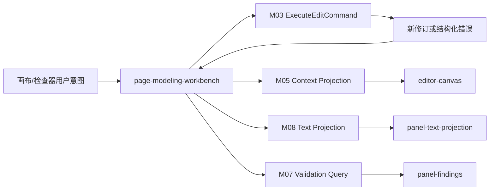

# OPM 单机建模工具页面组件树与交互状态表

文档版本：`v0.4-draft`

文档状态：P0 组件经原型验证；完整画布组件、事件与测试入口冻结待实现

更新时间：2026-07-28

## Task Type

- `feature`

## 1. 文档范围

本文档定义 P01-P06 的逻辑组件树、公共组件边界、页面专属组件、组件输入输出、关键事件、交互状态和主动作守卫。

组件名称用于表达职责，不表示已经选择 Vue、React、Web Components 或具体目录结构。

## 2. 关联文档

1. `docs/design/opm-modeling-workbench-page-design.md`
2. `docs/design/opm-modeling-workbench-state-model.md`
3. `docs/design/opm-modeling-workbench-field-region-detail.md`
4. `docs/design/opm-modeling-tool-module-design.md`
5. `docs/design/opm-modeling-tool-application-api-contract.md`
6. `docs/design/opm-complete-canvas-toolchain-design.md`

## 3. 使用原则

### 3.1 命名约定

| 前缀 | 职责 |
| --- | --- |
| `page-*` | 路由级页面容器，装配查询、命令和回流 |
| `shell-*` | 应用框架、项目/模型上下文和全局反馈 |
| `panel-*` | 可独立加载、折叠或调整的一级工作区 |
| `block-*` | 页面内业务区块，不独立拥有路由 |
| `editor-*` | OPD 画布、工具、选择和属性编辑协作组件 |
| `overlay-*` | 弹窗/抽屉/向导根组件 |
| `action-*` | 明确业务命令或任务动作，不用于普通状态切换 |

### 3.2 组件边界

1. `page-*` 只通过应用查询和用例装配数据，不包含 OPM 规则；
2. `editor-canvas` 只渲染 Context Projection 并发出用户意图，不写 Semantic Model；
3. `panel-property-inspector` 根据 Profile Schema 组装字段，但合法性最终由 M04/M06/M07 判定；
4. `panel-text`、`panel-findings`、`panel-history` 都是只读投影，不持有第二份事实；
5. 文件访问仅由用户文件选择结果和 M10 用例承接，组件不得自行扫描本地目录；
6. 通用视觉组件不得依赖 OPM 业务模块，业务事件由页面适配层转换为应用用例。

### 3.3 交互状态约定

1. 所有异步区块支持 `loading/ready/empty/error`；
2. 所有提交组件支持 `idle/preview/submitting/blocked/completed/failed` 的适用子集；
3. 禁用动作必须提供可访问的原因，不只改变颜色或透明度；
4. `blocked` 展示业务/规则原因和修复入口，`failed` 展示重试和诊断入口；
5. 动态内容不得改变工具栏、画布控件、面板标签和关键按钮的稳定尺寸。

## 4. 公共组件建议

| 组件 | 复用页面 | 职责 | 不负责 |
| --- | --- | --- | --- |
| `shell-app-frame` | P01-P06 | 应用框架、全局错误和后台任务提示 | 模型查询和规则 |
| `shell-context-breadcrumb` | P02-P06 | 项目/模型/Context 导航 | 修改业务名称 |
| `block-resource-state` | 全部 | loading/empty/error 和重试插槽 | 推断错误原因 |
| `block-status-indicator` | 全部 | 图标+文字+辅助色表达状态 | 保存业务状态 |
| `block-command-feedback` | 全部 | 成功、阻断、失败和恢复动作 | 自动清除未处理失败 |
| `block-revision-badge` | P02-P05 | revision 类型、短 ID 和只读状态 | 切换修订 |
| `block-profile-badge` | P02-P05 | Profile 名称、版本和状态 | 直接更换 Profile |
| `block-finding-list` | P03/P05 | Finding 筛选、列表和定位事件 | 修改模型 |
| `block-task-progress` | P05/P06/弹层 | 任务阶段、进度、取消和结果 | 假定任务可取消 |
| `block-local-path` | P01/P06/弹层 | 路径展示、选择和可访问性提示 | 直接执行文件 I/O |
| `overlay-impact-confirm` | OV04/OV10/OV11 | 影响清单、风险确认和提交 | 自行计算影响 |

公共组件只复用结构和交互语义，不通过一个巨型组件混合项目、模型、OPD、版本和备份业务。

## 5. 应用壳组件树

```text
shell-app-frame
├── shell-global-header
│   ├── shell-home-action
│   ├── shell-context-breadcrumb
│   └── block-background-task-center
├── shell-page-navigation
├── shell-page-outlet
├── block-command-feedback
└── overlay-host
```

`shell-page-navigation` 在 P03 进入专注工作台模式，可收窄为项目/模型返回入口；不得占用画布主要空间。`overlay-host` 同一时刻只允许一个高风险提交弹层获得焦点。

## 6. P01 项目库组件树

```text
page-project-library
├── block-page-command-bar
│   ├── action-create-project
│   ├── action-import-project
│   ├── block-project-scope-switch
│   ├── block-local-search
│   └── block-sort-menu
├── block-resource-state
│   └── block-project-table
│       ├── block-project-row
│       └── block-row-actions
└── block-project-empty-state
```

关键交互：

| 事件 | 发出组件 | 页面处理 | 守卫 | 反馈 |
| --- | --- | --- | --- | --- |
| `create-project-requested` | action-create-project | 打开 OV01 | 无冲突弹层 | 聚焦项目名称 |
| `project-open-requested` | project-row | 调用 OpenProject，成功进入 P02 | 项目存在且格式检查通过 | loading/错误阶段 |
| `project-archive-requested` | row-actions | 调用归档用例 | 当前为活动项目 | 行状态更新或失败原因 |
| `project-restore-requested` | row-actions | 调用恢复可见状态用例 | 当前为归档项目 | 保留筛选和行位置 |
| `project-import-requested` | action-import-project | 打开 OV07 | 无冲突导入任务 | 文件检查状态 |

## 7. P02 项目详情与模型列表组件树

```text
page-project-detail
├── shell-context-breadcrumb
├── block-project-summary
├── block-model-command-bar
│   ├── action-create-model
│   ├── block-model-search
│   └── action-open-local-data
├── block-resource-state
│   └── block-model-table
│       ├── block-model-row
│       └── block-model-row-actions
└── block-recent-activity
```

关键交互：

| 事件 | 页面处理 | 守卫 | 反馈/回流 |
| --- | --- | --- | --- |
| `model-create-requested` | 打开 OV02 | 项目活动、Profile Catalog 可用 | 成功进入 P03 |
| `model-open-requested` | OpenProject/OpenModel | 格式、Profile、规则和恢复检查通过 | 打开 P03 或显示恢复入口 |
| `profile-conversion-requested` | 打开 OV04 | 模型有耐久 Draft Revision | 分析后留在 P02/P05 |
| `local-data-open-requested` | 导航 P06 | project_id 有效 | 返回保持模型列表位置 |

## 8. P03 建模工作台组件树

```text
page-modeling-workbench
├── shell-workbench-header
│   ├── shell-context-breadcrumb
│   ├── block-profile-badge
│   ├── block-revision-badge
│   ├── block-save-status
│   └── block-workbench-actions
├── panel-model-navigation
│   ├── block-navigation-tabs
│   ├── block-process-tree
│   ├── block-object-forest
│   ├── block-model-view-list
│   ├── block-system-map
│   └── block-model-search
├── panel-opd-editor
│   ├── editor-toolchain
│   │   ├── tool-group-pointer
│   │   ├── tool-group-things
│   │   │   ├── tool-create-object
│   │   │   ├── tool-create-process
│   │   │   └── tool-create-state
│   │   ├── tool-relation-split-button
│   │   │   ├── tool-relation-primary
│   │   │   └── menu-relation-catalog
│   │   ├── tool-group-semantic
│   │   └── tool-group-layout
│   ├── editor-canvas
│   │   ├── editor-projection-layer
│   │   ├── editor-candidate-layer
│   │   ├── editor-selection-layer
│   │   ├── editor-finding-layer
│   │   └── editor-focus-layer
│   ├── editor-context-popover
│   ├── editor-command-feedback
│   └── editor-viewport-controls
├── panel-property-inspector
│   ├── block-selection-summary
│   ├── inspector-element-fields
│   ├── inspector-state-fields
│   ├── inspector-relation-fields
│   ├── block-layout-fields
│   └── block-trace-summary
└── panel-workbench-bottom
    ├── block-bottom-tabs
    ├── panel-text-projection
    ├── panel-findings
    ├── panel-operation-history
    └── panel-architecture-method
```

### 8.1 工作台数据流



页面不得把画布内部对象直接传给 M04；必须转换为带 `model_id/context_id/base_revision/profile_version/command_type/payload` 的应用命令。

### 8.2 画布与 viewport 事件

| 事件 | 来源 | 状态影响 | 是否产生修订 | 处理边界 |
| --- | --- | --- | --- | --- |
| `viewport-zoom-requested` | viewport-controls/滚轮 | viewport_state | 否 | M01 本地视图 |
| `viewport-pan-requested` | canvas | viewport_state | 否 | M01 本地视图 |
| `viewport-fit-requested` | viewport-controls | viewport_state | 否 | M01 本地视图 |
| `selection-changed` | selection-layer | selection_state | 否 | M01 + 追踪查询 |
| `node-create-previewed` | tool-palette/canvas | edit_submit=preview | 否 | Profile 候选过滤 |
| `state-create-requested` | toolchain/canvas | state_candidate=placing/editing | 否 | owner 与 Profile 候选过滤 |
| `state-candidate-changed` | state inspector/inline editor | state_candidate=editing/preview | 否 | name/value/roles/layout 候选 |
| `relation-tool-selected` | relation split-button/catalog | relation_candidate=armed | 否 | Capability 或目录入口 |
| `relation-endpoint-selected` | canvas | source-selected/filtering | 否 | API-EDT-001 端点归一化 |
| `relation-option-selected` | relation catalog/candidate popover | relation_candidate=preview | 否 | 采用 option 的规范端点和资产引用 |
| `relation-candidate-changed` | relation inspector/canvas | filtering/preview | 否 | 标签、modifier、fan 成员变化后重算 |
| `construct-delete-impact-requested` | State/Relation inspector | capability_option_resource=loading/current | 否 | API-EDT-001 返回 impact summary/token |
| `edit-command-submitted` | command-preview/inspector | submitting -> result | 是，成功时 | M03 |
| `candidate-cancelled` | candidate layer/feedback | candidate -> idle/ready | 否 | 不改变 committed Projection |
| `semantic-inzoom-requested` | 语义细化菜单 | preview -> submitting | 是 | M03/M05/M06/M07/M08 |
| `semantic-outzoom-requested` | 语义细化菜单 | preview -> submitting | 是 | M03/M05/M06/M07/M08 |

`viewport-zoom-requested` 与 `semantic-inzoom-requested` 必须是不同事件、不同控件和不同文案；不得根据缩放比例推断语义内缩放。

### 8.3 选择与图文问题联动

| 起点事件 | 页面编排 | 结果 |
| --- | --- | --- |
| `construct-selected` | 以稳定 ID 查询 Sentence/Finding trace | 画布选中，文本和问题突出显示 |
| `sentence-selected` | 解析 Fact/Construct trace，必要时切换 Context | 定位一个或多个画布 Construct |
| `finding-selected` | 解析 revision/context/element/fact/sentence locator | 打开对应 Context 并聚焦目标 |
| `search-result-selected` | 验证 model/context/element locator | 切换 Context，选择 occurrence |
| `context-selected` | 查询 Context Projection 和 Paragraph | 打开 OPD，更新面包屑和文本范围 |

联动失败时显示“目标在当前修订不存在”或具体原因，并清除旧高亮，不能定位到同名但不同 ID 的元素。

### 8.4 属性检查器交互

| 状态 | 组件行为 |
| --- | --- |
| no-selection | 显示 Context 摘要和当前 Profile，只读 |
| single-element | 按 Profile Schema 显示 Element 与 occurrence 分区 |
| state | 显示 State ID、owner、name/value、roles、显式性、布局和 Trace；owner 只读 |
| relation | 显示端点、方向和允许的 modifier，变更前重算候选 |
| multi-element | 只显示对齐、分布和安全公共字段 |
| sentence/finding | 显示只读追踪和定位动作 |
| preview | 表单保留候选值，画布显示明确预览 |
| submitting | 禁用同一字段重复提交，允许取消尚未发出的输入 |
| blocked | 字段级或组合级错误定位，不清空输入 |
| save-failed | 显示重试和最近耐久 revision，不伪装提交完成 |

### 8.5 工具栏与快捷键边界

1. 常用工具使用熟悉图标并提供工具提示；语义细化使用图标+完整文本菜单；
2. Delete、Undo、Redo、复制粘贴、视口适配和面板切换应支持键盘；具体键位在 handoff 冻结；
3. 当前焦点在文本筛选、名称表单或弹层时，不得把输入键解释为画布快捷键；
4. 关系创建必须能通过键盘选择源、目标和候选类型；
5. Esc 按优先级取消拖拽/关系预览、关闭非提交菜单、关闭可安全取消弹层，不撤销已提交修订。

### 8.6 完整工具链组件边界与测试入口

| 组件 | 输入 | 输出 | 稳定 `data-testid` |
| --- | --- | --- | --- |
| `editor-toolchain` | access mode、Profile/Symbol binding、active tool | tool mode | `P03-canvas-toolchain` |
| `tool-create-state` | owner selection、State option | state-create-requested | `P03-tool-state` |
| `tool-relation-split-button` | recent relation、Capability options | relation armed/catalog open | `P03-tool-relation-primary/menu` |
| `menu-relation-catalog` | search、16/8/10 分组、option/reason | option selected | `P03-relation-search/option-{capabilityId}` |
| `editor-candidate-layer` | normalized endpoints、descriptor、route preview | submit/cancel | `P03-relation-candidate` |
| `inspector-state-fields` | State DTO、role options、Trace | State candidate changes | `P03-inspector-state-*` |
| `inspector-relation-fields` | Fact、endpoints、labels、modifiers、fan | relation candidate changes | `P03-inspector-relation-*` |
| `editor-command-feedback` | submitting/blocked/conflict/failed | retry/cancel/locate | `P03-command-feedback` |

约束：

1. 通用操作按钮使用统一图标组件；OPM Object/Process/State/Relation 使用当前 Symbol Catalog 缩略符号；
2. `menu-relation-catalog` 只渲染 API-EDT-001 option，不维护 16/8/10 合法性副本；
3. candidate layer 只渲染临时 ViewModel，Projection layer 只渲染固定 read revision；
4. State 是 owner 内 construct，不复用 Element node component 冒充独立 Thing；
5. fundamental fan 在 Projection 层保持一个 Fact/junction/branches 组件组；Control annotation 不复制基础 edge。

## 9. P04 版本与基线组件树

```text
page-version-baseline
├── shell-context-breadcrumb
├── block-version-command-bar
├── panel-version-timeline
│   ├── block-draft-revisions
│   ├── block-named-snapshots
│   └── block-baselines
├── panel-version-compare
│   ├── block-revision-selector-left
│   ├── block-revision-selector-right
│   ├── block-diff-scope
│   └── block-diff-result
└── block-version-actions
```

| 事件 | 页面处理 | 守卫 |
| --- | --- | --- |
| `revision-open-requested` | 以 revision 进入 P03 只读/可写模式 | 类型决定 access_mode |
| `diff-run-requested` | 固定左右 revision 运行差异查询 | 两者不同且可读 |
| `snapshot-create-requested` | 打开 OV05 | 目标 revision 已耐久 |
| `baseline-create-requested` | 打开 OV06 | 当前草稿满足初始守卫 |
| `draft-from-baseline-requested` | 调用 M09 创建草稿 | Baseline 有效且不可变 |

## 10. P05 标准、校验与符合性组件树

```text
page-standard-conformance
├── shell-context-breadcrumb
├── block-profile-summary
├── block-validation-runner
├── panel-conformance-summary
├── panel-finding-browser
│   ├── block-finding-filters
│   ├── block-finding-list
│   └── block-finding-detail
├── panel-rule-detail
└── panel-capability-report
```

关键交互：

1. `validation-run-requested` 固定 revision、Profile 和规则版本后启动任务；
2. `finding-locate-requested` 回流 P03，并携带原始定位和 input_revision；
3. `rule-source-open-requested` 只打开仓库内可用规则来源或引用摘要，不依赖外网；
4. `profile-conversion-requested` 打开 OV04；
5. `baseline-create-requested` 打开 OV06；
6. 缺少原子规则或证据时，`panel-conformance-summary` 使用 `unknown/evidence-missing`，不展示通过式视觉。

## 11. P06 本地数据、备份与恢复组件树

```text
page-local-data
├── shell-context-breadcrumb
├── panel-storage-summary
├── panel-backup-policy
├── panel-backup-history
├── panel-transfer-tasks
└── block-local-data-actions
    ├── action-import
    ├── action-export
    ├── action-backup-now
    └── action-restore
```

| 事件 | 页面处理 | 守卫 | 失败行为 |
| --- | --- | --- | --- |
| `backup-policy-submitted` | 调用 M10 策略用例 | 路径、频率、保留数合法 | 保留表单并显示字段错误 |
| `backup-requested` | 打开 OV09 | 项目可读、位置可写 | 不产生不完整成功记录 |
| `restore-requested` | 打开 OV10 | 备份可选且可读 | 当前项目保持不变 |
| `task-cancel-requested` | 调用取消任务用例 | 任务声明当前阶段可取消 | 显示不能取消的明确原因 |
| `task-result-open-requested` | 打开结果位置或 manifest | 结果存在且安全 | 显示结果已移动/不可用 |

## 12. 弹层组件与交互

### 12.1 通用结构

```text
overlay-*
├── block-overlay-header
├── block-overlay-form
├── block-validation-summary
├── block-impact-preview
├── block-command-feedback
└── block-overlay-actions
```

弹层打开后焦点进入首个错误或首个可编辑字段；关闭后回到触发控件。提交期间禁止重复提交，但不得通过关闭弹层掩盖仍在执行的高风险任务。

### 12.2 专属组件

| overlay_id | 根组件 | 专属子组件 |
| --- | --- | --- |
| OV01 | `overlay-create-project` | project-form、local-location-summary |
| OV02 | `overlay-create-model` | model-form、profile-selector、root-context-preview |
| OV03 | `overlay-create-refinement` | refinee-summary、refinement-method-selector、target-tree-preview |
| OV04 | `overlay-profile-conversion` | target-profile-selector、conversion-impact-table、target-validation-summary |
| OV05 | `overlay-create-snapshot` | revision-summary、snapshot-form |
| OV06 | `overlay-create-baseline` | revision-evidence-summary、blocking-finding-list、baseline-form |
| OV07 | `overlay-import` | local-file-picker、import-stage-progress、import-plan |
| OV08 | `overlay-export` | export-scope-selector、format-selector、metadata-summary、local-target-picker |
| OV09 | `overlay-backup` | backup-scope、manifest-preview、local-target-picker |
| OV10 | `overlay-restore` | backup-inspector、restore-mode-selector、rollback-point-summary、impact-confirm |
| OV11 | `overlay-context-impact` | owner-reference-impact、refinement-impact、view-impact |

### 12.3 提交反馈

1. 表单校验错误定位到字段；
2. Profile/领域阻断定位到规则和受影响对象；
3. 后台任务启动成功后弹层可转为任务监视状态或关闭并在全局任务中心跟踪；
4. 原子提交失败保持源模型不变，并显示安全重试路径；
5. 完成后按页面设计包定义回流，不依赖用户猜测结果位置。

## 13. 组件到模块契约映射

| 组件/事件族 | 应用契约或查询 | 模块 |
| --- | --- | --- |
| 项目/模型页面 | OpenProject、项目/模型生命周期查询与命令 | M02 |
| editor 候选 | GetCommandCapabilities | M06，API-EDT-001 |
| editor 意图 | ExecuteEditCommand | M03，API-EDT-002 |
| 画布/导航投影 | Context、Occurrence、System map Query | M05 |
| 工具候选/动态表单 | Profile、Capability、Symbol、Rule Query | M06 |
| 问题/符合性 | ValidateModel、Finding/Conformance Query | M07 |
| 文本面板/追踪 | Text Artifact、Trace Query | M08 |
| 快照/基线/差异 | CreateSnapshot、CreateBaseline、Version/Diff Query | M09 |
| 导入导出/备份恢复 | ImportProject、ExportArtifact、RestoreBackup、Manifest Query | M10 |
| 方法面板 | Method Check、Decision/Asset Query | M11 |
| 任务进度 | Task Query/Cancel，通过上层端口 | M12 实现 |

稳定应用操作编号、通用包络、错误码和任务协议由 `opm-modeling-tool-application-api-contract.md` 承接；P0 HTTP/OpenAPI 已冻结，完整画布结构化 Option/command DTO 由 DEV-CANVAS-00 映射，通知传输保持既有任务协议。

## 14. 可访问性与视觉状态

1. 画布元素、关系、owned/reference、错误等级和只读状态必须使用形状、线型、图标或文字中的至少一种非颜色线索；
2. 陌生图标必须有 tooltip 和可访问名称；
3. 树、列表、标签、工具栏、画布选择和弹层支持明确焦点顺序；
4. 状态变化使用状态区和适当的可访问通知，不反复抢占焦点；
5. 错误信息先给业务语言，再给规则 ID 和技术详情；
6. 长名称允许换行或省略并提供完整值，不得覆盖相邻控件；
7. 面板折叠后保留可识别的恢复控件和当前问题/任务计数。

## 15. 原型验收关注点

1. 300 结点、600 关系的代表性 OPD 下，工具栏和面板布局不因加载态/计数变化发生跳动；
2. viewport zoom 与 semantic in/out-zoom 的文案、图标、事件和结果均可区分；
3. Element -> Sentence -> Finding -> Element 的跨区定位可往返且不按名称误定位；
4. `preview/submitting/blocked/committed/save-failed` 在画布和顶部状态中一致；
5. readonly-baseline 不存在可提交的语义编辑入口；
6. 键盘可以完成创建结点、选择端点、选择关系、提交、撤销和问题定位主路径；
7. 弹层取消、高风险确认和任务取消在各阶段行为明确。

现有原型验收只覆盖 P0 工具链和通用页面状态，不构成 State、16/8/10 符号、关系目录、fan、Control annotation 或完整键盘路径证据；这些由 DEV-CANVAS-01~06 的组件、视觉和 E2E 承接。

## 16. 事实与建议

### 16.1 已确认事实

1. 页面只能通过应用用例修改模型，画布和属性组件不是事实源；
2. M01 负责工作台装配，M03-M11 负责各自业务能力，M12 不向组件暴露持久化实现；
3. OPD、Sentence 和 Finding 通过稳定 ID 与 revision 追踪联动；
4. 首期 OPL/OPT 组件只读；
5. 核心操作必须同时支持鼠标和键盘，并提供非纯颜色状态线索。

### 16.2 已冻结与待实现

1. 组件名和事件名是逻辑 handoff 输入，不是已实现代码；
2. 公共组件粒度已通过原型初验，当前 Vue 设计确认前端只实现 P0 Object/Process/Consumption 工具，不等于完整画布组件已实现；
3. 最小视口与基础 ARIA 名称已验证，全键盘画布和屏幕阅读器细节由 DEV-08/09 承接；
4. 图形库固定为 X6，其焦点、非颜色标识和大图性能仍需生产 PoC 与自动化测试。
5. 完整工具链逻辑组件与稳定测试入口已冻结；目录文件和具体组件拆分由前端任务按复用情况确定，不改变事件和状态契约。
