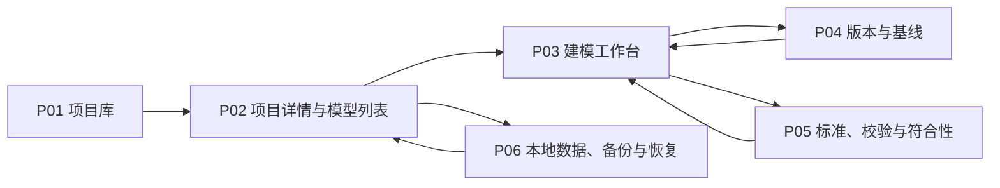

# OPM 单机建模工具页面专题设计包

文档版本：`v1.0`

文档状态：`FROZEN_INCLUDED`；P01-P06 信息架构与 handoff 冻结

全局设计状态、延期边界和开发准入以 `opm-design-freeze-baseline.md` 为唯一事实源。

更新时间：2026-07-27

## Task Type

- `feature`

## 1. 文档目的

本文档把 OPM 单机建模工具的页面组、导航、建模工作台信息架构、主动作和回流链路收敛为页面设计入口，供后续状态、字段、组件、接口和原型设计使用。

本文档重点回答：

1. 首期有哪些独立页面、工作台区域和受控弹层；
2. 用户如何从本地项目进入模型、编辑多张 OPD、检查 OPL/OPT、校验并生成基线；
3. 页面动作由哪些修订、校验、配置档和只读状态守卫；
4. 视口操作与 OPM 语义细化如何在界面上保持严格分离。

本文档不冻结视觉像素、前端框架、图形库、最终 URL 机制、API 字段、持久化 schema 或实现代码，也不替代原型验收、handoff 和开发执行包。

## 2. 关联文档

1. `docs/requirements/opm-online-modeling-tool-requirements.md`
2. `docs/requirements/opm-profile-capability-matrix.md`
3. `docs/requirements/opm-requirement-acceptance-matrix.md`
4. `docs/design/opm-modeling-tool-architecture.md`
5. `docs/design/opm-modeling-tool-module-design.md`
6. `docs/design/opm-modeling-workbench-state-model.md`
7. `docs/design/opm-modeling-workbench-field-region-detail.md`
8. `docs/design/opm-modeling-workbench-component-interaction.md`
9. `docs/design/opm-modeling-tool-application-api-contract.md`
10. `docs/design/opm-modeling-tool-persistence-contract.md`
11. `docs/design/opm-native-exchange-package-contract.md`

## 3. 专题定位与边界

### 3.1 专题目标

1. 为单用户、高频、长时建模提供安静、紧凑、可扫描的工作界面；
2. 让“一个模型、多张 OPD”的上下文结构成为一级导航，而不是把模型退化为单张画布；
3. 让 OPD、OPL/OPT、校验、版本和方法检查围绕同一修订协作；
4. 让用户始终能够判断当前配置档、修订、编辑状态、保存状态和基线状态。

### 3.2 必须承接

1. 项目、模型、配置档和本地工作区入口；
2. process tree、object forest、model views、System map 和跨图搜索；
3. OPD 图形编辑、只读 OPL/OPT、问题定位和版本操作；
4. 配置档转换预检、基线、导入导出、备份恢复等高风险动作；
5. 鼠标与键盘主路径、非纯颜色状态表达和陌生图标提示。

### 3.3 不承接

1. 用户、角色、租户、登录、权限和多人协同；
2. 评论、在线审批、云端分享和远程运行；
3. 首期直接编辑 OPL/OPT 并反向修改 OPD；
4. 仿真、动画、AI 自动建模和本体发布执行；
5. 自由图形绘制或配置档外语义扩展编辑。

独立扩展：[对话式智能建模助手设计](opm-conversational-modeling-design.md)第一版在左侧以“OPD 导航 / 智能助手”页签切换，助手不依赖底部或右侧属性区展开，默认 360 像素并复用分隔条调宽。每个 OPD 自动恢复一个固定会话，无需选择或新建，异常时可重连。支持多轮对话、当前图逐步实时生成、完成统一校验及一次确认、父子图读取和共享影响阻断；按[实现规格](../../specs/opm-conversational-modeling-implementation-task-spec.md)、[左侧迁移规格](../../specs/opm-assistant-left-panel-task-spec.md)及[唯一会话规格](../../specs/opm-assistant-single-session-task-spec.md)验收，不改变本节历史首期范围。本图整组事务见[实时整图规格](../../specs/opm-assistant-live-plan-task-spec.md)；最终平台 Findings 与独立只读标准语义审查、最多两轮自动修正及报告展示按[审查规格](../../specs/opm-assistant-validation-review-task-spec.md)验收，仅覆盖列明条款；跨图写入及自动细化仍禁用。

### 3.4 页面设计原则

1. 页面采用工具型信息密度，不使用营销式大标题、装饰性卡片墙或嵌套卡片；
2. 主动作靠近其作用对象，危险动作必须显示影响范围并二次确认；
3. 同一屏优先保持模型上下文，不因编辑属性、查看文本或处理问题频繁离开工作台；
4. 只读基线、候选编辑、已提交修订、保存失败和校验过期必须有文字或图标，不仅依赖颜色；
5. 页面只调用应用层查询和用例，不直接访问文件、数据库或语义内核。

## 4. 页面组定义

### 4.1 页面总表

下表的 `route` 是逻辑导航标识，不代表已经冻结浏览器路由或部署形态。

| page_id | 页面名称 | 逻辑 route | 页面性质 | 主目标 | 主要模块 |
| --- | --- | --- | --- | --- | --- |
| `P01` | 项目库 | `/projects` | 一级页 | 打开、新建、搜索、归档和恢复本地项目 | M01、M02 |
| `P02` | 项目详情与模型列表 | `/projects/:projectId` | 二级页 | 管理项目元数据和其中的 OPM 模型 | M01、M02、M06 |
| `P03` | 建模工作台 | `/projects/:projectId/models/:modelId/workbench` | 核心工作页 | 编辑多 OPD 模型并联动文本、问题和版本 | M01、M03-M09、M11 |
| `P04` | 版本与基线 | `/projects/:projectId/models/:modelId/versions` | 二级页 | 查看修订、快照、差异和只读基线 | M01、M09 |
| `P05` | 标准、校验与符合性 | `/projects/:projectId/models/:modelId/conformance` | 二级页 | 全量校验、查看规则证据和配置档能力状态 | M01、M06-M08 |
| `P06` | 本地数据、备份与恢复 | `/projects/:projectId/local-data` | 二级页 | 管理存储位置、导入导出、备份和恢复 | M01、M10、M12 |

### 4.2 受控弹层总表

| overlay_id | 名称 | 入口 | 提交结果 |
| --- | --- | --- | --- |
| `OV01` | 创建项目 | P01 | 新 Project，进入 P02 |
| `OV02` | 创建模型 | P02 | 绑定 Profile 的新 Model，进入 P03 |
| `OV03` | 创建细化 OPD | P03 选中可细化 Thing | 新 Context 与 Refinement Edge，打开新 OPD |
| `OV04` | 配置档转换分析 | P02/P05 | Conversion Report；确认后才产生新修订 |
| `OV05` | 创建命名快照 | P03/P04 | 不可变 Named Snapshot |
| `OV06` | 生成本地基线 | P03/P04/P05 | 通过全量门槛后生成不可变 Baseline |
| `OV07` | 导入项目或模型 | P01/P06 | 隔离 Import Plan；确认后创建新项目或草稿 |
| `OV08` | 导出产物 | P03/P04/P06 | Export Manifest 和本地文件位置 |
| `OV09` | 备份项目 | P06 | Backup Manifest |
| `OV10` | 恢复备份 | P06 | 默认生成独立恢复项目；覆盖恢复需额外确认 |
| `OV11` | 删除或移动 OPD 影响确认 | P03 | 取消或提交经影响分析的上下文命令 |

弹层不得保存与正式模型平行的业务事实。弹层输入只是命令参数或任务参数；关闭未提交弹层不得改变模型。

## 5. 全局信息架构与导航

### 5.1 应用层级



### 5.2 全局导航口径

1. 应用左上角固定提供返回项目库入口；
2. P02-P06 显示项目面包屑，P03-P05 继续显示模型和当前 OPD/视图上下文；
3. P03、P04、P05 属于同一模型工作上下文，切换页面时保留模型、当前修订和返回位置；
4. 搜索结果必须携带 `project_id/model_id/context_id/element_id` 等稳定定位信息，不能只返回名称；
5. 浏览器前进、后退和刷新只恢复可序列化导航状态，不重复执行写命令；
6. 未完成弹层、框选区域、拖拽中间态和撤销栈不进入 URL。

## 6. P03 建模工作台 IA

### 6.1 稳定区域

```text
+--------------------------------------------------------------------------------+
| 顶部上下文栏：项目 / 模型 / Profile / 修订 / 保存状态             全局动作      |
+----------------------+-----------------------------------+---------------------+
| 左侧模型导航         | 中央 OPD 画布                     | 右侧属性检查器      |
| process tree         | 稳定画布工具栏                    | 元素/关系/上下文    |
| object forest        | 当前 Context 投影                 | 配置档允许字段      |
| model views          |                                   |                     |
| 搜索 / System map    |                                   |                     |
+----------------------+-----------------------------------+---------------------+
| 底部工作区：OPL/OPT | 问题 | 操作历史 | 架构方法                           |
+--------------------------------------------------------------------------------+
```

区域尺寸由原型和前端设计冻结，但必须满足：中央画布始终获得主要空间；左右栏和底栏可折叠、可调整；工具栏、缩放控件和状态标识不得因动态文本改变布局。

### 6.2 顶部上下文栏

显示项目、模型、活动配置档及版本、当前修订、草稿/基线模式、保存状态和最后保存时间。主动作包括撤销、重做、全量校验、创建快照、生成基线、导出和更多模型操作。

守卫：

1. `readonly-baseline` 禁用全部语义写动作，只保留查看、比较、导出和“基于基线创建草稿”；
2. `submitting` 或写入未决时禁用相互冲突的写动作；
3. `save-failed` 不得显示“已保存”，生成基线必须禁用；
4. 配置档转换必须打开 OV04，不得作为普通下拉字段即时改写；
5. 生成基线必须固定目标修订并通过全量阻断校验。

### 6.3 左侧模型导航

左侧使用分组标签或等价紧凑导航，分别承接：

1. `process tree`：ISO 以 SD 为唯一根，显示过程细化层级；
2. `object forest`：显示多个对象细化根及其上下文树；
3. `model views`：显示视图名称、选择条件摘要和来源状态；
4. `System map`：显示 OPD、Thing、Link 和出现位置索引；
5. 搜索：定位项目内模型、OPD、Element 和 occurrence。

树节点必须区分拥有、引用、细化来源、当前打开和问题计数，不能只靠颜色。删除或移动 OPD 必须先进入 OV11。

### 6.4 中央 OPD 画布

画布承接当前 Context 的投影和临时交互状态。稳定工具栏按命令类别分区：

1. 选择、框选、平移；
2. 当前配置档允许的 Object、Process 及专属结点；
3. 基于源/目标端点动态过滤的关系命令；
4. 对齐、分布、自动布局；
5. 视口适配、放大、缩小和定位；
6. 语义细化菜单，包括状态显式/抑制、展开/折叠、内缩放/外缩放。

视口缩放控件必须使用“放大视图”“缩小视图”“适配画布”等名称，只修改 `viewport_state`。OPM 语义操作必须使用“过程内缩放”“过程外缩放”等完整名称，显示语义变更提示，并通过编辑命令产生新修订和文本更新；两类操作不得共用图标、快捷键或事件类型。

### 6.5 右侧属性检查器

检查器随选择类型切换：无选择、单个 Element、多个 Element、Relation、Context、Sentence 或 Finding。它只显示当前配置档允许的语义字段和适用的布局字段。

字段提交规则：

1. 普通布局字段只修改 Context/Occurrence 投影；
2. 名称、类型、状态、多重性、可见性和修饰符通过 M03 命令提交；
3. 跨图稳定 ID、来源修订、规则版本和生成追踪只读；
4. 多选仅显示可安全批量修改的公共字段；
5. 非法值保留在本地表单预览，不进入正式修订。

### 6.6 底部工作区

| 标签 | 内容 | 关键联动 |
| --- | --- | --- |
| OPL/OPT | 当前 OPD、子树或全模型的只读文本 | Sentence 与 OPD Construct 双向定位 |
| 问题 | 阻断、警告、建议和方法类 Finding | 从 Finding 定位 Context 与 Element/Fact |
| 操作历史 | 本地操作、对象、结果和时间 | 打开对应修订或错误详情，不等同 Undo |
| 架构方法 | 三层分类、6x1、功能信息模式和决策记录 | 与语言符合性分栏统计 |

当前“架构方法”先交付 6×1 关系检查：选择当前 OPD 或整个模型的关注过程，展示六类候选证据、未发现关系及人工确认说明。证据读取整个模型并显示所在 OPD，定位时高亮关系、端点及状态所属对象，可跨 OPD。编辑后自动刷新，切模型/版本丢弃迟到结果；错误可重试，历史只读版本也可检查。方法检查与语言校验结果独立。当前已支持 OPD 三层分类、父子细化与同模型显式架构关联。关联表单以当前图为源，记录“提供输入给”“生成”“追溯到”，列表显示源图、目标图和入站/出站，支持两端导航、删除确认及历史只读。分类、关联属于方法元数据，不生成画布关系或 OPL。功能信息模式、决策记录仍属待实现范围。

文本投影生成中或阻断时不得显示旧文本为“当前”；必须显示对应修订和 `generating/blocked/stale` 状态。

## 7. 页面 IA 与主动作

### 7.1 P01 项目库

主区块：顶部命令栏、活动项目表、归档项目视图、本地搜索和空状态。

主动作：新建项目、打开项目、重命名、归档、恢复、导入。

回流：打开进入 P02；导入通过 OV07 后进入新项目；归档后停留当前筛选且保留反馈。

### 7.2 P02 项目详情与模型列表

主区块：项目摘要、模型表、配置档摘要、最近活动和项目级动作。

主动作：新建模型、打开模型、重命名模型、配置档转换预检、进入本地数据页、移入回收站、恢复和永久删除。

模型区可切换活动列表与回收站。移入回收站前确认保留全部 OPD、草稿和历史；回收站中提供恢复及永久删除。永久删除必须输入完整模型名称，明确提示清除全部 OPD、草稿、历史版本与基线且应用内不可撤销。取消不提交命令，错误保留弹窗以供同一操作重试。本地存在尚未确认的编辑/保存输入时，先回工作台恢复，禁止静默丢弃输入。项目摘要中的模型数量只统计活动模型。

回流：创建模型通过 OV02 后进入 P03；转换分析返回 P02 或进入 P05 查看详情；关闭模型返回原列表位置。

### 7.3 P03 建模工作台

主区块见第 6 章。

主动作：创建和编辑语义、创建细化 OPD、图文定位、校验、保存、快照、基线、导出。

回流：P04/P05 返回时恢复 Context、选择和底部标签；从问题或搜索结果进入时定位到目标 occurrence；基线完成后可留在只读基线或基于其新建草稿。

### 7.4 P04 版本与基线

主区块：修订时间线、命名快照、基线列表、双版本选择和差异区。

主动作：创建快照、比较版本、打开只读版本、生成基线、基于基线创建草稿、导出。

差异必须分为语义、Context/Occurrence、普通布局和 OPL/OPT 文本，不把坐标变化描述为语义变化。

### 7.5 P05 标准、校验与符合性

主区块：当前配置档摘要、校验运行栏、Finding 列表、规则详情、能力报告和符合性摘要。

主动作：运行全量校验、筛选问题、定位工作台、查看规则来源、执行转换预检。

缺少原子规则、实现或证据时，符合性状态必须显示“无法判断”或“证据未就绪”，不得显示为符合。

### 7.6 P06 本地数据、备份与恢复

主区块：项目存储位置、备份策略、备份记录、导入导出任务和恢复入口。

主动作：打开位置、导出、立即备份、配置自动备份、校验并恢复。

页面不得暴露远程共享或账户设置。恢复默认创建新项目；覆盖当前项目必须展示回退点、影响范围和额外确认。

## 8. 核心用户链路

### 8.1 新建并开始建模

1. P01 通过 OV01 创建项目；
2. P02 通过 OV02 输入模型名称并选择 Profile 及版本；
3. 系统创建初始修订和根 Context，进入 P03；
4. 用户创建 Thing 和 Link，有效命令原子提交；
5. 文本和增量校验投影更新，保存状态反馈到顶部栏。

### 8.2 创建细化 OPD

1. P03 选中允许细化的 Object 或 Process；
2. 打开 OV03，选择配置档允许的细化方式；
3. 提交后创建 Context 与 Refinement Edge；
4. 左侧 process tree 或 object forest 更新并打开新 OPD；
5. 对应 OPL Paragraph/OPT 章节生成，父子导航可往返。

### 8.3 从问题回到模型

1. P03 底部问题标签或 P05 选择 Finding；
2. 系统解析稳定定位标识；
3. 打开对应 Model Revision 和 Context；
4. 定位相关 Element、Fact 或 Sentence；
5. 用户执行修复命令后，Finding 在匹配修订的新校验结果中更新。

### 8.4 生成基线

1. P03/P04/P05 打开 OV06；
2. 固定目标 Draft Revision，执行全量校验和文本追踪检查；
3. 有阻断项时显示问题并回流 P03/P05，不生成部分基线；
4. 通过后填写基线说明并确认；
5. 创建不可变 Baseline，提供查看、比较、导出和基于基线创建草稿。

## 9. 状态与守卫摘要

| 动作 | 启用条件 | 阻断反馈 |
| --- | --- | --- |
| 提交语义编辑 | 草稿可写、无进行中的冲突提交、候选输入合法 | 显示字段/端点/规则错误，保留候选输入 |
| 创建细化 OPD | 单选可细化 Thing、Profile 允许目标机制、草稿可写 | 说明选择或配置档不满足条件 |
| 撤销/重做 | 草稿可写且对应命令栈非空 | 按钮禁用并提供原因提示 |
| 切换 Profile | 非临时拖拽状态，允许创建隔离分析任务 | 强制进入 OV04，不直接修改模型 |
| 创建快照 | 目标修订已耐久保存 | 提示先解决保存失败或等待保存 |
| 生成基线 | 目标修订已保存、文本当前、全量校验无阻断 | 展示阻断 Finding 和证据缺口 |
| 导出正式资产 | 选定不可变修订或基线，生成物元数据完整 | 说明缺少修订/Profile/规则信息 |
| 恢复备份 | 文件安全、格式、版本和完整性检查通过 | 保持现有项目不变并显示失败阶段 |

完整状态定义见 `docs/design/opm-modeling-workbench-state-model.md`。

## 10. 需求与模块覆盖

| 页面/区域 | 主要需求 | 主要模块 |
| --- | --- | --- |
| P01/P02 | FR-PROJ-*、FR-LOCAL-001~002 | M01、M02、M06 |
| P03 左侧导航 | FR-OPD-* | M01、M05、M07 |
| P03 画布/检查器 | FR-EDIT-*、FR-META-* | M01、M03-M07 |
| P03 文本/问题 | FR-TEXT-*、FR-VAL-* | M01、M07、M08 |
| P03 方法 | FR-METHOD-* | M01、M11 |
| P04 | FR-VER-*、FR-LOCAL-003~004 | M01、M09 |
| P05 | FR-VAL-*、FR-META-012、ISO ISOR-* | M01、M06-M08 |
| P06/OV07-OV10 | FR-IO-*、FR-LOCAL-005~006、FR-ASSET-* | M01、M10、M12 |

## 11. 原型与开发推进建议

### 11.1 原型优先级

1. P03 空白、正常编辑、提交阻断、保存失败、文本生成中和只读基线状态；
2. P01-P02 新建项目/模型到打开工作台主路径；
3. P05 Finding 定位回 P03 和 OV06 基线阻断/成功路径；
4. P04 版本差异和 P06 恢复安全路径；
5. 键盘主路径、面板折叠和中等宽度桌面视口。

### 11.2 下游文档职责

1. 页面状态和跨页恢复由 `opm-modeling-workbench-state-model.md` 承接；
2. 页面字段来源、编辑性和守卫由 `opm-modeling-workbench-field-region-detail.md` 承接；
3. 组件树、事件和交互状态由 `opm-modeling-workbench-component-interaction.md` 承接；
4. 应用查询、命令、错误包络和后台任务协议由 `opm-modeling-tool-application-api-contract.md` 承接，逻辑持久化和交换边界由另外两份契约承接；
5. 页面覆盖和交互质量由 `opm-prototype-acceptance-report.md` 承接。

## 12. 事实与建议

### 12.1 已确认事实

1. 产品首期是单用户、单设备、本地优先，不包含账号、权限和多人协同；
2. Semantic Model 是唯一正式事实源，OPD 和 OPL/OPT 是投影；
3. 一个模型由多张相互关联的 OPD 表达，process tree、object forest 和 model view 必须分开管理；
4. 基线不可变，OPL/OPT 首期只读，保存失败不得显示成功；
5. 页面不得绕过 M02-M11 的应用用例直接访问 M12。

### 12.2 已冻结与待实现

1. P01-P06、逻辑 route 和五区工作台已经原型验收冻结；
2. P03 桌面优先，`<=820px` 单列降级、`<=520px` 紧凑表单；390px 视口已验证无全局横向溢出；
3. 桌面默认左右栏 230px/270px、底栏 240px；生产实现仍需提供折叠和调整；
4. `ARC-007/008/009` 已接受，准确依赖版本与生产性能由 DEV-00/02/09 验证。

## 2026-10-01 布局编辑增量

草稿工作台支持 Shift/Ctrl/Cmd 点击多选、再次点击取消选择；空白点击清除选择。拖动选中节点会整体移动选中节点及其所属状态；父与状态同时选中只应用一次偏移。特征连线接点随移动更新。

工具栏新增撤销布局和重做布局，快捷键为 Ctrl/Cmd+Z、Ctrl/Cmd+Shift+Z（兼容 Ctrl/Cmd+Y）。历史最多 100 步，仅保留当前会话当前 OPD 的布局操作；语义编辑、重载或切换图清空历史。输入框保留原生撤销。提交期间和只读版本禁用布局编辑，待确认交付沿已有恢复入口处理。完整验收见[任务规格](../../specs/opm-layout-selection-history-feature-task-spec.md)。


## 元素对齐与等距分布增量

草稿工具栏的布局菜单提供“对齐与等距分布”操作。Shift/Ctrl/Cmd 多选后，以最后选中的独立元素为基准进行左、水平居中、右、顶部、垂直居中、底部对齐。对齐至少两个独立元素；水平/垂直等距分布至少三个，固定两端，按元素边界间的空白距离均分，空间不足时拒绝整批。

节点排列保持尺寸，所属状态随父节点各自移动；父与状态同时选中只计算一次。独立状态只允许在同一所属节点内排列，超出内容区时拒绝操作，不改变所属节点尺寸。每次有效排列使用一条批量布局命令，支持现有布局撤销/重做；已经符合目标时不提交。关系编辑、提交中及只读模式不可排列，固定版本沿既有界面隐藏草稿布局工具。菜单支持 Escape、外部点击、键盘导航和窄屏定位。完整验收见[任务规格](../../specs/opm-align-distribute-feature-task-spec.md)。


## 2026-10-02 自动布局增量

布局菜单增加“自动布局…”入口，整理当前 OPD 的 owned 元素，支持从左到右及从上到下。关系端点归入所属顶层组后分层，循环折叠处理，孤立节点稳定排列；状态保留相对位置和尺寸，特征放在所属节点右下方，给主流程水平连线留出通道。reference 固定并作为避让区域。此规则不保证任意复杂图的最少交叉数，连线仍使用既有渲染器。

预览条明确显示“尚未应用”，当前画布使用临时坐标和现有关系渲染器；切换方向和取消均不产生草稿命令，Escape 取消。预览期间禁止画布几何编辑；窄屏预览控件固定在视口底部，避免遮挡首个节点，画布仍可平移、缩放。

点击“应用布局”复核原草稿身份及图，随后一次批量提交并记录一步布局历史，支持撤销/重做及保存重开。无变化不提交；原图、版本、token 或几何变化使旧预览失效；只读、提交中、加载中及未完成关系编辑不可开启。提交失败清理预览并恢复服务器已确认几何，待确认请求继续使用已有恢复入口。完整验收见[任务规格](../../specs/opm-auto-layout-feature-task-spec.md)。

## 2026-10-02 适应画布增量

比例菜单中的“适应画布 / Fit to view”按实际可见 SVG 内容居中缩放，包含展开特征、状态、关系文字和装饰，留出边距；折叠内容不计入。以外层画布宽高计算，避免窄屏被内部 620px 最小宽度裁切。适应最高 100%，缩放允许 0.01%–400%，显示实际百分比；“恢复100%”菜单项仅恢复比例，不修改模型坐标或语义。

适应模式中内容与画布尺寸变化重新适应，选择不重置视口；手动缩放和平移退出适应。自动布局预览不强制启动适应，已有适应模式随预览内容更新；用户可在预览中点击适应，切换方向继续适应。取消/Escape/失败还原预览前比例、平移和外层滚动；确认成功保留预览视口。只读版本也可操作视口，不产生草稿命令或布局历史。完整验收见[任务规格](../../specs/opm-fit-view-feature-task-spec.md)。

## 2026-10-02 选择模式空白拖动

选择模式支持鼠标左键拖动画布空白平移视口，超过 4px 才启动；拖动保留现有选择，点击空白仍取消选择。节点/状态/关系及装饰上的手势不进入空白平移，元素拖动与关系绘制沿用原流程；平移工具继续用于专门浏览。只读和自动布局预览同样允许空白平移，不写入模型、编辑序号或布局历史。拖动使用抓取光标，鼠标在画布外释放、失焦、取消及离开组件时结束捕获。完整验收见[任务规格](../../specs/opm-blank-drag-pan-feature-task-spec.md)。

## 2026-10-02 画布空白右键菜单

选择与平移模式下，右键画布空白显示「自动布局…」，整理当前 OPD 全部元素，无需先全选。点击复用工具栏的预览入口，确认后才应用，可取消或撤销。只读、空图、提交中、未完成关系编辑及已有布局预览时禁用；元素和关系保留原右键菜单。菜单限制在屏幕内，外部点击、Escape、滚动、窗口变化和图切换关闭。完整验收见[任务规格](../../specs/opm-blank-context-menu-feature-task-spec.md)。

空白菜单另含「撤销布局」「重做布局」及「对齐与分布」：历史项按现有会话布局历史启用，排列要求至少两个独立元素，分布要求三个。排列子菜单在同一浮层展开，带返回项，共用工具栏的六种对齐、两种分布及其图标和提示。右键保留当前多选，先选元素再右键空白即可操作。Escape 先返回主菜单，再关闭菜单；方向键跳过禁用项。只读、忙碌、未完成关系编辑及预览中禁用布局修改。完整验收见[增量规格](../../specs/opm-context-layout-actions-feature-task-spec.md)。

## 2026-10-02 OPD导航视觉整理

左侧标题使用「OPD导航」与独立计数徽标。各级图采用统一图标/层级引导线，当前图显示蓝色侧边标记；长名称省略显示，title保留全文。父图返回使用轻量按钮；创建子图表单分区显示细化对象、名称输入与提交按钮，并明确焦点/禁用状态。保留原切图、父图返回和创建流程，桌面与窄屏沿用原面板布局。验证见[规格](../../specs/opm-opd-navigator-visual-bugfix-task-spec.md)。

每个 OPD 名称行尾增加独立「＋」按钮，图名负责切图，＋在该行下方按需展开创建区，替代常驻表单。非当前行先切到目标图再展开；未选择对象或过程时提示先在画布选择细化元素。填写名称并确认后创建子图，取消或 Escape 不提交命令，切图或创建成功关闭创建区。只读、加载、提交、布局预览及关系编辑期间禁用入口。验证见[行尾添加规格](../../specs/opm-opd-row-add-feature-task-spec.md)。

对象或过程的右键菜单另提供「添加子图…」，以右键目标为细化元素，关闭菜单并展开对应 OPD 的既有创建区、聚焦名称；点击对号才提交创建。引用元素时禁用并通过title说明原因。状态、属性、操作和关系菜单不显示该项；只读及忙碌状态沿用既有编辑限制。原属性和删除菜单保留。验证见[元素右键添加规格](../../specs/opm-element-refinement-menu-feature-task-spec.md)。

当前图中已有细化子图的对象/过程使用宽度4的边框，普通边框为2，悬停提示「已有子图，右键选择“展开子图”」。标记由当前图导航的父图及细化元素关联派生，不依赖选择、不另行持久化，也不改变状态的INITIAL/FINAL图形语义。有子图时，右键「展开子图」替代「添加子图…」，进入对应图并保留父图返回及当前版本。只读右键仅提供属性和导航，跳过删除候选查询；加载/提交、布局预览及关系编辑期间禁用展开。验证见[子图标记与导航规格](../../specs/opm-refined-element-navigation-feature-task-spec.md)。


OPD 名称行右键提供「删除子图…」。根图、只读和忙碌期间禁用；确认窗口展示子树名称、图/元素/属性或操作/状态/关系数量以及外部引用阻断项。取消不提交，确认使用当前草稿的删除授权原子删除子树及专属内容；成功返回幸存父图，父元素恢复普通边框和「添加子图…」入口。历史版本保留，布局撤销不能恢复语义删除。验证见[子图删除规格](../../specs/opm-delete-context-feature-task-spec.md)。


返回父 OPD 位于当前子图名称行的＋之后，以返回箭头显示，title/aria-label保留完整含义。仅当前且有父图的行渲染按钮；根图无返回按钮，历史只读仍可导航。每行预留相同宽度的返回槽以避免切图时图名/＋错位，删除导航底部独立返回区域。验证见[行内返回规格](../../specs/opm-opd-row-parent-feature-task-spec.md)。


画布内滚轮直接向上放大、向下缩小，中心为鼠标位置，比例同步右下角缩放控件并退出自动适应模式。选择/平移工具及只读历史均支持；平移工具的滚轮改为缩放，拖动继续平移。滚轮仅在画布内生效，不产生语义/布局或保存命令。验证见[滚轮缩放规格](../../specs/opm-wheel-zoom-feature-task-spec.md)。

## 2026-10-02 右下角缩放控制增量

版本与编辑序号仅保留顶部标识。画布右下角固定显示缩小、可输入的百分比与比例菜单、放大，放在滚动画布外层，平移不改变控件位置。输入整数、小数和可选百分号，Enter或失焦应用、Esc取消；非法或非正数恢复原值并提示，有效值限制到既有0.01%–400%。比例菜单向上展开，提供25%、50%、75%、100%、125%、150%、200%、300%、400%，以及适应画布、恢复100%；按画布可见高度限制并可滚动，支持键盘导航和点击外部关闭。滚轮同步实际比例，不触发草稿写入。

工具栏提供真正的画布全屏/退出全屏，包含工具栏和画布；浏览器退出同步按钮状态，拒绝时提示。只读也可缩放、适应和全屏。连线交互的操作提示保留在左下方，普通版本和选择状态不再在画布重复显示。验证见[缩放控制规格](../../specs/opm-canvas-zoom-controls-feature-task-spec.md)。

## 2026-10-02 OPD JSON 导入与导出

2026-10-03 导航名称增量：根 SYSTEM_DIAGRAM 使用当前模型名称作为行内名称，悬停显示完整模型名称与「SD · 根图」；＋按钮的提示同步使用模型名称。子图及其他视图名称保持原值，长名称沿用省略显示，不修改持久OPD名称或标识。验证见[根图名称规格](../../specs/opm-root-opd-name-bugfix-task-spec.md)。

P03 的 OPD 名称右键菜单提供「导出 OPD JSON」，根图、子图及固定历史只读版本均可导出。下载 `.opd.json` 文件，内容为完整语义与布局，保留子图、必要父级依赖、状态、属性和关系。保存/提交/待确认期间禁用导出，文件错误显示在导航区。

P02「新建模型」旁提供「导入 OPD JSON」。选择文件后显示入口图及图/元素/状态/关系数量，确认新模型名称后导入并打开指定 OPD。导入会创建独立模型；文件大小上限10 MiB，格式、语义或环境规则绑定不匹配时显示错误并保持原数据。导入中防重复提交，完成前不能关闭弹窗；网络失败可使用原命令重试。桌面与窄屏使用同一弹窗与焦点管理。迁移协议与实际验证见[OPD JSON 规格](../../specs/opm-opd-json-transfer-feature-task-spec.md)。

## 2026-10-03 关系选中反馈

在选择模式点击关系，整组线段、端点标记、结构三角与控制/关系文字使用蓝色，线宽由2增为3。空心、实心、白色遮罩与透明背景保持原区别；点击空白或改选元素恢复原样。Effect的两段线与结构关系所有分支作为一个关系高亮，点击三角装饰同样选中所属关系，右键进入对应关系菜单。平移及绘制手势期间不改选关系；历史只读仍可选择。选中只影响视图，不修改语义、布局或保存序号，候选预览保持独立。验证见[连线选中反馈规格](../../specs/opm-relation-selection-bugfix-task-spec.md)。

## 2026-10-03 OPL 行定位与文本导出

点击 OPL 行时，按当前 trace 的 occurrence 同时高亮关系各分支与参与的对象、过程、属性、状态，包含状态/特征的所属元素。特征折叠时临时展开，取消定位后回到原折叠状态；直接操作收起按钮按当前可见状态执行。OPL 行本身显示选中背景；改选画布、点击空白、切图/版本或编辑内容变化时清除旧定位。语句定位独立于可编辑节点多选，不启用对齐/批量移动。

OPL 面板提供“导出 OPL”，下载当前 OPD 当前可见投影的全部语句，以 UTF-8、一句一行保存为“模型 - OPD.opl.txt”。空态/加载/提交中禁用，导出失败可重试；历史只读也可定位和导出，不提交保存或语义命令。导出的是当前生成文本；标准差异与覆盖边界见[规范复核记录](opm-opl-review-record.md)，验证见[OPL 面板规格](../../specs/opm-opl-panel-feature-task-spec.md)。

## 2026-10-03 模型问题校验与定位

活动草稿的“运行校验”以当前 exact DraftToken 查询全模型问题并打开“问题”面板，显示未校验、校验中、已完成、失败可重试及编辑后过期状态。同 token 切换 OPD 保留校验完成状态；模型、token 或会话变化后丢弃迟到响应。校验查询不修改模型、编辑序号或保存历史。

检查范围包括既有全模型基础结构约束、PROC-008/009/010 输入输出状态的对象归属，以及当前支持关系在各 OPD 的 OPL/Trace 生成约束。基础问题优先返回；每条关系独立检查，单条生成错误不会遮蔽其他关系的问题。已有 DraftFindings 字段、类别和严重程度保持不变，新增规则使用 rule.model.* 或 rule.opl.* 标识；coverage_state 仍为 INCOMPLETE，不代表 ISO 全规则覆盖。OPL 因已识别的语义问题无法生成时保留画布和问题入口，网络及身份错误仍按失败处理。

问题卡片显示中文标题、阻断程度、说明、所属 OPD/实体、修复建议和规则，英文原诊断可展开查看。“定位到画布”通过各图投影查找目标，跨图时同步 URL，加载完成后高亮关系及参与节点、状态、特征和所属元素，隐藏特征临时展开并居中目标。图结构或不可见目标明确提示；结果过期时禁止旧问题定位，改选、空白点击、切图或输入身份变化清除旧高亮。窄屏使用紧凑状态标签，问题内容可滚动查看。

历史版本显示已保存的问题记录并允许定位；运行按钮禁用，需返回活动草稿重校验。历史无问题记录和草稿零问题均使用有限覆盖文案。该流程复用 draft/findings 与 draft/projection，不新增 validation-tasks 流程，也不修复其历史持久化实现。实际画布测试、保存重开及覆盖边界见[问题校验规格](../../specs/opm-findings-workflow-feature-task-spec.md)。


## 2026-10-03 模型操作历史

操作历史按整个模型显示，最新操作在前，包含中文操作说明、当时目标名、OPD 名、时间与结果。活动草稿与只读保存版本共用只读查询；历史版本显示截取输入及保存时点之前的记录。保存和固定记录提供“查看版本”，通过既有版本导航更新 URL。

历史独立加载：读取失败显示重试，不阻断画布编辑；按 100 条分页，支持刷新及加载更早记录。切模型、切 OPD、编辑与离开工作台使旧响应失效。手动保存和检测到自动保存后刷新可见历史。新编辑保存原始名称，旧编辑明确缺失说明，不根据当前模型反推历史详情。操作历史与布局撤销/重做是不同功能；架构方法仍待接入。

## 2026-10-05 脑图分析模式（阶段 A/B）

完整设计见[脑图分析与 OPD 转换](opm-mindmap-analysis-design.md)。P03 中央区域增加稳定的“脑图分析 / OPD 建模”切换，脑图使用主画布；左侧沿用导航与智能助手，分析详情与转换操作放在脑图内部详情栏，窄屏改为上下布局。关闭右侧和底部仍可完成分析、生成及确认，不把脑图作为新建模型的必经步骤。

当前为每模型一份脑图，记录目标、对象、活动、状态及问题。脑图节点可以未分类，分支可以只是分类；所属对象和实体引用与树形父子关系分开。支持键盘新增、改名、拖动、折叠、撤销和独立自动保存，两种画布分别保留视口及选择。

“生成 OPD”明确分析范围、目标图与排除项；生成后自动打开 OPD 预览，保留返回脑图入口和左侧会话。助手连续生成，最终校验和语义审查后只确认一次。歧义集中处理；超限或未支持内容不能静默遗漏。首版只转换到单个 OPD，父子图生成按后续阶段启用。

脑图保存状态、分析问题与正式模型保存状态、模型 Findings 分开显示。转换记录提供来源定位和后续差异预览；切换模式不提交修改，删除脑图节点不删除正式元素，模型或脑图版本变化使旧预览失效。只读 Revision 不展示可编辑的活动脑图冒充历史内容。

首版已实现编辑、独立保存、JSON 导入导出、模型级分析会话、单 OPD 实时预览/确认和来源定位；刷新后恢复目标图上次明确的排除项。类型、归属或已有关系定义变化时阻断，不覆盖手工修改，不自动删除正式元素。父子图自动生成、跨图事务和双向同步后置。实际浏览器与 DeepSeek 验证见[实施规格](../../specs/opm-mindmap-implementation-task-spec.md)，完整后续要求见 MM-01 至 MM-11。
