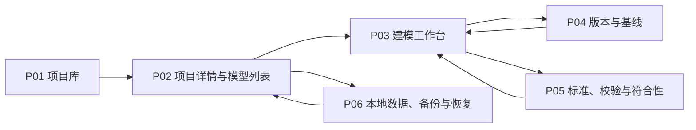

# OPM 单机建模工具页面专题设计包

文档版本：`v0.3-draft`

文档状态：P01-P06 信息架构经原型验证，P0 handoff 已冻结

更新时间：2026-07-27

## Task Type

- `feature`

## 1. 文档目的

本文档把 OPM 单机建模工具的页面组、导航、建模工作台信息架构、主动作和回流链路收敛为页面设计入口，供后续状态、字段、组件、接口和原型设计使用。

本文档重点回答：

1. 首期有哪些独立页面、工作台区域和受控弹层；
2. 用户如何从本地项目进入模型、编辑多张 OPD、检查 OPL/OPT、校验并生成基线；
3. 页面动作由哪些修订、校验、配置档和只读状态守卫；
4. 视口操作与 OPM 语义细化如何在界面上保持严格分离。

本文档不冻结视觉像素、前端框架、图形库、最终 URL 机制、API 字段、持久化 schema 或实现代码，也不替代原型验收、handoff 和开发执行包。

## 2. 关联文档

1. `docs/requirements/opm-online-modeling-tool-requirements.md`
2. `docs/requirements/opm-profile-capability-matrix.md`
3. `docs/requirements/opm-requirement-acceptance-matrix.md`
4. `docs/design/opm-modeling-tool-architecture.md`
5. `docs/design/opm-modeling-tool-module-design.md`
6. `docs/design/opm-modeling-workbench-state-model.md`
7. `docs/design/opm-modeling-workbench-field-region-detail.md`
8. `docs/design/opm-modeling-workbench-component-interaction.md`
9. `docs/design/opm-modeling-tool-application-api-contract.md`
10. `docs/design/opm-modeling-tool-persistence-contract.md`
11. `docs/design/opm-native-exchange-package-contract.md`

## 3. 专题定位与边界

### 3.1 专题目标

1. 为单用户、高频、长时建模提供安静、紧凑、可扫描的工作界面；
2. 让“一个模型、多张 OPD”的上下文结构成为一级导航，而不是把模型退化为单张画布；
3. 让 OPD、OPL/OPT、校验、版本和方法检查围绕同一修订协作；
4. 让用户始终能够判断当前配置档、修订、编辑状态、保存状态和基线状态。

### 3.2 必须承接

1. 项目、模型、配置档和本地工作区入口；
2. process tree、object forest、model views、System map 和跨图搜索；
3. OPD 图形编辑、只读 OPL/OPT、问题定位和版本操作；
4. 配置档转换预检、基线、导入导出、备份恢复等高风险动作；
5. 鼠标与键盘主路径、非纯颜色状态表达和陌生图标提示。

### 3.3 不承接

1. 用户、角色、租户、登录、权限和多人协同；
2. 评论、在线审批、云端分享和远程运行；
3. 首期直接编辑 OPL/OPT 并反向修改 OPD；
4. 仿真、动画、AI 自动建模和本体发布执行；
5. 自由图形绘制或配置档外语义扩展编辑。

### 3.4 页面设计原则

1. 页面采用工具型信息密度，不使用营销式大标题、装饰性卡片墙或嵌套卡片；
2. 主动作靠近其作用对象，危险动作必须显示影响范围并二次确认；
3. 同一屏优先保持模型上下文，不因编辑属性、查看文本或处理问题频繁离开工作台；
4. 只读基线、候选编辑、已提交修订、保存失败和校验过期必须有文字或图标，不仅依赖颜色；
5. 页面只调用应用层查询和用例，不直接访问文件、数据库或语义内核。

## 4. 页面组定义

### 4.1 页面总表

下表的 `route` 是逻辑导航标识，不代表已经冻结浏览器路由或部署形态。

| page_id | 页面名称 | 逻辑 route | 页面性质 | 主目标 | 主要模块 |
| --- | --- | --- | --- | --- | --- |
| `P01` | 项目库 | `/projects` | 一级页 | 打开、新建、搜索、归档和恢复本地项目 | M01、M02 |
| `P02` | 项目详情与模型列表 | `/projects/:projectId` | 二级页 | 管理项目元数据和其中的 OPM 模型 | M01、M02、M06 |
| `P03` | 建模工作台 | `/projects/:projectId/models/:modelId/workbench` | 核心工作页 | 编辑多 OPD 模型并联动文本、问题和版本 | M01、M03-M09、M11 |
| `P04` | 版本与基线 | `/projects/:projectId/models/:modelId/versions` | 二级页 | 查看修订、快照、差异和只读基线 | M01、M09 |
| `P05` | 标准、校验与符合性 | `/projects/:projectId/models/:modelId/conformance` | 二级页 | 全量校验、查看规则证据和配置档能力状态 | M01、M06-M08 |
| `P06` | 本地数据、备份与恢复 | `/projects/:projectId/local-data` | 二级页 | 管理存储位置、导入导出、备份和恢复 | M01、M10、M12 |

### 4.2 受控弹层总表

| overlay_id | 名称 | 入口 | 提交结果 |
| --- | --- | --- | --- |
| `OV01` | 创建项目 | P01 | 新 Project，进入 P02 |
| `OV02` | 创建模型 | P02 | 绑定 Profile 的新 Model，进入 P03 |
| `OV03` | 创建细化 OPD | P03 选中可细化 Thing | 新 Context 与 Refinement Edge，打开新 OPD |
| `OV04` | 配置档转换分析 | P02/P05 | Conversion Report；确认后才产生新修订 |
| `OV05` | 创建命名快照 | P03/P04 | 不可变 Named Snapshot |
| `OV06` | 生成本地基线 | P03/P04/P05 | 通过全量门槛后生成不可变 Baseline |
| `OV07` | 导入项目或模型 | P01/P06 | 隔离 Import Plan；确认后创建新项目或草稿 |
| `OV08` | 导出产物 | P03/P04/P06 | Export Manifest 和本地文件位置 |
| `OV09` | 备份项目 | P06 | Backup Manifest |
| `OV10` | 恢复备份 | P06 | 默认生成独立恢复项目；覆盖恢复需额外确认 |
| `OV11` | 删除或移动 OPD 影响确认 | P03 | 取消或提交经影响分析的上下文命令 |

弹层不得保存与正式模型平行的业务事实。弹层输入只是命令参数或任务参数；关闭未提交弹层不得改变模型。

## 5. 全局信息架构与导航

### 5.1 应用层级



### 5.2 全局导航口径

1. 应用左上角固定提供返回项目库入口；
2. P02-P06 显示项目面包屑，P03-P05 继续显示模型和当前 OPD/视图上下文；
3. P03、P04、P05 属于同一模型工作上下文，切换页面时保留模型、当前修订和返回位置；
4. 搜索结果必须携带 `project_id/model_id/context_id/element_id` 等稳定定位信息，不能只返回名称；
5. 浏览器前进、后退和刷新只恢复可序列化导航状态，不重复执行写命令；
6. 未完成弹层、框选区域、拖拽中间态和撤销栈不进入 URL。

## 6. P03 建模工作台 IA

### 6.1 稳定区域

```text
+--------------------------------------------------------------------------------+
| 顶部上下文栏：项目 / 模型 / Profile / 修订 / 保存状态             全局动作      |
+----------------------+-----------------------------------+---------------------+
| 左侧模型导航         | 中央 OPD 画布                     | 右侧属性检查器      |
| process tree         | 稳定画布工具栏                    | 元素/关系/上下文    |
| object forest        | 当前 Context 投影                 | 配置档允许字段      |
| model views          |                                   |                     |
| 搜索 / System map    |                                   |                     |
+----------------------+-----------------------------------+---------------------+
| 底部工作区：OPL/OPT | 问题 | 操作历史 | 架构方法                           |
+--------------------------------------------------------------------------------+
```

区域尺寸由原型和前端设计冻结，但必须满足：中央画布始终获得主要空间；左右栏和底栏可折叠、可调整；工具栏、缩放控件和状态标识不得因动态文本改变布局。

### 6.2 顶部上下文栏

显示项目、模型、活动配置档及版本、当前修订、草稿/基线模式、保存状态和最后保存时间。主动作包括撤销、重做、全量校验、创建快照、生成基线、导出和更多模型操作。

守卫：

1. `readonly-baseline` 禁用全部语义写动作，只保留查看、比较、导出和“基于基线创建草稿”；
2. `submitting` 或写入未决时禁用相互冲突的写动作；
3. `save-failed` 不得显示“已保存”，生成基线必须禁用；
4. 配置档转换必须打开 OV04，不得作为普通下拉字段即时改写；
5. 生成基线必须固定目标修订并通过全量阻断校验。

### 6.3 左侧模型导航

左侧使用分组标签或等价紧凑导航，分别承接：

1. `process tree`：ISO 以 SD 为唯一根，显示过程细化层级；
2. `object forest`：显示多个对象细化根及其上下文树；
3. `model views`：显示视图名称、选择条件摘要和来源状态；
4. `System map`：显示 OPD、Thing、Link 和出现位置索引；
5. 搜索：定位项目内模型、OPD、Element 和 occurrence。

树节点必须区分拥有、引用、细化来源、当前打开和问题计数，不能只靠颜色。删除或移动 OPD 必须先进入 OV11。

### 6.4 中央 OPD 画布

画布承接当前 Context 的投影和临时交互状态。稳定工具栏按命令类别分区：

1. 选择、框选、平移；
2. 当前配置档允许的 Object、Process 及专属结点；
3. 基于源/目标端点动态过滤的关系命令；
4. 对齐、分布、自动布局；
5. 视口适配、放大、缩小和定位；
6. 语义细化菜单，包括状态显式/抑制、展开/折叠、内缩放/外缩放。

视口缩放控件必须使用“放大视图”“缩小视图”“适配画布”等名称，只修改 `viewport_state`。OPM 语义操作必须使用“过程内缩放”“过程外缩放”等完整名称，显示语义变更提示，并通过编辑命令产生新修订和文本更新；两类操作不得共用图标、快捷键或事件类型。

### 6.5 右侧属性检查器

检查器随选择类型切换：无选择、单个 Element、多个 Element、Relation、Context、Sentence 或 Finding。它只显示当前配置档允许的语义字段和适用的布局字段。

字段提交规则：

1. 普通布局字段只修改 Context/Occurrence 投影；
2. 名称、类型、状态、多重性、可见性和修饰符通过 M03 命令提交；
3. 跨图稳定 ID、来源修订、规则版本和生成追踪只读；
4. 多选仅显示可安全批量修改的公共字段；
5. 非法值保留在本地表单预览，不进入正式修订。

### 6.6 底部工作区

| 标签 | 内容 | 关键联动 |
| --- | --- | --- |
| OPL/OPT | 当前 OPD、子树或全模型的只读文本 | Sentence 与 OPD Construct 双向定位 |
| 问题 | 阻断、警告、建议和方法类 Finding | 从 Finding 定位 Context 与 Element/Fact |
| 操作历史 | 本地操作、对象、结果和时间 | 打开对应修订或错误详情，不等同 Undo |
| 架构方法 | 三层分类、6x1、功能信息模式和决策记录 | 与语言符合性分栏统计 |

文本投影生成中或阻断时不得显示旧文本为“当前”；必须显示对应修订和 `generating/blocked/stale` 状态。

## 7. 页面 IA 与主动作

### 7.1 P01 项目库

主区块：顶部命令栏、活动项目表、归档项目视图、本地搜索和空状态。

主动作：新建项目、打开项目、重命名、归档、恢复、导入。

回流：打开进入 P02；导入通过 OV07 后进入新项目；归档后停留当前筛选且保留反馈。

### 7.2 P02 项目详情与模型列表

主区块：项目摘要、模型表、配置档摘要、最近活动和项目级动作。

主动作：新建模型、打开模型、重命名模型、配置档转换预检、进入本地数据页。

回流：创建模型通过 OV02 后进入 P03；转换分析返回 P02 或进入 P05 查看详情；关闭模型返回原列表位置。

### 7.3 P03 建模工作台

主区块见第 6 章。

主动作：创建和编辑语义、创建细化 OPD、图文定位、校验、保存、快照、基线、导出。

回流：P04/P05 返回时恢复 Context、选择和底部标签；从问题或搜索结果进入时定位到目标 occurrence；基线完成后可留在只读基线或基于其新建草稿。

### 7.4 P04 版本与基线

主区块：修订时间线、命名快照、基线列表、双版本选择和差异区。

主动作：创建快照、比较版本、打开只读版本、生成基线、基于基线创建草稿、导出。

差异必须分为语义、Context/Occurrence、普通布局和 OPL/OPT 文本，不把坐标变化描述为语义变化。

### 7.5 P05 标准、校验与符合性

主区块：当前配置档摘要、校验运行栏、Finding 列表、规则详情、能力报告和符合性摘要。

主动作：运行全量校验、筛选问题、定位工作台、查看规则来源、执行转换预检。

缺少原子规则、实现或证据时，符合性状态必须显示“无法判断”或“证据未就绪”，不得显示为符合。

### 7.6 P06 本地数据、备份与恢复

主区块：项目存储位置、备份策略、备份记录、导入导出任务和恢复入口。

主动作：打开位置、导出、立即备份、配置自动备份、校验并恢复。

页面不得暴露远程共享或账户设置。恢复默认创建新项目；覆盖当前项目必须展示回退点、影响范围和额外确认。

## 8. 核心用户链路

### 8.1 新建并开始建模

1. P01 通过 OV01 创建项目；
2. P02 通过 OV02 输入模型名称并选择 Profile 及版本；
3. 系统创建初始修订和根 Context，进入 P03；
4. 用户创建 Thing 和 Link，有效命令原子提交；
5. 文本和增量校验投影更新，保存状态反馈到顶部栏。

### 8.2 创建细化 OPD

1. P03 选中允许细化的 Object 或 Process；
2. 打开 OV03，选择配置档允许的细化方式；
3. 提交后创建 Context 与 Refinement Edge；
4. 左侧 process tree 或 object forest 更新并打开新 OPD；
5. 对应 OPL Paragraph/OPT 章节生成，父子导航可往返。

### 8.3 从问题回到模型

1. P03 底部问题标签或 P05 选择 Finding；
2. 系统解析稳定定位标识；
3. 打开对应 Model Revision 和 Context；
4. 定位相关 Element、Fact 或 Sentence；
5. 用户执行修复命令后，Finding 在匹配修订的新校验结果中更新。

### 8.4 生成基线

1. P03/P04/P05 打开 OV06；
2. 固定目标 Draft Revision，执行全量校验和文本追踪检查；
3. 有阻断项时显示问题并回流 P03/P05，不生成部分基线；
4. 通过后填写基线说明并确认；
5. 创建不可变 Baseline，提供查看、比较、导出和基于基线创建草稿。

## 9. 状态与守卫摘要

| 动作 | 启用条件 | 阻断反馈 |
| --- | --- | --- |
| 提交语义编辑 | 草稿可写、无进行中的冲突提交、候选输入合法 | 显示字段/端点/规则错误，保留候选输入 |
| 创建细化 OPD | 单选可细化 Thing、Profile 允许目标机制、草稿可写 | 说明选择或配置档不满足条件 |
| 撤销/重做 | 草稿可写且对应命令栈非空 | 按钮禁用并提供原因提示 |
| 切换 Profile | 非临时拖拽状态，允许创建隔离分析任务 | 强制进入 OV04，不直接修改模型 |
| 创建快照 | 目标修订已耐久保存 | 提示先解决保存失败或等待保存 |
| 生成基线 | 目标修订已保存、文本当前、全量校验无阻断 | 展示阻断 Finding 和证据缺口 |
| 导出正式资产 | 选定不可变修订或基线，生成物元数据完整 | 说明缺少修订/Profile/规则信息 |
| 恢复备份 | 文件安全、格式、版本和完整性检查通过 | 保持现有项目不变并显示失败阶段 |

完整状态定义见 `docs/design/opm-modeling-workbench-state-model.md`。

## 10. 需求与模块覆盖

| 页面/区域 | 主要需求 | 主要模块 |
| --- | --- | --- |
| P01/P02 | FR-PROJ-*、FR-LOCAL-001~002 | M01、M02、M06 |
| P03 左侧导航 | FR-OPD-* | M01、M05、M07 |
| P03 画布/检查器 | FR-EDIT-*、FR-META-* | M01、M03-M07 |
| P03 文本/问题 | FR-TEXT-*、FR-VAL-* | M01、M07、M08 |
| P03 方法 | FR-METHOD-* | M01、M11 |
| P04 | FR-VER-*、FR-LOCAL-003~004 | M01、M09 |
| P05 | FR-VAL-*、FR-META-012、ISO ISOR-* | M01、M06-M08 |
| P06/OV07-OV10 | FR-IO-*、FR-LOCAL-005~006、FR-ASSET-* | M01、M10、M12 |

## 11. 原型与开发推进建议

### 11.1 原型优先级

1. P03 空白、正常编辑、提交阻断、保存失败、文本生成中和只读基线状态；
2. P01-P02 新建项目/模型到打开工作台主路径；
3. P05 Finding 定位回 P03 和 OV06 基线阻断/成功路径；
4. P04 版本差异和 P06 恢复安全路径；
5. 键盘主路径、面板折叠和中等宽度桌面视口。

### 11.2 下游文档职责

1. 页面状态和跨页恢复由 `opm-modeling-workbench-state-model.md` 承接；
2. 页面字段来源、编辑性和守卫由 `opm-modeling-workbench-field-region-detail.md` 承接；
3. 组件树、事件和交互状态由 `opm-modeling-workbench-component-interaction.md` 承接；
4. 应用查询、命令、错误包络和后台任务协议由 `opm-modeling-tool-application-api-contract.md` 承接，逻辑持久化和交换边界由另外两份契约承接；
5. 页面覆盖和交互质量由 `opm-prototype-acceptance-report.md` 承接。

## 12. 事实与建议

### 12.1 已确认事实

1. 产品首期是单用户、单设备、本地优先，不包含账号、权限和多人协同；
2. Semantic Model 是唯一正式事实源，OPD 和 OPL/OPT 是投影；
3. 一个模型由多张相互关联的 OPD 表达，process tree、object forest 和 model view 必须分开管理；
4. 基线不可变，OPL/OPT 首期只读，保存失败不得显示成功；
5. 页面不得绕过 M02-M11 的应用用例直接访问 M12。

### 12.2 已冻结与待实现

1. P01-P06、逻辑 route 和五区工作台已经原型验收冻结；
2. P03 桌面优先，`<=820px` 单列降级、`<=520px` 紧凑表单；390px 视口已验证无全局横向溢出；
3. 桌面默认左右栏 230px/270px、底栏 240px；生产实现仍需提供折叠和调整；
4. `ARC-007/008/009` 已接受，准确依赖版本与生产性能由 DEV-00/02/09 验证。
