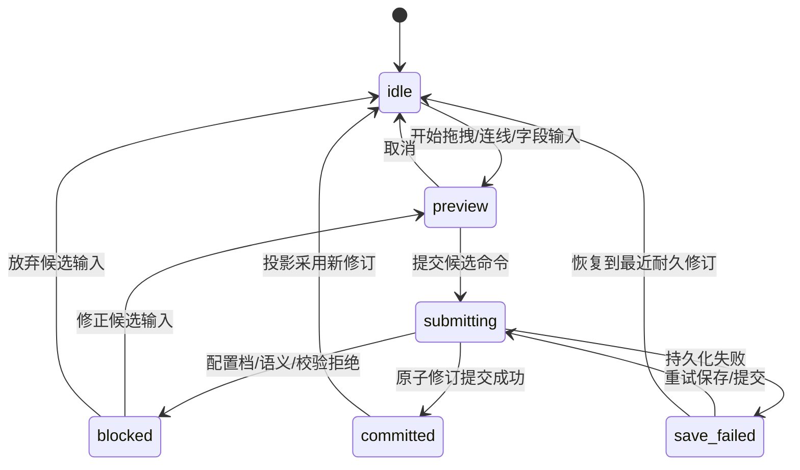
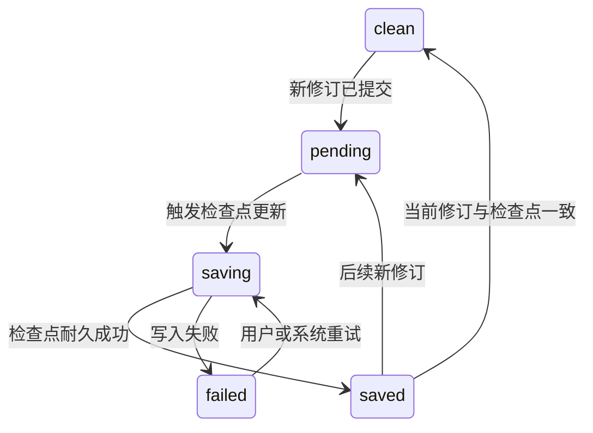
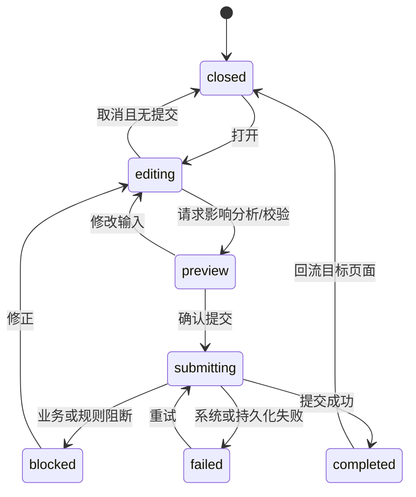

# OPM 单机建模工具页面状态模型

文档版本：`v1.0`

文档状态：`FROZEN_INCLUDED`；P01-P06 与完整画布状态模型冻结，实施证据按开发包记录

全局设计状态、延期边界和开发准入以 `opm-design-freeze-baseline.md` 为唯一事实源。

更新时间：2026-07-28

## Task Type

- `feature`

## 1. 文档范围

本文档定义 P01-P06 的状态分层、逻辑 URL 进入规则、跨页回流、建模工作台正交状态切片、关键状态转换和动作守卫。

本文档定义的是产品状态语义，不指定前端 store、路由库、缓存技术或 API 实现。

## 2. 关联文档

1. `docs/design/opm-modeling-workbench-page-design.md`
2. `docs/design/opm-modeling-workbench-field-region-detail.md`
3. `docs/design/opm-modeling-workbench-component-interaction.md`
4. `docs/design/opm-modeling-tool-module-design.md`
5. `docs/requirements/opm-online-modeling-tool-requirements.md`
6. `docs/design/opm-modeling-tool-application-api-contract.md`
7. `docs/design/opm-complete-canvas-toolchain-design.md`

## 3. 状态建模原则

### 3.1 状态分层

| 分层 | 含义 | 是否进入逻辑 URL | 耐久来源 |
| --- | --- | --- | --- |
| `route_context` | project、model、revision、context 和页面身份 | 是，稳定标识进入 | M02/M09 查询后校验 |
| `query_state` | 搜索、筛选、排序、标签和差异选择 | 仅可分享、可恢复部分 | URL 或本地偏好 |
| `local_view_state` | 面板尺寸、折叠、viewport、临时选择和焦点 | 否 | 会话内或本地偏好 |
| `resource_state` | 页面查询的 loading/ready/empty/error | 否 | 应用查询结果 |
| `editor_state` | 当前修订、候选输入、提交、撤销重做和只读模式 | 仅 revision 模式进入 | M03/M09 + 会话状态 |
| `projection_state` | OPD、文本、校验和方法投影的新鲜度 | 否 | M05/M07/M08/M11 |
| `overlay_state` | 弹层打开、预览、提交和失败状态 | 否 | 页面会话 |
| `background_task_state` | 校验、转换、导入、导出、备份和恢复任务 | 任务 ID 可选进入查询 | M10/M12 任务查询 |

这些状态是正交切片，不允许用一个“页面状态”枚举覆盖所有组合。例如页面可以同时是 `ready + editable-draft + save-failed + text-current + validation-stale`。

### 3.2 一致性原则

1. 所有投影都必须携带 `input_revision`；不同修订的 OPD、文本和校验结果不得组合成“当前”界面；
2. `committed` 表示语义修订已原子提交，不等于自动保存检查点已成功更新；
3. `save-failed` 必须保留可恢复编辑，并禁止基线和依赖耐久修订的动作；
4. `readonly-baseline` 是模型访问模式，不得由禁用控件的偶然组合推断；
5. 后台任务读取固定修订，完成结果不得覆盖用户已前进到的新修订状态；
6. 页面刷新不得重复写命令或自动确认弹层。

### 3.3 固定枚举口径

| 状态切片 | 枚举 |
| --- | --- |
| `page_resource` | `loading / ready / empty / error` |
| `access_mode` | `editable-draft / readonly-snapshot / readonly-baseline / recovery-required` |
| `edit_submit` | `idle / preview / submitting / blocked / committed / save-failed` |
| `autosave` | `clean / pending / saving / saved / failed` |
| `text_projection` | `text-current / generating / text-stale / blocked / failed` |
| `validation` | `validation-stale / running / current / failed` |
| `selection` | `no-selection / single-element / state / multi-element / relation / context / sentence / finding` |
| `state_candidate` | `unavailable / ready / placing / editing / preview / submitting / blocked / failed / committed` |
| `relation_candidate` | `idle / armed / source-selected / filtering / preview / submitting / blocked / failed / committed` |
| `overlay_submit` | `closed / editing / preview / submitting / blocked / completed / failed` |
| `background_task` | `queued / running / cancelling / cancelled / completed / failed` |

`blocked` 表示输入或规则已明确拒绝；`failed` 表示系统、持久化或任务执行异常。两者的修复路径不同，不得合并为同一错误状态。

## 4. 逻辑 URL 与恢复规则

### 4.1 进入 URL 的状态

1. `page_id` 对应的逻辑 route；
2. `project_id`、`model_id`、可选 `revision_id` 和 `context_id`；
3. P04 的左右比较版本；
4. P05 可复现的严重级别、规则类别和状态筛选；
5. 需要从外部入口定位时的 `element_id/finding_id/sentence_id`，消费后转为选择状态。

### 4.2 不进入 URL 的状态

1. viewport 比例、平移位置、框选范围和鼠标模式；
2. 属性表单未提交值、拖拽中间态和关系创建预览；
3. 撤销/重做栈和自动保存定时状态；
4. 弹层表单、二次确认和本地文件选择结果；
5. 面板拖动中的临时尺寸和当前键盘焦点。

### 4.3 刷新与非法入口

1. 刷新后先解析 route，再由 M02/M09 验证项目、模型、修订和 Context 是否存在；
2. revision 未指定时打开最新可恢复 Draft Revision；不存在草稿时打开最新 Baseline 的只读视图；
3. Context 不存在或不属于指定模型时，回退到该模型默认根 Context，并显示非阻断说明；
4. revision 是 Snapshot/Baseline 时强制只读，不因 URL 参数进入编辑模式；
5. 项目归档仍可显式打开，但显示归档状态；恢复或基于其中模型创建草稿必须走明确动作；
6. 格式或恢复检查失败时进入 `recovery-required`，不打开部分可编辑模型。

## 5. 全局回流约定

### 5.1 返回位置

从 P03 进入 P04/P05 时保存以下会话回流信息：`context_id`、选择稳定 ID、底部标签、左侧导航标签和 viewport bookmark。返回 P03 时：

1. 若目标 revision 未变化，恢复 Context、选择和 viewport；
2. 若已生成新修订，恢复 Context 和稳定元素选择，viewport 尽量恢复；
3. 若目标已删除，打开最近有效父 Context，并说明定位失效原因；
4. 若从 Finding 进入，优先定位 Finding 的 `input_revision`，用户确认后才切换到当前草稿修复。

### 5.2 默认规则

1. P01 默认显示活动项目；归档视图是显式筛选；
2. P02 默认按最近打开时间展示模型，不静默打开上次模型；
3. P03 默认打开上次有效 Context，否则打开 SD/根 Context；
4. P04 默认选择当前草稿与最近 Named Snapshot/Baseline 比较，但不自动启动差异任务；
5. P05 默认展示当前修订的最新校验结果；结果过期时显示 `validation-stale`；
6. P06 默认展示项目级本地数据，不自动扫描或恢复文件。

## 6. 建模工作台状态切片

### 6.1 工作区资源 `workspace_resource`

| 状态 | 进入条件 | 页面行为 | 可恢复动作 |
| --- | --- | --- | --- |
| `loading` | 正在验证项目、模型、Profile 和修订 | 显示稳定骨架，禁用模型动作 | 等待或取消返回 |
| `ready` | 所需资源和当前 OPD 投影可读 | 开放符合模式的动作 | 正常工作 |
| `error` | 打开失败且无安全只读投影 | 显示结构化错误和阶段 | 重试、返回 P02、进入恢复 |
| `recovery-required` | 检测到格式、原子写或恢复问题 | 不打开可编辑画布 | 进入 P06 或恢复向导 |

### 6.2 编辑与提交 `edit_submit`

规则：

1. `preview` 可以显示临时图形，但不得标记为正式 OPL/OPT；
2. `submitting` 期间锁定与同一候选冲突的命令，视口平移和查看允许继续；
3. `blocked` 保留可修正候选值，并显示领域错误、配置档错误或定位信息；
4. `save-failed` 不得把画布标记为已保存，退出页面前必须提示未耐久状态；
5. `committed` 只有收到包含新 revision 的成功结果后成立。

### 6.3 自动保存 `autosave`

顶部栏必须同时显示语义修订和自动保存结果，不能用“已提交”替代“已保存”。

### 6.4 文本投影 `text_projection`

| 状态 | 判定 | 显示规则 |
| --- | --- | --- |
| `text-current` | `text.input_revision == active_revision` 且规则版本匹配 | 可作为当前只读文本并参与基线门槛 |
| `generating` | 新修订文本正在生成 | 保留旧文本时明确标注其旧 revision，不作为当前 |
| `text-stale` | 已有文本不匹配当前修订或规则版本 | 显示过期状态，禁止基线 |
| `blocked` | 当前语义无法生成合法文本 | 显示阻断 Finding，不输出占位正式句 |
| `failed` | 生成器异常或资产不可用 | 显示重试和诊断入口，禁止基线 |

### 6.5 校验 `validation`

| 状态 | 判定 | 页面行为 |
| --- | --- | --- |
| `validation-stale` | 最新报告 revision/rule version 不匹配 | 可显示旧报告但标注过期，不用于基线 |
| `running` | 增量或全量规则在固定修订执行 | 显示范围、进度和固定 revision |
| `current` | 报告与当前修订/Profile/规则版本匹配 | 展示等级计数和定位动作 |
| `failed` | 任务或规则资产失败 | 区分系统失败与模型 Finding，允许重试 |

新的语义修订提交后，旧校验立即进入 `validation-stale`。普通 viewport 和非语义布局变化不得使语义校验过期；是否使布局质量检查过期由规则类别决定。

### 6.6 选择 `selection`

| 状态 | 右侧检查器 | 底部联动 |
| --- | --- | --- |
| `no-selection` | 当前 Context 摘要 | OPL/OPT 保持当前段落 |
| `single-element` | Element + occurrence 字段 | 突出关联 Sentence/Finding |
| `state` | State + owner + role + occurrence 字段 | 突出使用该 State 的 Fact/Sentence/Finding |
| `multi-element` | 安全公共字段和数量摘要 | 汇总相关 Finding，不合并语义值 |
| `relation` | Relation、端点和修饰符 | 突出对应 Sentence/Fact |
| `context` | Context、来源和细化信息 | 显示对应 Paragraph/章节 |
| `sentence` | Sentence 追踪只读详情 | 画布定位一个或多个 Construct |
| `finding` | Finding、规则和修复建议 | 定位 Context、Element/Fact/Sentence |

跨 Context 的选择定位先切换 Context，再更新 selection；失败时不得保留看似有效的旧高亮。

### 6.7 访问模式 `access_mode`

| 模式 | 语义写入 | 版本动作 | 导出 |
| --- | --- | --- | --- |
| `editable-draft` | 允许，受命令守卫控制 | 快照、校验、基线 | 允许当前修订或基线产物 |
| `readonly-snapshot` | 禁止 | 比较、基于快照创建草稿 | 允许 |
| `readonly-baseline` | 禁止 | 比较、基于基线创建草稿 | 允许正式资产 |
| `recovery-required` | 禁止 | 仅诊断和恢复 | 仅允许安全诊断包，具体待契约确认 |

### 6.8 State 候选 `state_candidate`

| 状态 | 进入条件 | 页面行为 | 退出 |
| --- | --- | --- | --- |
| `unavailable` | 无合法 owner、只读或 Profile 禁止 | State 工具禁用并给出原因 | 选择合法 Object/Attribute -> ready |
| `ready` | 合法 owner 已选中 | owner 锁定并可进入放置 | 点击工具 -> placing；取消选择 -> unavailable |
| `placing` | State 工具激活 | 只接受 owner content box 内位置 | 点击合法位置 -> editing；Esc -> ready |
| `editing` | 候选 State 已创建 | 编辑 name/value 和 role，不显示正式 OPL | 本地格式通过 -> preview；取消 -> ready |
| `preview` | 候选字段完整 | 显示候选符号、影响和非正式文本预览 | 提交 -> submitting；修改 -> editing |
| `submitting` | `CREATE_STATE/UPDATE_STATE` 已发出 | 锁定冲突字段，允许 viewport | COMMITTED/BLOCKED/FAILED |
| `blocked` | Profile/领域/文本阻断 | 保留候选并定位 owner/字段/规则 | 修正 -> editing；放弃 -> ready |
| `failed` | 持久化/系统失败 | 保留可重试输入，显示最近耐久 Revision | 重试 -> submitting；放弃 -> ready |
| `committed` | 返回唯一 committed_revision | 采用新 Projection，清除候选 | Projection current -> ready |

规则：

1. `state_candidate` 是 `edit_submit` 的专用细分，提交阶段必须与全局 `edit_submit` 一致，不能一个显示 committed、另一个显示 failed；
2. owner、Context、Profile binding 或 base revision 变化时，placing/editing/preview 候选进入 blocked(`REVISION_STALE`)并要求重算；
3. State 拖出 owner 不进入布局 candidate；跨 owner 移动不在本状态机支持；
4. committed 前的 State 不进入正式 selection、Context Projection、OPL 或 Finding。

### 6.9 关系候选 `relation_candidate`

| 状态 | 进入条件 | 页面行为 | 退出 |
| --- | --- | --- | --- |
| `idle` | 未选择关系工具 | 无候选 overlay | 选择目录项/主按钮 -> armed |
| `armed` | 关系类型或目录已激活 | 等待第一个端点 | 选端点 -> source-selected；Esc -> idle |
| `source-selected` | 第一个用户端点已选 | 显示端点焦点和可连接目标 | hover/选第二端点 -> filtering |
| `filtering` | 调用 API-EDT-001 | 展示 loading、多候选或不可用原因 | 唯一/用户选择 -> preview；无候选 -> blocked |
| `preview` | 规范端点和 option 已冻结 | 显示 descriptor、route、标签/修饰表单和非正式 OPL | 提交 -> submitting；换端点 -> filtering |
| `submitting` | `CREATE_FACT/UPDATE_FACT` 已发出 | 锁定同一 Fact 候选 | COMMITTED/BLOCKED/FAILED；冲突 -> source-selected |
| `blocked` | 候选或提交被拒绝 | 保留端点、标签和修饰，显示 reason/error | 修正 -> filtering；放弃 -> idle |
| `failed` | 系统、持久化或 Projection 回读失败 | 保留可重试输入，显示最近耐久 Revision | 重试 -> submitting；放弃 -> idle |
| `committed` | 返回唯一 committed_revision | 采用正式 Fact/Trace/Projection | 连续创建 -> armed；否则 -> idle |

规则：

1. `first_endpoint` 只是用户选择顺序；正式 `normalized_endpoints` 只能来自 API-EDT-001 option；
2. `capability_query_id/option_id` 绑定 base revision、Context、Profile binding、端点和 draft fields，任一变化即失效；
3. 多候选时不得自动提交排序第一项；最近使用只影响目录排序；
4. viewport、菜单展开、搜索词和 hover 不改变 candidate 的语义摘要；
5. Control modifier 复用基础 Fact candidate，fundamental fan 维护一个 Fact candidate 和多个 ordered refinee，不生成重叠/拆分候选。

## 7. 页面状态模型

### 7.1 P01 项目库

主要切片：

1. `project_list_resource: loading / ready / empty / error`；
2. `project_scope: active / archived / all`；
3. `search_query`、`sort_order` 和分页/窗口状态；
4. `selected_project_id`；
5. `OV01/OV07 overlay_submit`。

归档/恢复提交时保留列表筛选和行位置。操作成功后以返回的 project 状态更新行，不预先假设成功。

### 7.2 P02 项目详情与模型列表

主要切片：

1. `project_resource`、`model_list_resource`；
2. `selected_model_id`、搜索和 Profile 筛选；
3. `open_workspace_state: idle / opening / blocked / opened / failed`；
4. `OV02/OV04 overlay_submit`；
5. 项目归档只读提示。

### 7.3 P03 建模工作台

主要切片：

1. 第 6 章全部正交状态；
2. `navigation_state: process-tree / object-forest / model-views / system-map / search`；
3. `bottom_panel: text / findings / history / method`；
4. `viewport_state: scale / translation / mode / fit_target`；
5. `panel_state: left/right/bottom open + size`；
6. `OV03/OV05/OV06/OV08/OV11 overlay_submit`。
7. `state_candidate` 和 `relation_candidate`，均绑定当前 Context/base revision；
8. `capability_option_resource: idle/loading/current/stale/error`，只保存 API-EDT-001 查询结果。

`viewport_state` 变化不得进入 `edit_submit`，不得使 `text_projection` 或语义 `validation` 过期。

### 7.4 P04 版本与基线

主要切片：

1. `version_list_resource`；
2. `left_revision_id/right_revision_id`；
3. `diff_scope: semantic / context / layout / text / all`；
4. `diff_state: idle / running / current / failed`；
5. `OV05/OV06/OV08 overlay_submit`。

差异结果必须绑定左右 revision；任一选择变化后旧结果立即过期。

### 7.5 P05 标准、校验与符合性

主要切片：

1. `profile_resource`、`capability_report_resource`；
2. `validation` 和 `conformance_state: unknown / partial / full / nonconformant / evidence-missing`；
3. Finding 严重级别、类别、Context 和规则筛选；
4. `selected_finding_id/selected_rule_id`；
5. `OV04/OV06 overlay_submit`。

`evidence-missing` 不得被映射为 `partial` 或 `full`。符合性结果必须显示输入 revision、Profile、规则和证据版本。

### 7.6 P06 本地数据、备份与恢复

主要切片：

1. `storage_resource`、`backup_policy_resource`、`backup_list_resource`；
2. `background_task_state` 和任务类型；
3. `selected_backup_id/selected_manifest_id`；
4. `OV07/OV08/OV09/OV10 overlay_submit`；
5. `replace_confirmation_state`，只用于显式覆盖恢复。

任务取消只在任务声明可取消时可用；进入原子提交阶段后显示“正在完成”，不得伪装为可安全取消。

## 8. 弹层状态与高风险动作

### 8.1 通用弹层状态机

### 8.2 额外守卫

| 弹层 | 必须完成的 preview | 禁止行为 |
| --- | --- | --- |
| OV04 配置档转换 | 无损/扩展/有损/不可映射项和目标校验 | 选择目标 Profile 后立即改原模型 |
| OV06 生成基线 | 固定 revision 的全量校验、文本追踪和元数据摘要 | 有阻断项或保存失败时提交 |
| OV07 导入 | 文件安全、格式、Profile、标识和 Import Plan | 校验前覆盖活动模型 |
| OV08 导出 | 范围、格式、revision/Profile/规则元数据 | 导出未标识版本的正式资产 |
| OV10 恢复 | 完整性、版本、目标项目和回退点 | 默认覆盖当前项目 |
| OV11 OPD 影响 | owner/reference/refinement/view 影响清单 | 无分析直接删除或移动 |

## 9. 动作守卫矩阵

| 动作 | access_mode | edit_submit | autosave | text | validation |
| --- | --- | --- | --- | --- | --- |
| 语义编辑 | 仅 editable-draft | idle/preview | 任意但失败需显式 | 任意 | 任意 |
| viewport 操作 | 所有可查看模式 | 任意 | 任意 | 任意 | 任意 |
| 创建快照 | editable-draft | idle | saved/clean | 可过期但需标注 | 可过期 |
| 生成基线 | editable-draft | idle | saved/clean | text-current | current 且无 BLOCKING |
| 打开只读版本 | 非 recovery-required | idle | 任意 | 对应 revision 可用 | 对应报告可用 |
| 配置档转换确认 | editable-draft | idle | saved/clean | 目标试生成成功 | 目标校验满足转换门槛 |
| 正式资产导出 | draft/snapshot/baseline | idle | 目标 revision 耐久 | 对应 revision current | 携带对应状态和证据 |

## 10. 异常与恢复

1. 查询失败：保留 route_context，提供重试和返回，不清空本地项目数据；
2. 提交阻断：保留候选输入并定位具体字段、端点或规则；
3. 持久化失败：保留未耐久编辑，明确最近安全 revision 和重试/回退选择；
4. 文本生成失败：保持语义修订可诊断，标记文本失败并禁止基线；
5. 校验任务失败：不把任务失败显示为模型通过或不符合；
6. 后台任务结果过期：保存任务结果供查看，但不覆盖当前 revision 的状态摘要；
7. Context 定位失败：回退到有效父 Context，清除无效选择并说明原因；
8. 应用异常重开：恢复最近 Autosave Checkpoint，必要时进入 recovery-required。
9. Candidate Revision 过期：保留用户意图和可编辑字段，清除 option ID/规范端点，刷新 Projection 后重新查询，不直接重放旧 payload。

## 11. 事实与建议

### 11.1 已确认事实

1. 草稿、快照和基线的可变性不同；基线必须只读；
2. 正式语义、文本、追踪和校验摘要按修订原子提交；
3. 保存失败必须保留编辑并显示真实状态；
4. 视口缩放不产生语义命令，语义 in-zooming/out-zooming 产生新修订；
5. 校验和文本都必须绑定输入修订及规则/Profile 版本。

### 11.2 已冻结与待实现

1. P0 状态切片已映射现有 OpenAPI；完整画布 State/关系候选已映射应用 API 逻辑契约，TypeScript DTO 必须由 DEV-CANVAS-00 的机器契约生成；
2. 面板默认尺寸和移动降级已经原型验证，本地偏好与 viewport bookmark 保存周期由生产实现确定；
3. 任务固定为查询 + SSE，取消点和进度阶段由每类任务实现定义；
4. 浏览器 route 承载 revision/context 稳定定位，viewport 和未提交状态不进入 URL。
5. 现有 P0 设计确认前端只实现 Object/Process/Consumption 工具状态，不能作为 State/完整关系 candidate 已实现证据。
