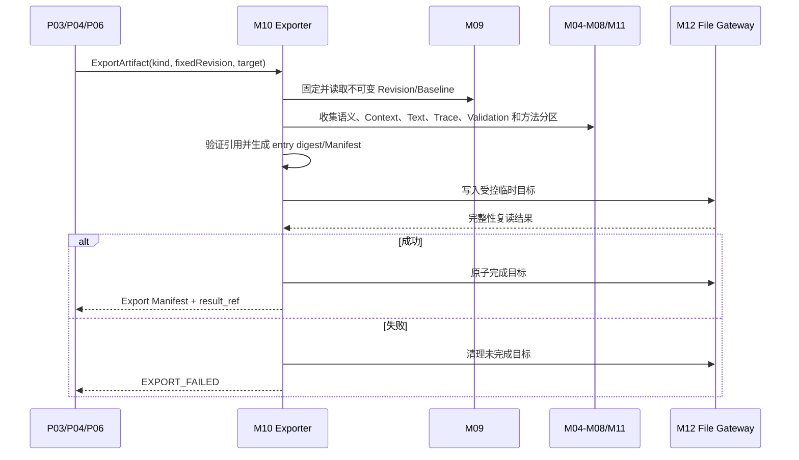

# OPM 原生模型交换包契约

文档版本：`v1.1`

文档状态：`FROZEN_INCLUDED`；原生交换逻辑与物理容器冻结，机器资产按开发包实现

全局设计状态、延期边界和开发准入以 `opm-design-freeze-baseline.md` 为唯一事实源。

更新时间：2026-07-31

## Task Type

- `feature`

## 1. 文档范围

本文档定义 OPM 单机建模工具原生交换包的 package kind、逻辑清单、内容分区、稳定身份、引用完整性、版本兼容、摘要、安全限制、导出和 staging 导入规则。

“原生”表示本产品定义的结构化交换格式，不表示 ISO 19450:2024 已定义或认可该格式。ISO 工具互操作必须另行调研标准或供应商格式、建立映射和代表性证据。

本文档冻结首发原生交换包的物理格式：

1. 文件扩展名固定为 `.opmp`，物理容器固定为 ZIP，容器 MIME type 固定为 `application/zip`；不得以 TAR、目录包或其他容器写出 `exchange_format_version=1.0`；
2. `manifest.json` 及其他 JSON entry 固定使用 UTF-8 Canonical JSON；规范化规则与 `opm-physical-data-and-migration-design.md` 第 10.1 节一致，即对象键字典序、Decimal 规范化并禁止 NaN/Infinity；
3. entry 和 package 完整性摘要固定使用 SHA-256，摘要值使用 64 位小写十六进制；所有 `logical_path` 使用 ZIP 内相对路径；
4. 首个机器 Schema 必须实现本节物理格式，不得在实现阶段重新选择容器、扩展名、编码或摘要算法。

本文档仍不冻结：

1. 数字签名、加密、第三方信任链和远程传输协议；
2. 外部 OPM 工具导入导出格式；
3. PDF、SVG、PNG 的渲染规范；
4. 完整项目备份的物理格式和默认保留策略。

## 2. 关联文档

1. `docs/requirements/opm-online-modeling-tool-requirements.md`
2. `docs/requirements/opm-profile-capability-matrix.md`
3. `docs/requirements/opm-common-semantic-core.md`
4. `docs/design/opm-modeling-tool-application-api-contract.md`
5. `docs/design/opm-modeling-tool-persistence-contract.md`
6. `docs/design/opm-modeling-tool-module-design.md`
7. `docs/design/opm-core-metamodel-field-schema.md`
8. `docs/design/opm-profile-package-field-schema.md`
9. `docs/design/opm-rule-definition-field-schema.md`

## 3. 设计原则

1. 包内容来自固定不可变 Revision 或 Baseline，导出期间不读取移动中的 Draft Head；
2. Manifest 是包内入口，所有正式分区均有长度、摘要、版本和依赖声明；
3. Semantic Partition 是事实源，OPD、文本、校验和报告不得形成平行可写语义；
4. 稳定身份、Context 层级、关系端点、布局、Profile 和版本元数据必须可恢复；
5. 未知必填分区、未知语义类型、摘要失败或悬空引用必须阻断导入；
6. 导入只在隔离 staging 中解析和验证，确认前不得修改活动项目；
7. 首期不支持自动合并到同一模型事实图；身份碰撞必须显式规划；
8. 中文草案扩展必须保留来源和隔离标识，不能静默输出或导入为 ISO 能力。

## 4. Package Kind

| package_kind | 作用 | 必须包含 | 典型入口 |
| --- | --- | --- | --- |
| `PROJECT_FULL` | 迁移一个完整本地项目 | Project/Model 目录、所需 Revision、Snapshot、Baseline、Profile 依赖、操作历史和必要派生物 | P06/OV08 |
| `MODEL_REVISION` | 交换一个模型的固定 Revision | Model metadata、目标 Revision 全分区、Profile 依赖和引用清单 | P03/P04/OV08 |
| `BASELINE_ASSET` | 交付不可变业务语义资产 | Baseline、目标 Revision、完整 OPD、文本、Trace、校验/证据和 Profile/规则引用 | P04/P05/OV08 |

SVG/PNG/PDF/纯 OPL/OPT 是 `ExportArtifact` 的呈现产物，不是可无损恢复的原生交换包。完整备份可以复用清单和分区规则，但必须额外满足项目历史、恢复点和本地恢复要求，不能把任意 MODEL_REVISION 包标记为备份。

## 5. 格式版本

### 5.1 版本字段

`exchange_format_version` 逻辑上使用 `major.minor`：

1. major 变化表示现有读取器不能保证正确解释；
2. minor 变化只允许兼容性新增，旧读取器可以在未触及未知 required 能力时读取；
3. Manifest 必须声明 `minimum_reader_version`；
4. 首发机器格式固定 `exchange_format_version=1.0`、`minimum_reader_version=1.0`；机器 Schema、writer、reader 和 golden package 尚未通过实现验收时，只能标记为 `NOT_IMPLEMENTED/NOT_RUN`，不得更改已冻结版本值；
5. `1.x` reader 可以读取 `minimum_reader_version<=自身版本` 且不包含未知 required 能力的包；major 不同、最低读取器版本过高或出现未知 required 能力时必须阻断；
6. 格式版本与 storage_schema_version、model_revision、Profile/规则版本完全独立。

### 5.2 扩展兼容

扩展使用稳定命名空间和版本，并声明 `required=true/false`：

- required 扩展无法识别时阻断导入；
- optional 扩展无法识别时可以保留为不参与正式语义的 opaque payload，但必须在 Import Plan 中列出；
- 任何影响 Element、Fact、Context、文本或规则解释的扩展都必须是 required；
- opaque payload 不得进入 ISO Semantic Partition 或生成 ISO OPL。

## 6. Manifest

### 6.1 包身份与来源

| 字段 | 必填 | 含义 |
| --- | --- | --- |
| `package_id` | 是 | 本次导出的唯一包标识 |
| `package_kind` | 是 | 第 4 章枚举 |
| `exchange_format_version` | 是 | 首发固定为 `1.0` |
| `minimum_reader_version` | 是 | 首发固定为 `1.0`；不得高于 `exchange_format_version` |
| `created_at` | 是 | 导出完成时间 |
| `producer_application/version` | 是 | 产生工具及版本，不作为符合性证据 |
| `source_project_id` | PROJECT_FULL 时是 | 源项目稳定 ID |
| `source_model_id` | MODEL/BASELINE 时是 | 源模型稳定 ID |
| `source_revision_id` | MODEL/BASELINE 时是 | 固定不可变 Revision |
| `source_baseline_id` | BASELINE_ASSET 时是 | 源 Baseline |
| `identity_namespace` | 是 | 解释包内稳定 ID 的源命名空间 |

### 6.2 语义与规则上下文

| 字段 | 必填 | 含义 |
| --- | --- | --- |
| `profile_id/profile_version` | 是 | 模型配置档绑定 |
| `rule_version` | 是 | 校验和转换规则版本 |
| `text_grammar_version` | 是 | OPL/OPT 生成资产版本 |
| `text_modality` | 是 | `OPL/OPT` |
| `model_conformance_status` | 是 | `SYMBOLIC/FULL/NONCONFORMANT/NOT_EVALUATED/EVIDENCE_MISSING` 及模型证据引用 |
| `tool_vendor_evidence_ref` | 否 | 生产工具的 TOOL-GUIDE/OPL 能力证据引用，不从单个模型推断 |
| `capability_report_ref` | 是 | 能力实现状态和证据版本引用 |
| `profile_dependencies` | 是 | 嵌入或外部必需 Profile/规则资产摘要 |

模型符合性缺少完整规则和证据时必须为 `NOT_EVALUATED/EVIDENCE_MISSING` 或符合实际的非符合状态，不能因包类型为 BASELINE_ASSET 自动声明 ISO 符合。工具制造商符合性是产品级结论，不能由单个模型包自动得出。

### 6.3 内容清单

每个逻辑 entry 至少包含：

| 字段 | 含义 |
| --- | --- |
| `entry_id` | 包内唯一条目标识 |
| `entry_role` | semantic/context/text/trace/validation/version/profile/method/history/asset 等 |
| `logical_path` | 容器无关的逻辑名称，不允许绝对路径或 `..` |
| `media_type/schema_id/schema_version` | 内容类型和 schema 解释 |
| `required` | 缺失是否阻断读取 |
| `byte_length` | 解码前声明长度 |
| `digest_algorithm/digest` | 完整性摘要 |
| `depends_on` | 其他 entry_id 的显式依赖 |

Manifest 自身也必须有整体 package digest 的规范化计算规则；首个机器 Schema 必须冻结 SHA-256 覆盖范围和计算顺序，不得依赖 ZIP entry 的物理排列顺序。

## 7. 逻辑内容分区

### 7.1 必需分区

| 分区 | 内容 | PROJECT_FULL | MODEL_REVISION | BASELINE_ASSET |
| --- | --- | --- | --- | --- |
| Catalog | Project/Model metadata、Profile Binding | 必需 | Model 必需 | Model 必需 |
| Revision Header | revision、parent、sequence、版本和 digest | 必需集合 | 必需 | 必需 |
| Semantic | Element、Fact、属性、端点、修饰、来源、扩展隔离 | 必需 | 必需 | 必需 |
| Context | Context、Occurrence、Refinement、View Definition、Layout | 必需 | 必需 | 必需 |
| Text | Paragraph/Sentence、模态和 grammar version | 必需 | 必需 | 必需 |
| Trace | Fact/Construct/Sentence/Rule 映射 | 必需 | 必需 | 必需 |
| Validation | 提交摘要；按 kind 包含全量报告和 Finding | 必需 | 必需 | 完整报告必需 |
| Profile Dependency | Profile/Rule/Grammar 的嵌入资产或摘要依赖 | 必需 | 必需 | 必需 |

### 7.2 条件分区

| 分区 | 包含条件 | 约束 |
| --- | --- | --- |
| Snapshot/Baseline | PROJECT_FULL 或 BASELINE_ASSET | 不可变，必须指向包内或已声明 Revision |
| Operation History | PROJECT_FULL | 移除不必要本地绝对路径，不新增用户身份 |
| Method | 存在三层分类、决策、豁免或资产映射 | 与语言语义/语言 Finding 分区 |
| Capability Report | 全部 kind | 至少提供当前 Profile 能力状态和证据版本 |
| Visual Asset | 用户选择包含 SVG/PNG/PDF | 只读呈现物，不参与语义恢复 |
| Extension | 源模型包含配置档专属扩展 | 必须声明命名空间、版本、required 和 Profile 归属 |

### 7.3 禁止内容

原生包不得包含：

1. 应用令牌、密钥、远程凭据和本机敏感配置；
2. 任意绝对路径、父目录跳转或设备专属临时路径；
3. 页面 viewport、hover、焦点、未提交表单和渲染缓存；
4. 无来源的正式 OPL/OPT 句子或无 Fact 的正式 OPD Construct；
5. 未声明 schema、摘要或 required 状态的二进制附件；
6. 将 OPM 上游资产标记为已发布本体的无证据声明。

## 8. 引用完整性

导出前和导入 staging 中必须验证：

1. Relation/Fact 的所有端点存在于 Semantic Partition；
2. Occurrence 只引用存在的 Element/Fact，且归属有效 Context；
3. Refinement Edge 的父子 Context、refineable 和 refinee 存在且类型合法；
4. Model view 的选择条件和事实来源可解析；
5. Text Trace 的 Fact、Construct、Sentence 和 Rule 引用完整；
6. Revision 父链无循环，目标 head/Snapshot/Baseline 引用存在；
7. Baseline 的 Profile、规则、文本、Trace、Validation 和能力报告摘要匹配；
8. 所有 required entry 和 depends_on 条目存在且摘要通过；
9. 同一 identity_namespace 内 ID 唯一，删除标识不得被另一对象复用；
10. 不允许包外隐式文件引用；外部 Profile 依赖必须由 manifest 显式声明并在导入环境解析。

## 9. 身份与碰撞

### 9.1 身份保留

1. 包内保留源 `identity_namespace`、model/element/fact/context/occurrence/revision ID；
2. 同一导入结果内，跨 OPD 和 Revision 的 Element/Fact ID 必须保持一致；
3. 因本地目录碰撞需要重映射 Project/Model ID 时，内部语义 ID 不应无理由重写；
4. 发生任何重映射都必须生成 `IdentityMap(source_namespace, source_id, target_id, reason)`；
5. 后续再次导入可以使用 origin 和 package digest 检测重复，但首期不自动合并。

### 9.2 首期导入模式

| 模式 | 适用包 | 身份策略 | 是否合并现有事实 |
| --- | --- | --- | --- |
| `NEW_PROJECT` | PROJECT_FULL/MODEL/BASELINE | 分配新 project_id；无冲突时保留 model 内稳定 ID，记录 origin | 否 |
| `NEW_MODEL` | MODEL_REVISION/BASELINE_ASSET | 分配新 model_id；保留 element/fact/context ID 和源命名空间 | 否 |
| `NEW_DRAFT_FROM_PACKAGE` | 与目标 Model 来源明确匹配时 | 必须完成显式身份对齐和 base_revision 守卫 | 否，仅创建新 Draft 候选 |
| `REPLACE_PROJECT` | 仅恢复流程 | 由 Restore Plan、回退点和额外确认控制 | 原子替换，不做字段级合并 |

普通原生导入不提供 `MERGE_INTO_MODEL`。未来若增加合并，必须设计三方基线、Fact 级冲突、Profile 差异和用户确认，不得复用当前 NEW_DRAFT 行为静默实现。

## 10. 兼容性判定

### 10.1 判定维度

| 维度 | 结果 |
| --- | --- |
| 物理安全 | `PASS/REJECTED` |
| exchange format | `SUPPORTED/MIGRATABLE/UNSUPPORTED` |
| schema | `SUPPORTED/MIGRATABLE/UNSUPPORTED` |
| Profile/规则/Grammar | `EXACT/AVAILABLE_MIGRATION/MISSING/CONFLICT` |
| 语义能力 | `CORE/CONDITIONAL/DERIVED/LOSSY/UNMAPPABLE` 汇总 |
| 引用与摘要 | `VALID/INVALID` |
| 文本可生成性 | `VALID/BLOCKED/NOT_EVALUATED` |
| 符合性证据 | `CURRENT/STALE/MISSING/NOT_APPLICABLE` |

### 10.2 决策规则

1. 任一物理安全、required entry、摘要或引用失败即 REJECTED；
2. major format 不支持且无迁移器即 FORMAT_VERSION_UNSUPPORTED；
3. Profile 必需资产缺失或 digest 冲突时不得按同名 Profile 猜测导入；
4. LOSSY/UNMAPPABLE 不允许静默进入目标 Profile；配置档转换必须单独生成 Conversion Report；
5. Validation/Text 不通过时可以保留 staging 诊断，但不得提交为正常 Draft Head；
6. 历史符合性结果若规则或证据不匹配，只能标记 stale/missing，不得重新表述为 current。

## 11. 导出流程

导出完成后源 Revision、Baseline 和模型 head 均不变化。Manifest 和 Operation Record 记录导出结果，但不把本地目标路径写入可跨设备的语义分区。

## 12. Staging 导入流程

### 12.1 阶段

| 阶段 | 动作 | 失败结果 |
| --- | --- | --- |
| IMP-01 | 文件/容器安全检查 | IO_SECURITY_REJECTED |
| IMP-02 | 读取 Manifest 和格式版本 | IMPORT_INVALID/FORMAT_VERSION_UNSUPPORTED |
| IMP-03 | 校验 entry 长度、摘要和依赖 | PACKAGE_INTEGRITY_FAILED |
| IMP-04 | 解析 schema、身份和引用图 | IMPORT_INVALID |
| IMP-05 | 解析 Profile/规则/Grammar 依赖 | PROFILE_ASSET_MISSING/CONFLICT |
| IMP-06 | 归一化 Semantic/Context 并执行全量规则 | VALIDATION_BLOCKED |
| IMP-07 | 试生成 Text/Trace 并比对声明 | TEXT_GENERATION_BLOCKED |
| IMP-08 | 分析身份碰撞、目标模式和迁移 | Import Plan |
| IMP-09 | 用户确认 plan_id + plan_digest | 取消则无业务写入 |
| IMP-10 | 原子创建 Project/Model/Draft 和身份映射 | PERSISTENCE_FAILED，目标保持不变 |

### 12.2 Import Plan

| 字段 | 含义 |
| --- | --- |
| `plan_id/plan_digest` | 预检结果和确认防篡改标识 |
| `package_id/package_digest` | 固定输入包 |
| `target_mode/target_project/model` | 提交目标 |
| `format/profile/rule compatibility` | 版本兼容结论 |
| `identity_collisions/identity_map` | 碰撞和计划映射 |
| `semantic_conversion_summary` | CORE/CONDITIONAL/DERIVED/LOSSY/UNMAPPABLE |
| `validation/text_summary` | 试校验、试生成和阻断项 |
| `required_confirmations` | 有损、重映射、迁移、覆盖等确认 |
| `expires_when` | 包摘要、目标 head、Profile/规则或应用状态变化 |

提交时任一过期条件成立必须重新 Inspect，不得使用旧计划覆盖新目标状态。

## 13. 资源与安全限制

具体阈值由安全和性能设计冻结，但读取器必须在分配大对象前检查：

1. 包总大小、entry 数量、单 entry 大小和声明/实际长度；
2. 若采用压缩容器，解压后大小、压缩比、嵌套层数和重复 entry；
3. logical_path 路径穿越、绝对路径、符号链接和设备文件；
4. schema 深度、集合长度、字符串长度、图引用数量和递归/循环；
5. 未知 media type、可执行内容和外部实体/网络引用；
6. Manifest bomb、摘要算法白名单和耗时限制；
7. staging 配额、失败清理和应用重启后的过期回收。

解析器不得执行包内脚本、宏、外部链接或任意代码。所有验证默认离线完成。

## 14. 包、备份与本体发布包的边界

| 产物 | 主要目标 | 是否要求完整本地历史 | 是否表示已发布本体 |
| --- | --- | --- | --- |
| 原生交换包 | OPM 项目/模型/基线可移植交换 | 取决于 package_kind | 否 |
| 项目备份 | 灾难恢复和本机迁移 | 是 | 否 |
| OPM 业务语义资产包 | 向下游交付 OPM 基线和追踪 | 固定 Baseline 即可 | 否，仍是本体上游语义源 |
| 本体发布包 | 完成本体映射、校验和受控发布后的下游产物 | 由后续契约定义 | 满足发布契约后才可以 |

不得通过修改 Manifest 标签把 OPM BASELINE_ASSET 直接变成本体发布包。

## 15. 验收映射

| 契约面 | 需求 | 验证重点 |
| --- | --- | --- |
| 格式与 Profile 标识 | FR-IO-001、FR-TEXT-007 | Manifest 版本和解释上下文完整 |
| 无损恢复 | FR-IO-002、FR-ASSET-003~004 | ID、OPD 层级、Fact、布局、文本、Trace 和版本恢复 |
| staging 与原子性 | FR-IO-004、NFR-REL-004 | 任一阶段失败不覆盖现有模型 |
| 身份稳定 | FR-OPD-012、FR-ASSET-002 | 跨 OPD/Revision/导入稳定，重映射有 origin |
| Profile 隔离 | FR-META-007~012、FR-VAL-004 | 中文扩展不静默进入 ISO |
| 本地安全 | NFR-SEC-003~006 | 路径、大小、内容、摘要和敏感信息检查 |
| ISO 声明边界 | FR-IO-007、主需求 11.2 | 原生包不冒充 ISO 标准交换格式或符合性证据 |

## 16. 事实与建议

### 16.1 已确认事实

1. 首期必须有带格式版本和 Profile 标识的原生结构化交换格式；
2. 导入必须保持稳定身份、OPD 层级、关系语义、布局和版本元数据；
3. 导入、恢复和 Profile 转换失败不得部分覆盖现有模型；
4. 当前没有已确认的 ISO 19450:2024 标准模型交换文件格式或外部工具互操作结论；
5. 当前仓库已有核心/Profile/Rule 逻辑 schema，但没有原生交换格式实现、物理交换 schema、golden package 或执行证据。

### 16.2 冻结实现与延期边界

1. 三种 package kind、Manifest、逻辑分区和三份字段设计共同作为首个交换 machine schema 的输入；
2. 物理容器固定为 `.opmp` ZIP、`application/zip`、UTF-8 Canonical JSON entries、相对路径和 SHA-256；流式解析、原子写和路径安全属于实现验收，不再重新选型；
3. 首发固定 `exchange_format_version=1.0`、`minimum_reader_version=1.0`；正式发布必须形成 machine schema、迁移规则、golden package、破损包和版本兼容测试集；这些是待实现证据，不是开放设计；
4. 数字签名和静态加密按 `DFD-009` 延期，外部 OPM 工具适配和本体发布按 `DFD-008` 延期。
