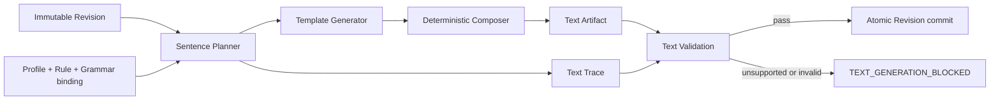

# OPM 符号与文本生成实现契约

文档版本：`v0.2-draft`

文档状态：P0 实现契约与完整画布符号设计冻结；完整资产、Clause 15 排序和 Annex A 语法仍待实现

更新时间：2026-07-28

## Task Type

- `feature`

## 1. 范围与结论

本文档冻结 `Object / Process / State`、ISO 配置档 16 类 Procedural Link、8 类 Control Link 组合和 10 类 Structural Link 的图形描述符边界、锚点、端点、路由、标签槽位，以及 OPL `Planner -> Generator -> Composer -> Trace` 的输入输出和失败语义。

P0 生产实现只承诺 `Object / Process / Consumption / System Diagram / Revision / OPL` 最小闭环；其余已定义符号可以进入组件开发和契约测试，但必须在对应 Profile Capability、Rule 和验收样例同时就绪后才能在生产工具栏中启用。

完整工具栏分组、State 交互、关系候选和 API 扩展前置见 [OPM 完整画布工具链设计](opm-complete-canvas-toolchain-design.md)。

本文档不授予“符合 ISO 19450:2024”的产品声明。代表性 Profile 和规则仍为 `DRAFT`，未完成 96 项 Capability、103 个规则组、511 个原子 `shall`、完整 Clause 7-10 符号资产和 Annex A Grammar 前，界面只能显示“ISO 草案配置档”与证据缺口。

## 2. 规范依据与实现边界

| 资产 | ISO 19450:2024 依据 | 本契约冻结内容 |
| --- | --- | --- |
| Object | 7.1.2 | 带名称标签的矩形 |
| Process | 7.2.2 | 带名称标签的椭圆 |
| State | 7.3.5.2、7.3.5.4 | 对象内部圆角矩形；初始/默认/最终状态修饰 |
| Consumption | 9.1.2 | 对象到过程的闭合箭头；`Processing consumes Consumee.` |
| Result | 9.1.3 | 过程到对象的闭合箭头；`Processing yields Resultee.` |
| Effect | 9.1.4 | 对象与过程之间的双向闭合箭头；`Processing affects Affectee.` |
| Agent | 9.2.2 | 对象到过程、过程端实心圆；`Agent handles Processing.` |
| Instrument | 9.2.3 | 对象到过程、过程端空心圆；`Processing requires Instrument.` |
| State-specified/Control/Exception | 9.3-9.5 | State 端点、`e/c` 注记、Invocation 闪电线和时间异常短杠 |
| Tagged Structural | 10.2 | 空心箭头、双向 harpoon 与标签槽位 |
| Fundamental Structural | 10.3 | 四类三角 junction、fan、完整/不完整集合 |
| State-specified Structural | 10.4 | State qualification 与对应结构关系组合 |
| OPD 层级与 OPL | 6.2.6.3、Clause 14、Clause 15 | 多 OPD 导航、语义缩放事件分离、确定性句子和追踪 |

ISO 只定义符号和语义要求，不定义浏览器像素尺寸、配色、X6 Cell 结构或交互命令。第 4-6 章的像素和事件值是本工具的实现约束，不冒充标准原文。

## 3. 资产包与版本

### 3.1 `SymbolCatalog`

```text
SymbolCatalog {
  catalog_id
  catalog_version
  lifecycle                 // DRAFT | ACTIVE | DEPRECATED | RETIRED
  profile_id
  profile_version
  symbols[]                 // SymbolDescriptor
  markers[]                 // MarkerDescriptor
  render_tokens
  source_evidence[]
  catalog_digest            // sha256，覆盖规范化后的全部内容
}
```

同一 `catalog_id + catalog_version` 的内容不可变。Revision 必须绑定 `catalog_digest`；打开历史 Revision 时不得自动替换为 registry 中的最新符号包。

### 3.2 `SymbolDescriptor`

```text
SymbolDescriptor {
  symbol_id
  semantic_kind
  capability_id
  primitive                 // RECT | ELLIPSE | ROUNDED_RECT | PATH
  normalized_geometry       // 0..100 局部坐标
  default_size
  minimum_size
  contour
  fill
  label_slots[]
  anchors[]
  hit_area
  source_locator
}
```

`symbol_id` 是语义资产引用，不是 DOM ID 或 X6 shape 名。X6 node/edge 只能保存 `occurrence_id`、`target_id`、`symbol_id` 和布局投影；不得把 X6 Cell JSON 写回 Semantic Model 作为事实源。

### 3.3 `RelationSymbolDescriptor`

```text
RelationSymbolDescriptor {
  symbol_id
  capability_id
  line_descriptor_ref
  source_marker_ref?
  target_marker_ref?
  junction_marker_ref?
  control_annotation_ref?
  completeness_annotation_ref?
  label_slots[]
  endpoint_roles[]
  route_family
  template_family_ref
  source_locator
}
```

`RelationSymbolDescriptor` 描述标准符号的归一化结构，不保存某条 edge 的折点。Descriptor 与 `capability_id + template_family_ref` 必须成组发布；任何一项缺失都阻断该关系的生产工具入口。

## 4. 首批结点符号

### 4.1 通用渲染令牌

| 令牌 | 冻结值 | 规则 |
| --- | --- | --- |
| `node.stroke` | `#20242a` | 正常语义轮廓；不得用选择色替代 |
| `node.fill` | `#ffffff` | P0 默认信息型填充；Essence/Affiliation 视觉语义由后续完整目录覆盖 |
| `node.stroke_width` | `2px` | 默认轮廓 |
| `state.initial_width` | `4px` | 初始状态粗轮廓 |
| `state.final_gap` | `3px` | 最终状态双轮廓间距 |
| `label.color` | `#171a1f` | 结点正式标签 |
| `selection.color` | `#0b6bcb` | 仅交互覆盖层，不属于符号资产 |
| `warning.color` | `#b25b00` | Finding 覆盖层，不改写轮廓语义 |
| `anchor.hit_size` | `14px` | 指针命中区；默认不显示 |

颜色不是唯一状态信号。选择、只读、错误和焦点必须同时具备轮廓/图标/文字或辅助技术状态。

### 4.2 结点描述符

| `symbol_id` | Primitive | 默认尺寸 | 最小尺寸 | 标签槽位 | 边界/包含规则 |
| --- | --- | --- | --- | --- | --- |
| `symbol.object.basic` | `RECT` | `160 x 72` | `120 x 56` | 中心水平/垂直，内边距 12 | 标签换行后扩高；State 必须位于对象内部 |
| `symbol.process.basic` | `ELLIPSE` | `168 x 84` | `128 x 64` | 椭圆内接矩形居中，内边距 16 | 锚点按椭圆边界交点计算 |
| `symbol.state.basic` | `ROUNDED_RECT` | `88 x 28` | `64 x 24` | 居中，内边距 8 | 圆角 10；不能脱离 owner object 单独存在 |

名称编辑使用 HTML 输入覆盖层，提交前只产生候选值；完成 `API-EDT-002` 后才更新正式标签。超长名称优先换行并扩高，不缩小字体，不溢出结点，不改变稳定 ID。

### 4.3 状态修饰

| 状态角色 | 图形规则 | 组合规则 |
| --- | --- | --- |
| 普通 | `2px` 单轮廓圆角矩形 | 默认 |
| `INITIAL` | `4px` 单轮廓 | 可与 DEFAULT/FINAL 组合 |
| `FINAL` | `2px` 双轮廓，间距 `3px` | 内层轮廓不得压住标签 |
| `DEFAULT` | 左侧斜向右上的空心箭头指向状态 | 箭头属于状态修饰，不创建 Fact |

State 的拖动边界限制为 owner object 的 content box。跨对象拖动不作为布局命令处理，必须转换为明确的语义命令并重新通过 Profile/Rule 校验；P0 不提供该命令。

## 5. 首批关系符号

### 5.1 端点与方向

| `symbol_id` | source 语义 | target 语义 | source marker | target marker | OPL 模板 ID |
| --- | --- | --- | --- | --- | --- |
| `symbol.link.consumption` | Consumee Object/State | Consuming Process | 无 | `closed-arrow` | `opl.consumption.v1` |
| `symbol.link.result` | Creating Process | Resultee Object/State | 无 | `closed-arrow` | `opl.result.v1` |
| `symbol.link.effect` | Affectee Object/State | Affecting Process | `closed-arrow` | `closed-arrow` | `opl.effect.v1` |
| `symbol.link.agent` | Agent Object/State | Enabled Process | 无 | `filled-circle` | `opl.agent.v1` |
| `symbol.link.instrument` | Instrument Object/State | Enabled Process | 无 | `open-circle` | `opl.instrument.v1` |

`source/target` 表示规范语义方向，不跟随用户拖线顺序。用户从任一端开始连接时，Candidate Builder 必须按 Capability 归一化端点；不能唯一归一化时显示候选关系菜单，禁止猜测。

### 5.2 Marker

| Marker | 几何 | 尺寸 | 填充 |
| --- | --- | --- | --- |
| `closed-arrow` | 等腰闭合箭头 | `10 x 8` | `#ffffff`，轮廓 `#20242a` |
| `filled-circle` | 圆 | 直径 `8` | `#20242a` |
| `open-circle` | 圆 | 直径 `8` | `#ffffff`，轮廓 `#20242a` |

Marker 始终位于实际边界交点之外的端部，不得覆盖结点轮廓或标签。Effect 两端 marker 的方向分别朝向各自端点。

### 5.3 Anchor、Port 和路由

1. 语义端点保存 `target_kind + target_id + role + ordinal`，不保存页面 Port ID；
2. Occurrence 投影生成稳定 Port ID：`occurrence_id + endpoint_role + ordinal`；
3. Object 使用矩形边界交点，Process 使用椭圆边界交点，State 使用圆角矩形近似边界交点；
4. 首选路由为 orthogonal，最小首末直线段 `16px`，避让结点外扩框 `12px`；
5. 用户编辑折点只修改对应 `Layout.route_points`，不改变 Fact 端点或生成新 OPL；
6. 端点重新连接属于语义命令，必须携带 `base_revision`、`command_id`、Profile/Rule 绑定；
7. 路由器不能找到无交叉路径时允许显示可见交叉，但不得静默移动结点或改变语义方向。

关系标签使用独立 `label slot`：主标签位于路径长度 50% 处，条件/事件修饰靠近规范指定端点。P0 基础五类关系不显示重复的关系名称；类型由 marker 与选择后的检查器共同表达。

### 5.4 完整关系线型与 Marker 目录

| ID | 归一化图形语义 | 使用范围 |
| --- | --- | --- |
| `line.solid` | 连续实线 | 基础过程、控制、结构和异常关系 |
| `line.lightning` | 闪电形折线 | Invocation/Self-invocation |
| `marker.closed-arrow` | 闭合空心箭头 | Consumption、Result、Effect、Invocation |
| `marker.filled-circle` | 实心圆 | Agent 的 Process 端 |
| `marker.open-circle` | 空心圆 | Instrument 的 Process 端 |
| `marker.open-arrow` | 空心箭头 | Unidirectional Tagged/Null-tagged |
| `marker.harpoon-forward/reverse` | 两端相反侧的 harpoon 形箭头 | Bidirectional/Reciprocal Tagged |
| `marker.filled-triangle` | 实心黑三角，尖端连接 refineable | Aggregation-participation |
| `marker.exhibition-triangle` | 空心大三角内嵌较小实心黑三角 | Exhibition-characterization |
| `marker.open-triangle` | 空心三角，尖端连接 general | Generalization-specialization |
| `marker.classification-triangle` | 空心大三角内嵌小黑圆 | Classification-instantiation |
| `annotation.event-e` | 靠近 Process 端的 `e` | Event Control Link |
| `annotation.condition-c` | 靠近 Process 端的 `c` | Condition Control Link |
| `annotation.exception-overtime` | 靠近处理 Process 的一条斜短杠 | Overtime Exception |
| `annotation.exception-undertime` | 靠近处理 Process 的两条平行斜短杠 | Undertime Exception |
| `annotation.incomplete-set` | 三角 marker 下方纵线上的横向短杠 | 不完整 fundamental refinee 集合 |

上述完整目录只冻结几何关系和语义位置。除第 4、5.2 节已冻结的 P0 浏览器实现令牌外，其余 marker 的准确像素尺寸必须由版本化 Symbol Catalog 和视觉 golden 冻结，不能从 ISO 页面测量后直接写死为浏览器像素。

### 5.5 Procedural Link 描述符

| Capability | Symbol ID | Line | End marker / target-near annotation | Label slot | Route family | Template family |
| --- | --- | --- | --- | --- | --- | --- |
| `CAP-ISO-PROC-001` | `symbol.link.consumption` | solid | none / closed-arrow | none | binary-orthogonal | `opl.consumption.*` |
| `CAP-ISO-PROC-002` | `symbol.link.result` | solid | none / closed-arrow | none | binary-orthogonal | `opl.result.*` |
| `CAP-ISO-PROC-003` | `symbol.link.effect` | solid | closed-arrow / closed-arrow | none | binary-orthogonal | `opl.effect.*` |
| `CAP-ISO-PROC-004` | `symbol.link.agent` | solid | none / filled-circle | none | binary-orthogonal | `opl.agent.*` |
| `CAP-ISO-PROC-005` | `symbol.link.instrument` | solid | none / open-circle | none | binary-orthogonal | `opl.instrument.*` |
| `CAP-ISO-PROC-006` | `symbol.link.consumption.state` | solid | none / closed-arrow | state qualification | state-binary | `opl.consumption.state.*` |
| `CAP-ISO-PROC-007` | `symbol.link.result.state` | solid | none / closed-arrow | state qualification | state-binary | `opl.result.state.*` |
| `CAP-ISO-PROC-008` | `symbol.link.effect.state.input-output` | solid | closed-arrow / closed-arrow | input/output State | state-effect | `opl.effect.state.input-output.*` |
| `CAP-ISO-PROC-009` | `symbol.link.effect.state.input` | solid | closed-arrow / closed-arrow | input State | state-effect | `opl.effect.state.input.*` |
| `CAP-ISO-PROC-010` | `symbol.link.effect.state.output` | solid | closed-arrow / closed-arrow | output State | state-effect | `opl.effect.state.output.*` |
| `CAP-ISO-PROC-011` | `symbol.link.agent.state` | solid | none / filled-circle | agent State | state-binary | `opl.agent.state.*` |
| `CAP-ISO-PROC-012` | `symbol.link.instrument.state` | solid | none / open-circle | instrument State | state-binary | `opl.instrument.state.*` |
| `CAP-ISO-PROC-013` | `symbol.link.invocation` | lightning | none / closed-arrow | none | process-invocation | `opl.invocation.*` |
| `CAP-ISO-PROC-014` | `symbol.link.invocation.self` | lightning | none / closed-arrow | none | process-self-loop | `opl.invocation.self.*` |
| `CAP-ISO-PROC-015` | `symbol.link.exception.overtime` | solid | none / overtime annotation | duration near handling Process | process-exception | `opl.exception.overtime.*` |
| `CAP-ISO-PROC-016` | `symbol.link.exception.undertime` | solid | none / undertime annotation | duration near handling Process | process-exception | `opl.exception.undertime.*` |

State-specified Effect 的双 marker 仍表达 Effect 语义，输入/输出 State 由规范端点和 label slot 决定。前端不得根据视觉折点重建端点角色。

时间异常的一/两条斜短杠是靠近 handling Process 的 line annotation，不是箭头或端点 marker；表格中的 target-near 只描述注记位置。

### 5.6 Control Link 描述符

| Capability | 基础 descriptor | Control annotation | Annotation slot | Route family | Template family |
| --- | --- | --- | --- | --- | --- |
| `CAP-ISO-CTRL-001` | Consumption/Effect input | `event-e` | process-input-near | inherit-base | `opl.control.event.transforming.*` |
| `CAP-ISO-CTRL-002` | Agent/Instrument | `event-e` | process-input-near | inherit-base | `opl.control.event.enabling.*` |
| `CAP-ISO-CTRL-003` | State Consumption/State Effect input | `event-e` | process-input-near | inherit-base | `opl.control.event.transforming.state.*` |
| `CAP-ISO-CTRL-004` | State Agent/State Instrument | `event-e` | process-input-near | inherit-base | `opl.control.event.enabling.state.*` |
| `CAP-ISO-CTRL-005` | Consumption/Effect input | `condition-c` | process-input-near | inherit-base | `opl.control.condition.transforming.*` |
| `CAP-ISO-CTRL-006` | Agent/Instrument | `condition-c` | process-input-near | inherit-base | `opl.control.condition.enabling.*` |
| `CAP-ISO-CTRL-007` | State Consumption/State Effect input | `condition-c` | process-input-near | inherit-base | `opl.control.condition.transforming.state.*` |
| `CAP-ISO-CTRL-008` | State Agent/State Instrument | `condition-c` | process-input-near | inherit-base | `opl.control.condition.enabling.state.*` |

Event/Condition 注记属于基础 Fact 的控制语义组合，不绘制第二条重叠边。Effect 只在 Object/State -> Process 的输入段放置注记；输出段不放置 `e/c`。

### 5.7 Structural Link 描述符

| Capability | Symbol ID | Marker | Label slot | Route family | Template family |
| --- | --- | --- | --- | --- | --- |
| `CAP-ISO-STRUCT-001` | `symbol.link.structural.tagged.unidirectional` | target open-arrow | shaft-forward 必填 | binary-structural | `opl.structural.tagged.unidirectional.*` |
| `CAP-ISO-STRUCT-002` | `symbol.link.structural.null-tagged.unidirectional` | target open-arrow | none | binary-structural | `opl.structural.null-tagged.unidirectional.*` |
| `CAP-ISO-STRUCT-003` | `symbol.link.structural.tagged.bidirectional` | two-sided harpoons at both ends | forward/reverse 各一 | binary-structural | `opl.structural.tagged.bidirectional.*` |
| `CAP-ISO-STRUCT-004` | `symbol.link.structural.tagged.reciprocal` | two-sided harpoons at both ends | reciprocal 单标签或无标签 | binary-structural | `opl.structural.tagged.reciprocal.*` |
| `CAP-ISO-STRUCT-005` | `symbol.link.structural.aggregation` | junction filled-triangle | completeness | fundamental-fan | `opl.structural.aggregation.*` |
| `CAP-ISO-STRUCT-006` | `symbol.link.structural.exhibition` | junction exhibition-triangle | completeness + feature grouping | fundamental-fan | `opl.structural.exhibition.*` |
| `CAP-ISO-STRUCT-007` | `symbol.link.structural.generalization` | junction open-triangle | completeness | fundamental-fan | `opl.structural.generalization.*` |
| `CAP-ISO-STRUCT-008` | `symbol.link.structural.classification` | junction classification-triangle | none | fundamental-fan | `opl.structural.classification.*` |
| `CAP-ISO-STRUCT-009` | `symbol.link.structural.exhibition.state` | exhibition-triangle | value State | state-fundamental | `opl.structural.exhibition.state.*` |
| `CAP-ISO-STRUCT-010` | `symbol.link.structural.tagged.state` | inherit tagged variant | tagged + source/target State | state-structural | `opl.structural.tagged.state.*` |

### 5.8 Structural fan 与完整性

1. Fundamental relation 是一个拥有一个 refineable 和一个或多个 refinee 的 Fact，不是多条互不相关的 binary edge。
2. `fundamental-fan` 使用一个 junction marker：尖端连 refineable，refinees 连三角形水平底边一侧。
3. Aggregation、Exhibition 和 Generalization 的不完整集合使用 `annotation.incomplete-set`；Classification 不区分完整/不完整实例集合。
4. 添加、删除或重排 refinee 必须保持 Fact ID，重算完整性 marker 和 OPL list composition。
5. Refinee 分支的视觉顺序默认取 Fact endpoint ordinal；普通 route point 修改不得改变 ordinal。
6. fan 无法避让时优先调整 junction/branch layout，不得拆成多个 Fact 或隐藏分支。

### 5.9 Label slot

| Slot | 锚定规则 | 冲突处理 |
| --- | --- | --- |
| `shaft-forward` | 关系正向 shaft 中段、与路径方向一致 | 平移到最近无碰撞段，保持 leader |
| `shaft-reverse` | bidirectional 反向 harpoon 对应一侧 | 不得与 forward 合并 |
| `reciprocal` | 关系中段单槽 | 无标签时不保留空框 |
| `process-input-near` | 靠近规范 Process 输入端 | `e/c` 优先于用户标签，禁止被 marker 覆盖 |
| `state-qualification` | 靠近对应 State/owner 端点 | State 显式时避免重复文字，抑制时按 descriptor 输出 |
| `duration` | 靠近 exception handling Process | 与一/两条异常短杠保持 descriptor 间距 |
| `completeness` | fundamental junction 下方纵线 | 只由完整性字段控制 |

标签位置由 route 投影保存，但 slot 语义由 Descriptor 决定。用户可移动 label position，不能把 forward label 拖到 reverse slot 改变语义。

## 6. 视口缩放与语义缩放隔离

| 维度 | 视口操作 | OPM 语义操作 |
| --- | --- | --- |
| 用户文案 | 放大视图、缩小视图、适配画布 | 过程内缩放、过程外缩放、对象内缩放、对象外缩放 |
| 事件类型 | `VIEWPORT_ZOOM_SET/FIT/PAN` | `SEMANTIC_IN_ZOOM/SEMANTIC_OUT_ZOOM` |
| 状态归属 | `WorkspaceSession.viewport_state` | Semantic Model + Context/Occurrence |
| API | 不调用写 API | `API-EDT-002` |
| Revision/OPL | 不产生、不刷新 | 原子产生新 Revision 和新文本投影 |
| 撤销栈 | UI 视图历史，可不持久化 | 模型 Operation Record，可撤销/重做 |

视口比例范围冻结为 `25%..400%`，步长 `10%`，`Ctrl/Cmd + 0` 适配画布。此数值是交互约束，不是 OPM 标准语义。任何视口事件进入 `ExecuteEditCommand` 均视为实现缺陷。

## 7. OPL 生成流水线



### 7.1 输入

```text
TextGenerationInput {
  revision_candidate
  context_scope
  profile_ref + digest
  rule_set_ref + digest
  grammar_ref + digest
  symbol_catalog_ref + digest
  locale
}
```

生成器只读取规范化 Candidate Revision，不读取 X6 Cell、DOM、当前视口或用户选择。任一绑定缺失、摘要不匹配、Capability 未实现或 Fact 无可用模板时必须阻断提交，不允许生成近似自然语言替代正式 OPL。

### 7.2 阶段接口

| 阶段 | 输入 | 输出 | 失败码 |
| --- | --- | --- | --- |
| Planner | Revision + Context + binding | 稳定排序的 `SentencePlan[]` | `TEXT_PLAN_UNSUPPORTED` |
| Generator | `SentencePlan` + grammar | `SentenceToken[]` | `TEXT_TEMPLATE_MISSING` |
| Composer | tokens + ordering rules | `Sentence[]` + paragraph | `TEXT_COMPOSITION_FAILED` |
| Trace | plan + sentence | Fact/Element/Occurrence/Sentence 多对多映射 | `TEXT_TRACE_INCOMPLETE` |
| Validator | artifact + trace + rules | pass 或 Findings | `TEXT_GENERATION_BLOCKED` |

`SentencePlan` 至少包含 `sentence_id`、`context_id`、`template_id`、`input_fact_ids`、`input_element_ids`、`occurrence_ids`、`sort_key` 和 `grammar_version`。Sentence ID 由稳定输入和模板版本派生；名称变化后可以生成新 ID，但同一 Revision 重放必须字节一致。

### 7.3 P0 模板

| Template ID | 受控输出 |
| --- | --- |
| `opl.consumption.v1` | `{Process} consumes {Object}.` |
| `opl.consumption.state.v1` | `{Process} consumes {state} {Object}.` |
| `opl.result.v1` | `{Process} yields {Object}.` |
| `opl.result.state.v1` | `{Process} yields {state} {Object}.` |
| `opl.effect.v1` | `{Process} affects {Object}.` |
| `opl.agent.v1` | `{Agent} handles {Process}.` |
| `opl.instrument.v1` | `{Process} requires {Instrument}.` |

正式字符串使用 ASCII 句点。Thing 名称使用模型中的规范名称；大小写、粗体 token 和状态标签由 Grammar 资产生成，UI 样式不得写入纯文本。中文草案文本属于 OPT Profile，不得套用上述 OPL 模板后标记为 ISO OPL。

#### 7.3.1 完整模板族注册

完整 Grammar 资产必须为第 5.5~5.7 节的每个 `template family` 注册至少一个确定版本的模板，并声明：

1. 对应 `capability_id` 和可接受的 Endpoint Schema；
2. 单端、双端、State-specified、fan、完整/不完整集合与标签变体；
3. Sentence Plan precedence、列表合成、正反方向句子数量和 token emphasis；
4. 输入 Fact/State/Feature/Condition/Modifier 到 token range 的完整 Trace；
5. 不支持组合的稳定失败码。

模板族不是可执行模板 ID。生产 Revision 必须绑定具体 `template_id + grammar_version + digest`，不能把通配符 `*` 写入 Sentence Plan。

| 能力集合 | 必须注册的模板族数量 | 特殊变体 |
| --- | --- | --- |
| Procedural | 16 | Effect 三种 State 指定、Self-invocation、两种时间异常 |
| Control | 8 | Event/Condition、Transforming/Enabling、State/non-State |
| Structural | 10 | 双向两句、互惠单句、fan、完整性、State 指定 |

Control template family 必须按实际基础关系继续细分到 concrete template。例如 Transforming Event 至少区分 Consumption 与 Effect 输入段；8 个 Capability family 不是只实现 8 个字符串模板。

### 7.4 确定性排序

P0 只启用单个根 Context 中的基础 Consumption。排序键冻结为：

```text
context_path_ordinal
+ grammar_precedence
+ primary_process_stable_id
+ fact_stable_id
+ sentence_id
```

完整 ISO OPL 的 precedence、链接扇、合句和段落规则必须由 Clause 15 规则资产替换 `grammar_precedence`。某一模型出现 P0 未覆盖的多关系合成场景时，生成器返回 unsupported 并阻断正式 OPL，不得仅靠 stable ID 排序后声称符合标准。

### 7.5 实时与原子性

1. 拖动、连线和表单编辑期间只生成候选预览，不更新正式 Text Artifact；
2. 提交命令时依次执行 Candidate Builder、Rule Filter、领域校验、OPL 生成、Text Trace、Post-commit 校验和持久化；
3. Semantic Model、Context/Occurrence、Text Artifact、Text Trace、Validation Summary、Revision 和 Operation Record 在同一业务事务成功后才返回 `COMMITTED`；
4. 任一文本阶段失败不得返回 `committed_revision`，画布恢复最近已提交投影并保留候选输入；
5. 后台全量校验读取固定 Revision。结果过期时保存为历史但标记 `stale`，不得覆盖当前摘要。

## 8. 图文追踪与定位

| 方向 | 输入 | 结果 |
| --- | --- | --- |
| OPD -> OPL | occurrence/element/fact | 一个或多个 sentence + token range |
| OPL -> OPD | sentence/token range | Fact、Element 和当前/引用 Occurrence 集合 |
| Finding -> OPD/OPL | finding locator | Context、Occurrence、Sentence、字段路径 |

点击关系高亮对应 OPL 句子；点击句子优先定位当前 Context 中的 occurrence，没有当前 occurrence 时显示定位菜单，不按名称猜测。高亮只进入 selection state，不改变 Layout、Semantic Model 或 Revision。

## 9. 代表性 golden cases

| Case | 事实 | 预期 OPL | 预期 marker |
| --- | --- | --- | --- |
| `G-OPL-001` | Processing consumes Raw Material | `Processing consumes Raw Material.` | Object -> Process 闭合箭头 |
| `G-OPL-002` | Processing consumes available Raw Material | `Processing consumes available Raw Material.` | State -> Process 闭合箭头 |
| `G-OPL-003` | Processing yields Product | `Processing yields Product.` | Process -> Object 闭合箭头 |
| `G-OPL-004` | Processing affects Product | `Processing affects Product.` | 双向闭合箭头 |
| `G-OPL-005` | Operator is agent of Processing | `Operator handles Processing.` | Process 端实心圆 |
| `G-OPL-006` | Processing uses Machine as instrument | `Processing requires Machine.` | Process 端空心圆 |

`G-OPL-001` 是首批端到端门槛；`G-OPL-002~006` 是组件/契约门槛，只有 Capability 与 Rule 完整接入后才进入生产工具栏验收。

### 9.1 完整能力 golden 集合

| Golden ID 范围 | Capability 范围 | 最低正例 | 关键反例/边界 |
| --- | --- | --- | --- |
| `G-OPL-PROC-001~016` | `CAP-ISO-PROC-001~016` | 每个 Capability 一个独立可提交模型 | 端点反转、错误 State owner、缺持续时间、Self ID 不同 |
| `G-OPL-CTRL-001~008` | `CAP-ISO-CTRL-001~008` | 每个 Capability 覆盖全部允许的基础关系变体 | Result 控制、Effect 输出段控制、Event+Condition 非法组合 |
| `G-OPL-STRUCT-001~010` | `CAP-ISO-STRUCT-001~010` | 每个 Capability 一个基础正例；多形态能力覆盖全部允许变体 | Object-Process 非法 tagged、标签缺失、fan 空集合、State owner 错误 |

每个 golden fixture 必须同时断言：

1. 规范化 Fact/Endpoint/State/Modifier；
2. `symbol_id`、line、marker、label slot、route family；
3. 具体 `template_id`、纯文本、token、Sentence 数量与顺序；
4. Fact/Element/State/Occurrence/Sentence Trace；
5. Profile/Rule/Grammar/Symbol binding digest；
6. 重开 Projection 和同 Revision 重放字节一致。

Structural fan 还必须覆盖单 refinee、多 refinee、添加/删除 refinee、完整/不完整切换和 Classification 无完整性标记。Bidirectional Tagged 必须产生两个方向的语句；Reciprocal 按 Grammar 产生互惠句，不能复制双向句后只隐藏一个标签。

`CAP-ISO-STRUCT-010` 还必须覆盖 source State、destination State、双端 State 与 unidirectional/bidirectional/reciprocal 的全部 Profile 允许组合。Control golden 的 ID 可以在 `-001A/-001B` 等 case suffix 下扩展，`001~008` 表示 Capability 主集合而不是只允许 8 个 fixture。

## 10. 测试与完成定义

### 10.1 组件测试

1. 每个结点的 SVG path/bbox 与描述符一致；
2. State 永远位于 owner object content box；
3. 16/8/10 关系的 line、marker、annotation、方向、fan junction 和边界交点正确；
4. 关系标签、marker 与结点在 `25%/100%/400%` 不发生遮挡；
5. 选择/告警覆盖层移除后基础符号完全恢复。

### 10.2 契约测试

1. `SymbolCatalog` 同版本内容不可变，Revision digest 可复现；
2. 视口缩放不调用写 API、不产生 Revision、不改变 OPL；
3. 语义缩放必须调用 `API-EDT-002` 并产生 Revision；
4. `G-OPL-001~006` 及 `G-OPL-PROC/CTRL/STRUCT` 的纯文本、token、Trace 和 digest 可重复；
5. 缺模板、未知 Capability、规则版本冲突和 Trace 缺失均阻断提交；
6. 同一 Revision 重放得到字节一致的 Text Artifact。

### 10.3 浏览器验收

桌面与窄视口均检查 Object/Process/State、关系 marker、长名称换行、图文互定位、视口缩放、语义缩放确认、只读基线和 Finding 定位。Canvas 不是空白，按钮/文字/结点/连线不得重叠。

## 11. 开发输入与后续门槛

P0 可直接依据本契约实现：

1. X6 Object/Process node 与 Consumption edge；
2. normalized semantic DTO -> X6 projection adapter；
3. viewport event store 与 semantic command bus 隔离；
4. `opl.consumption.v1` Planner/Generator/Composer/Trace；
5. golden、digest、阻断和图文定位测试。

以下事项不阻断 P0 框架开发，但阻断对应完整能力启用和 ISO 声明：完整 Symbol Catalog 机器资产、96 Capability、103 规则组及原子规则、Clause 15 完整排序/合句、Annex A Grammar 可执行化、全部 `G-OPL-PROC/CTRL/STRUCT` 证据、中文 OPT 正式配置档和第三方互操作证据。
